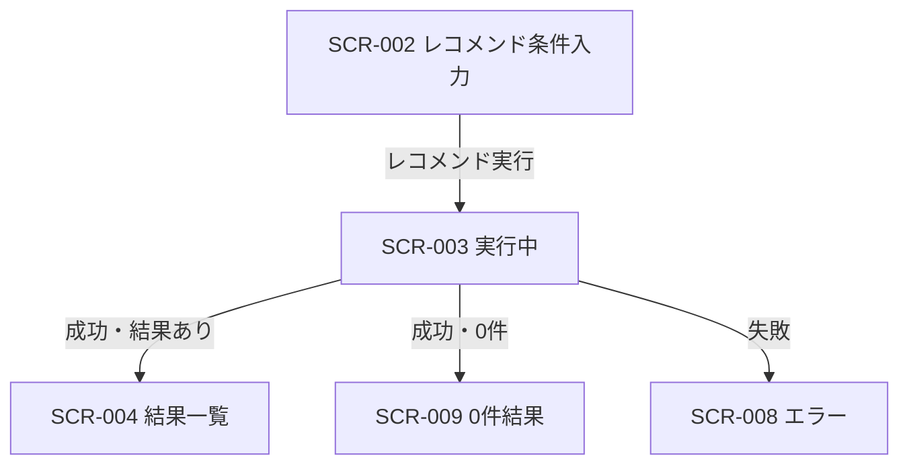

# レコメンド実行中表示 画面仕様書

## 1. ドキュメント情報

| 項目     | 内容                   |
| -------- | ---------------------- |
| 画面ID   | `SCR-003`              |
| 画面名   | レコメンド実行中表示   |
| 画面種別 | `画面状態`             |
| MVP対象  | `○`                    |
| 作成日   | 2026-07-16             |
| 更新日   | 2026-07-16             |

---

## 2. 概要

SCR-003 は、レコメンド条件入力（SCR-002）から API-PUB-002（レコメンド実行）を呼び出したあとの **推薦処理中 UI 状態** である。独立した業務画面・専用 URL ではない。

画面一覧の URL案 `/recommendations/loading` は参考表記に留め、**MVP では専用 route を新設しない**。宿主は SCR-002 の実装面（`/recommendations` 上の recommendation-input）であり、実行中は `phase === "running"` で LoadingPanel（UI-032）を表示する。

---

## 3. 目的

- レコメンド実行中であることをユーザーに伝え、待機中の不安を軽減すること
- API-PUB-002 呼び出し中に入力フォーム操作や二重送信が起きないようにすること
- 処理完了後に結果あり（SCR-004）／0件（SCR-009）／失敗（SCR-008）へ正しく遷移すること
- デザインルール ST-LOAD および UI-032 に沿ったローディング表現（幾何学的モーフィング）を定義すること

---

## 4. 対象ユーザー

| ユーザー種別 | 内容                                           |
| ------------ | ---------------------------------------------- |
| 主利用者     | ギフトを探したい一般ユーザー（MVP は非認証） |
| 補助利用者   | なし（MVP）                                    |
| 管理者       | なし（本画面状態は管理機能を持たない）         |

---

## 5. 画面表示条件

| 項目            | 内容                                                                 |
| --------------- | -------------------------------------------------------------------- |
| 表示URL / Route | 独立 URL なし。宿主は SCR-002 の `/recommendations`（画面遷移図 §10）。画面一覧の `/recommendations/loading` は参考案であり MVP では採用しない |
| 遷移元          | SCR-002（レコメンド実行。クライアントバリデーション通過後）         |
| 遷移先          | SCR-004（成功・結果あり）／SCR-009（成功・0件）／SCR-008（失敗）   |
| 認証要否        | `false`（MVP 非認証。API-PUB-002 と同方針）                          |
| 権限条件        | なし                                                                 |
| 初期表示条件    | SCR-002 でレコメンド実行が開始され、API-PUB-002 呼び出しが進行中であること |

### 5.1 宿主・実装対応（現状正本）

| 項目 | 内容 |
| ---- | ---- |
| 宿主画面 | SCR-002 レコメンド条件入力画面 |
| 実装参照 | `apps/web/src/features/recommendation-input/RecommendationInputPage.tsx` |
| 状態キー | `phase === "running"` |
| 表示部品 | `LoadingPanel`（UI-032）。インジケータは **幾何学的モーフィング**（§8.2） |
| 処理中メッセージ定数 | `RUNNING_MESSAGE`（`constants.ts`） |

宿主は `phase === "running"` ＋ LoadingPanel とする。インジケータの見た目は現状の円形 `animate-spin` Spinner（UI-031）ではなく、本仕様 §8.2 の幾何学的モーフィングへ実装 Task で差し替える。専用 `/recommendations/loading` page の新設は **MVP out of scope** とする。

---

## 6. 画面遷移



### 6.1 遷移一覧

|  No | 操作               | 遷移先  | 条件                                      | 備考 |
| --: | ------------------ | ------- | ----------------------------------------- | ---- |
|   1 | レコメンド実行開始 | SCR-003 | SCR-002 クライアント検証通過後            | API-PUB-002 呼び出し開始と同時に表示 |
|   2 | 推薦成功・結果あり | SCR-004 | HTTP 200 かつ推薦結果が 1 件以上          | 結果データの受け渡しは SCR-002 / SCR-004 実装方針に従う |
|   3 | 推薦成功・結果なし | SCR-009 | HTTP 200 かつ推薦結果 0 件（正常系）      | SCR-009 本仕様は out of scope（言及のみ） |
|   4 | 推薦失敗           | SCR-008 | 通信失敗・4xx/5xx・タイムアウト等         | SCR-008 本仕様は out of scope（言及のみ） |

### 6.2 キャンセル導線

| 項目 | 内容 |
| ---- | ---- |
| 画面一覧 | キャンセル導線（入力画面へ戻る）は MVP 対象 **△** |
| 本仕様の扱い | **MVP 対象外（確定）**。画面内のキャンセルボタン・中断操作は提供しない |
| 現状実装 | キャンセル UI なし（`phase === "running"` 中は LoadingPanel のみ）。本仕様と一致 |
| 備考 | ブラウザ戻る / リロードによる離脱時の request 扱いは §6.3 |

### 6.3 ブラウザ戻る / リロード時の扱い（MVP 方針）

SCR-003 は独立 URL ではなく React の `phase` 状態であるため、ブラウザ履歴に「実行中」専用エントリは積まない（専用 route 非採用と整合）。

| 操作 | MVP 方針 | 理由 |
| ---- | -------- | ---- |
| リロード | 実行中 state は復元しない。再表示後は SCR-002 の入力フォーム（`phase === "form"`）。入力値は既存の sessionStorage 復元方針に従う。API-PUB-002 は **自動再実行しない** | `phase` はメモリ上のみ。実行中の再開 invent を避ける |
| ブラウザ戻る | 前履歴（例: SCR-001）へ戻る。実行中 UI は破棄する。完了後の自動遷移は行わない | 同一 URL 上の状態のため、戻る＝ページ離脱 |
| 進行中 request | コンポーネント unmount / ページ破棄時に **AbortController 等で中断**し、完了後の `setPhase` / `router.push` を発火させない | 離脱後の意図しない遷移・state 更新を防ぐ |
| `beforeunload` 確認 | **出さない**（MVP） | キャンセル導線非採用と揃え、離脱コストを増やさない |

詳細の確定記録は §22.1。実装の微調整（Abort の載せ方など）は実装 Task でよい。

---

## 7. 画面レイアウト

### 7.1 レイアウト概要

デザインルール **ST-LOAD** に従い、画面中央にローディングインジケータ（幾何学的モーフィング）と短い説明文を配置する。入力フォームは非表示とし、実行中の操作不可を明示する。過剰なカード装飾は避ける。

### 7.2 ワイヤーフレーム簡易図

```text
┌────────────────────────────────────┐
│ レコメンド実行中                   │  ← PageLayout title（宿主）
├────────────────────────────────────┤
│                                    │
│     (幾何学的モーフィング)         │  ← §8.2（必須）
│   条件に合うギフトを探しています   │  ← RUNNING_MESSAGE
│       しばらくお待ちください。     │  ← 補足（必須）
│                                    │
└────────────────────────────────────┘
```

### 7.3 画面領域

| 領域   | 内容                                         | 表示条件 |
| ------ | -------------------------------------------- | -------- |
| Header | PageLayout タイトル（例: 「レコメンド実行中」） | 常時（宿主レイアウト） |
| Main   | LoadingPanel（モーフィングインジケータ + 処理中メッセージ + 補足メッセージ） | `phase === "running"` |
| Footer | なし（キャンセル導線は MVP 対象外。§6.2）   | - |

---

## 8. 表示項目

|  No | 項目名           | 物理名 / key        | 型     | 表示形式 | 必須 | 表示条件 | 備考 |
| --: | ---------------- | ------------------- | ------ | -------- | ---- | -------- | ---- |
|   1 | ローディング表示 | `loadingIndicator`  | status | 幾何学的モーフィング | ○ | 常時（本状態中） | LoadingPanel 内。仕様は §8.2 |
|   2 | 処理中メッセージ | `runningMessage`    | string | Text     | ○ | 常時（本状態中） | 正本文言は §8.1 |
|   3 | 補足メッセージ   | `runningHint`       | string | Text     | ○ | 常時（本状態中） | 正本文言は §8.1。画面一覧は △ だが本仕様で必須化（§22.1） |
|   4 | ページタイトル   | `pageTitle`         | string | Text     | ○ | 常時 | 例: 「レコメンド実行中」 |
|   5 | キャンセル導線   | `cancelAction`      | action | Button/Link | - | 非表示 | MVP 対象外（§6.2） |

### 8.1 処理中・補足メッセージ（正本）

| 項目 | 内容 |
| ---- | ---- |
| 処理中メッセージ | `条件に合うギフトを探しています` |
| 根拠（処理中） | 画面一覧 §4.3 の例示、および実装定数 `RUNNING_MESSAGE` |
| 補足メッセージ | `しばらくお待ちください。` |
| 根拠（補足） | 現状実装（LoadingPanel 子要素）。文言変更時は実装定数と同期すること |
| LoadingPanel デフォルト | コンポーネント既定値は「推薦を実行しています」（デザインルール ST-LOAD 例示）。**SCR-003 では `RUNNING_MESSAGE` を明示指定し、上記正本文言を使う** |
| 禁止 | 技術詳細（HTTP status、stack trace、内部フェーズ名）をユーザー向け本文に出さない |

### 8.2 ローディングアニメーション（正本）

| 項目 | 内容 |
| ---- | ---- |
| 必須表示 | **幾何学的モーフィング**インジケータ（単純な円形回転スピナー／border-spin は主表示に使わない） |
| 表現 | 単純な幾何形状（円・角丸四角・多角形など）が連続的に形を変える（morph）ループ。待機感を伝えつつ、進捗％やフェーズ名は出さない |
| 配置 | 処理中メッセージの上（ST-LOAD / LoadingPanel 標準） |
| コンポーネント | `LoadingPanel`（UI-032）内のインジケータとして実装する。UI-031 Spinner（ボタン内等のインライン用）とは責務を分ける |
| 色・トーン | デザインルールの primary / 既存トークンに合わせる。過剰なグロー・多色レインボーは避ける |
| 動きの強さ | 控えめ（デザインルール §8）。ループは無限でよいが、注意を奪う急激な拡大縮小は避ける |
| `prefers-reduced-motion` | 低減指定時はモーフィングを止め、静的な幾何アイコンまたはフェード等の控えめ表現にフォールバック（実装 Task） |
| a11y | `role="status"` / `aria-live="polite"`（LoadingPanel 実装と整合）。装飾のみにせず、文言とセットで状態を伝える |
| 実装メモ | 現状の LoadingPanel 内 `Spinner`（`animate-spin`）は本仕様と不一致。実装 Task で差し替えまたは LoadingPanel 用 variant を追加する（本 Task ではコード変更しない） |

### 8.3 表示しない項目

| 項目 | 理由 |
| ---- | ---- |
| 推薦結果カード / 順位 | 結果は SCR-004 |
| エラー詳細 / `traceId` | 失敗時は SCR-008。本状態では出さない |
| 入力フォーム | 実行中は非表示（操作不可） |
| 進捗パーセント / フェーズ名 | MVP 対象外 |
| secret / token / Authorization | 表示禁止 |

---

## 9. 入力項目

なし。

本状態中はユーザー入力を受け付けない。キャンセル導線は MVP 対象外（§6.2）。

---

## 10. 操作仕様

|  No | 操作             | トリガー                 | 処理内容                                      | 成功時 | 失敗時 | 備考 |
| --: | ---------------- | ------------------------ | --------------------------------------------- | ------ | ------ | ---- |
|   1 | 実行中表示開始   | SCR-002 主 CTA 成功直後  | `phase` を running にし LoadingPanel を表示   | 本状態表示 | - | 二重送信防止は宿主側 |
|   2 | 結果あり遷移     | API-PUB-002 成功・1件以上 | SCR-004 へ遷移 / 結果提示                     | SCR-004 | - | |
|   3 | 0件遷移          | API-PUB-002 成功・0件    | SCR-009 相当の Empty 状態へ                   | SCR-009 | - | 0件は正常系 |
|   4 | 失敗遷移         | API-PUB-002 失敗等       | SCR-008 相当の Error 状態へ                   | - | SCR-008 | |
|   5 | キャンセル       | （なし）                 | -                                             | - | - | MVP 対象外（§6.2） |

---

## 11. 状態別表示仕様

### 11.1 初期表示

本状態自体が「実行中」のため、初期表示＝ Loading 表示（幾何学的モーフィング + 処理中メッセージ + 補足）とする。フォーム初期表示は SCR-002 の責務。

### 11.2 Loading状態

本仕様の主状態。ST-LOAD / UI-032 を適用する。

| 観点 | 方針 |
| ---- | ---- |
| 視覚 | 幾何学的モーフィング（§8.2）+ 処理中メッセージ + 補足メッセージ（§8.1） |
| 操作 | 入力・再実行 CTA は不可（フォーム非表示）。キャンセル導線なし |
| a11y | `role="status"` / `aria-live="polite"`（LoadingPanel 実装と整合） |
| 二重送信 | 実行中は主 CTA を再表示しない |

### 11.3 Empty状態

本状態では扱わない。0件は遷移先 SCR-009。

### 11.4 Error状態

本状態では扱わない。失敗は遷移先 SCR-008。

### 11.5 Success状態

本状態では扱わない。成功は SCR-004 または SCR-009 へ自動遷移する。

---

## 12. バリデーション仕様

なし。

入力検証は遷移元 SCR-002 の責務。本状態中に追加のクライアントバリデーションは行わない。

---

## 13. エラー表示仕様

本状態自体ではエラー UI を表示しない。発生したエラーは SCR-008 へ遷移して表示する。

| エラー種別     | 発生条件                         | 表示内容 | ユーザー操作 | 備考 |
| -------------- | -------------------------------- | -------- | ------------ | ---- |
| API通信エラー  | ネットワーク失敗・5xx 等         | （本状態では非表示） | SCR-008 へ | 契約のユーザー向け文言は API-PUB-002 / SCR-008 |
| 認証エラー     | MVP では原則発生しない           | （本状態では非表示） | SCR-008 へ | 非認証前提 |
| 権限エラー     | MVP では原則発生しない           | （本状態では非表示） | SCR-008 へ | |
| 入力エラー     | 実行前に検出                     | SCR-002 内 InlineError | 自画面にとどまる | SCR-003 へ進まない |
| タイムアウト   | Reco / LLM タイムアウト等        | （本状態では非表示） | SCR-008 へ | 例: `GRS-REC-101` |
| 想定外エラー   | 上記以外                         | （本状態では非表示） | SCR-008 へ | |

---

## 14. API連携仕様

### 14.1 利用API一覧

|  No | API名           | Method | Endpoint                         | 利用タイミング | 用途 |
| --: | --------------- | ------ | -------------------------------- | -------------- | ---- |
|   1 | レコメンド実行  | `POST` | `/api/v1/recommendations`        | SCR-003 表示中 | API-PUB-002。呼び出し自体は SCR-002 実行操作で開始 |

本状態は **待機 UX** が主責務であり、API Request 組み立て・送信の詳細仕様は SCR-002 / API-PUB-002 契約を正本とする。

### 14.2 Request

本状態では新規 Request を組み立てない。SCR-002 が開始した API-PUB-002 Request の完了を待つ。

Request 例・フィールド定義は `docs/06_実装設計/api/API-PUB-002_レコメンド実行API契約仕様書.md` を正とする。

### 14.3 Response

| 結果 | HTTP | 画面遷移 |
| ---- | ---- | -------- |
| 結果あり | 200 | SCR-004 |
| 0件 | 200 | SCR-009（正常系。異常終了ではない） |
| 失敗 | 4xx / 5xx 等 | SCR-008 |

Response ボディの詳細マッピングは SCR-004 / SCR-008 / SCR-009 側の仕様および API-PUB-002 契約を正とする。

### 14.4 画面項目とのマッピング

| 画面項目         | API項目 | 変換内容 | 備考 |
| ---------------- | ------- | -------- | ---- |
| 処理中メッセージ | なし    | 固定文言（§8.1） | Response 待ち中の表示 |
| 補足メッセージ   | なし    | 固定文言（§8.1） | Response 待ち中の表示 |
| ローディング表示 | なし    | - | 幾何学的モーフィング（§8.2） |

---

## 15. データ取得・更新タイミング

| タイミング     | 処理                         | 対象API / 処理 | 備考 |
| -------------- | ---------------------------- | -------------- | ---- |
| 初期表示時     | LoadingPanel 表示のみ        | なし（表示）   | API は遷移元で開始済み |
| ユーザー操作時 | 原則なし（キャンセル対象外） | なし         | §6.2 |
| 応答受信時     | 結果種別に応じて遷移         | API-PUB-002 Response | SCR-004 / 008 / 009 |
| 再表示時       | 実行中 state は復元しない。入力フォームへ戻る | - | §6.3。入力値は sessionStorage 復元可 |
| 離脱時         | 進行中 request を中断         | AbortController 等 | §6.3 |

画面状態は DB に保存しない（画面一覧 / Observability 方針）。

---

## 16. 非機能・UX観点

| 観点             | 方針 |
| ---------------- | ---- |
| レスポンシブ対応 | 中央寄せローディングが主要ブレークポイントで視認できること |
| アクセシビリティ | LoadingPanel の `role="status"` / `aria-live="polite"`。キーボードで誤操作可能な CTA を出さない |
| パフォーマンス   | 待機中に不要な再レンダーや追加 API を発火しない |
| SEO              | 対象外（非インデックス前提のアプリ画面） |
| 多言語対応       | MVP 対象外（日本語固定） |
| ブラウザ対応     | プロジェクト共通の対象ブラウザに従う |
| 待機時間 UX      | 処理が長い場合でも技術詳細を出さず、幾何学的モーフィング + 処理中メッセージ + 補足メッセージを維持 |

---

## 17. セキュリティ観点

| 観点           | 方針 |
| -------------- | ---- |
| 認証           | MVP 非認証。本状態で認証 UI を出さない |
| 認可           | なし |
| 個人情報表示   | 入力内容・推薦結果を本状態に再表示しない |
| secret表示防止 | API key / token / `.env` 実値 / Authorization を表示・ログ出力しない |
| XSS対策        | 固定文言表示が主。API 文言を出す場合はエスケープ済みコンポーネント経由（遷移先側） |
| CSRF対策       | API-PUB-002 呼び出し方針に従う（本状態固有の追加要件なし） |

---

## 18. ログ・計測

| 種別         | 内容 | 出力タイミング | 備考 |
| ------------ | ---- | -------------- | ---- |
| 画面表示ログ | 実行中状態の表示開始（任意） | `phase` が running になったとき | PII / secret を含めない |
| 操作ログ     | 原則なし（キャンセル対象外） | - | |
| エラーログ   | 失敗時は遷移先 / API 層で記録 | API 失敗時 | 本状態で詳細をユーザー表示しない |
| メトリクス   | 待機時間・成功/失敗件数（任意） | 応答完了時 | MVP 最小で可 |

---

## 19. MVP対象範囲

### 19.1 MVP対象

- 画面状態としての実行中表示（独立 URL なし）
- ST-LOAD / LoadingPanel（UI-032）によるローディング
- 幾何学的モーフィングインジケータ（§8.2）
- 処理中メッセージ正本「条件に合うギフトを探しています」
- 補足メッセージ正本「しばらくお待ちください。」（必須）
- API-PUB-002 呼び出し中の操作不可（フォーム非表示・二重送信防止）
- 完了後の SCR-004 / SCR-009 / SCR-008 への分岐（遷移先の包括仕様は各正本）
- ブラウザ戻る / リロード時の扱い（§6.3。実行中復元なし・自動再実行なし・request 中断）

### 19.2 MVP対象外

- 専用 route `/recommendations/loading` の新設
- キャンセル導線（画面一覧 △。本仕様で非採用確定）
- SCR-003 主表示としての円形回転スピナー（border-spin）のみの表現
- 進捗パーセント、Reco 内部フェーズ名の表示
- リロード後の実行中 state 復元、および API 自動再実行
- `beforeunload` による離脱確認ダイアログ
- SCR-008 / SCR-009 の包括仕様書作成（本 Task では遷移先言及のみ）
- OpenAPI / generated / ソースコード変更（モーフィング実装は実装 Task）
- 認証・認可方式の変更

---

## 20. テスト観点

|  No | 観点           | 確認内容 | 種別 |
| --: | -------------- | -------- | ---- |
|   1 | 初期表示       | 実行開始直後に幾何学的モーフィング + 処理中文言 + 補足文言が表示される | manual |
|   2 | Loading状態    | 実行中に入力フォームや再実行 CTA・キャンセル UI が出ない | manual |
|   3 | Empty状態      | 0件時に SCR-009 相当へ進む（本状態に留まらない） | manual |
|   4 | Error状態      | 失敗時に SCR-008 相当へ進む（本状態にエラー詳細を出さない） | manual |
|   5 | API連携        | API-PUB-002 呼び出し中に本状態が表示される | integration |
|   6 | レスポンシブ   | 主要幅で中央ローディングが崩れていない | manual |
|   7 | route 非新設   | `/recommendations/loading` が必須導線として存在しない | manual |
|   8 | キャンセル     | キャンセル UI がない | manual |
|   9 | リロード       | 実行中にリロードすると入力フォームへ戻り、自動再実行しない | manual |
|  10 | ブラウザ戻る   | 実行中に戻ると前履歴へ離脱し、完了後の自動遷移が起きない | manual |

---

## 21. レビュー観点

- 画面一覧の SCR-003（画面状態・MVP ○・表示項目）と矛盾していないか
- 画面遷移図どおり、独立 URL 画面ではなく画面状態として記載しているか
- 専用 `/recommendations/loading` route 新設が MVP out of scope として明示されているか
- ST-LOAD / UI-032 との対応がデザインルール・UIコンポーネント一覧と整合しているか
- 処理中メッセージ正本が `RUNNING_MESSAGE`（条件に合うギフトを探しています）と一致しているか
- 補足メッセージが必須であり、ローディング視覚が幾何学的モーフィング（§8.2）として定義されているか
- キャンセル導線が MVP 対象外（非採用）として明示され、現状実装（なし）と矛盾していないか
- ブラウザ戻る / リロード方針（§6.3）が invent せず、実行中復元・自動再実行を禁止しているか
- SCR-008 / SCR-009 の包括仕様を本 Task で書き足していないか
- secret / `.env` 実値を含んでいないか

---

## 22. 未決事項

なし（旧未決事項は確定。§22.1 参照）。

### 22.1 確定方針（旧未決）

|  No | 論点 | 確定内容 | 参照 |
| --: | ---- | -------- | ---- |
|   1 | キャンセル導線の採否 | **不要（MVP 対象外）**。画面内キャンセル UI は提供しない | §6.2・§8・§19 |
|   2 | 補足メッセージとローディング視覚 | 補足は **必須**（正本: 「しばらくお待ちください。」）。ローディング視覚は **幾何学的モーフィング**（円形回転スピナーは主表示に使わない） | §8.1・§8.2・§11.2 |
|   3 | ブラウザ戻る / リロード時の扱い | **実行中 state は復元しない**。リロード後は入力フォームへ戻り API は自動再実行しない。戻るは前履歴へ離脱。進行中 request は unmount 時に中断し、完了後遷移を発火させない。`beforeunload` は出さない | §6.3・§15 |

---

## 23. 関連資料

| 種別 | パス / URL | 用途 |
| ---- | ---------- | ---- |
| 画面一覧 | `docs/05_アプリケーション設計/アプリ/web/画面一覧.md` | SCR-003 定義・表示項目・MVP △項目 |
| 画面遷移図 | `docs/05_アプリケーション設計/アプリ/web/画面遷移図.md` | 画面状態方針・遷移・URLなし |
| SCR-002 画面仕様書 | `docs/06_実装設計/web/SCR-002_レコメンド条件入力画面画面仕様書.md` | 宿主・実行開始・二重送信防止 |
| API-PUB-002 契約 | `docs/06_実装設計/api/API-PUB-002_レコメンド実行API契約仕様書.md` | 待機中 API・0件正常系・エラー |
| デザインルール | `docs/05_アプリケーション設計/アプリ/web/デザインルール.md` | ST-LOAD |
| UIコンポーネント一覧 | `docs/05_アプリケーション設計/アプリ/web/UIコンポーネント一覧.md` | UI-032（LoadingPanel）。UI-031 はインライン用 |
| 実装（参考） | `apps/web/src/features/recommendation-input/RecommendationInputPage.tsx` | `phase === "running"` |
| 実装定数（参考） | `apps/web/src/features/recommendation-input/constants.ts` | `RUNNING_MESSAGE` |
| テンプレート | `prompts/templates/docs/screen-spec.md` | 章構成 |

---

## 24. 備考

- SCR-003 は独立業務画面ではなく UI 状態である（画面遷移図正本）。
- 画面一覧の URL案 `/recommendations/loading` と画面遷移図の「URLなし」は、MVP では後者（専用 route 非採用）を採る。
- デザインルール ST-LOAD の例示文言「推薦を実行しています」は LoadingPanel デフォルトと一致するが、SCR-003 のユーザー向け正本は画面一覧例および `RUNNING_MESSAGE` に合わせ「条件に合うギフトを探しています」とする。
- 画面一覧の補足メッセージ / キャンセル導線は △ だが、本仕様では補足を必須・キャンセルを非採用とする（§22.1）。画面一覧本体の △ 表記更新は本 Task の out of scope（必要なら別 Task）。
- SCR-008 / SCR-009 の詳細仕様は各画面の仕様書 Task を正とし、本書類では遷移先としてのみ言及する。
- 本 Task ではソースコード変更を行わない（docs 成果物のみ）。幾何学的モーフィングへの差し替え、AbortController 等は実装 Task の責務。
- デザインルール ST-LOAD の「スピナー」表記は画面状態ローディングの総称として読み、SCR-003 の具体表現は本仕様の幾何学的モーフィングを正とする。
