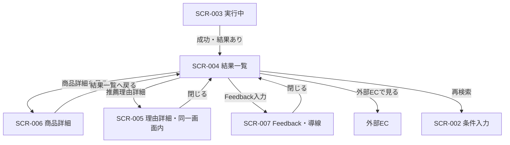

# レコメンド結果一覧画面 画面仕様書

## 1. ドキュメント情報

| 項目     | 内容                     |
| -------- | ------------------------ |
| 画面ID   | `SCR-004`                |
| 画面名   | レコメンド結果一覧画面   |
| 画面種別 | `通常画面`               |
| MVP対象  | `○`                      |
| 作成日   | 2026-07-14               |
| 更新日   | 2026-07-14               |

---

## 2. 概要

API-PUB-002（レコメンド実行）の成功レスポンスのうち、推薦結果あり（`resultItemCount > 0`）の結果を順位付きで表示する MVP 中核の結果画面である。一覧データは実行 API の Response を正とし、SCR-002 / SCR-003 経由で sessionStorage に保存された `RecommendationRunResponseData` を route の `resultId` で読み取って表示する（API一覧 §13.1）。

---

## 3. 目的

- 推薦された商品を順位付きで一覧し、各商品の短い推薦理由をユーザーに伝えること
- 商品詳細・外部EC・再検索への導線を提供すること
- 推薦理由詳細（SCR-005）をモーダルまたは画面内展開として本画面内で扱えること
- Feedback（SCR-007 / API-PUB-004）本実装を別レーンに残しつつ、MVP では導線レベルを定義すること

---

## 4. 対象ユーザー

| ユーザー種別 | 内容                                           |
| ------------ | ---------------------------------------------- |
| 主利用者     | ギフトを探したい一般ユーザー（MVP は非認証） |
| 補助利用者   | なし（MVP）                                    |
| 管理者       | なし（本画面は管理機能を持たない）             |

---

## 5. 画面表示条件

| 項目            | 内容                                                                 |
| --------------- | -------------------------------------------------------------------- |
| 表示URL / Route | `/recommendations/{result_id}`（確定。画面一覧 §4.4・画面遷移図 §10 と一致。実装 path: `/recommendations/[resultId]`） |
| 遷移元          | SCR-003（推薦成功・結果あり）。商品詳細（SCR-006）からの戻り、推薦理由詳細・Feedback 表示の閉じる |
| 遷移先          | SCR-006（商品詳細）、SCR-005（理由詳細・同一画面内）、SCR-007（Feedback・導線）、SCR-002（再検索）、外部EC |
| 認証要否        | `false`（MVP 非認証）                                                |
| 権限条件        | なし                                                                 |
| 初期表示条件    | route の `resultId` と一致する sessionStorage 結果が存在するとき、一覧を表示可能にする |

---

## 6. 画面遷移



### 6.1 遷移一覧

|  No | 操作               | 遷移先                         | 条件                         | 備考 |
| --: | ------------------ | ------------------------------ | ---------------------------- | ---- |
|   1 | 推薦成功・結果あり | SCR-004                        | SCR-003 から。items ≥ 1      | sessionStorage へ結果保存済み前提 |
|   2 | 商品詳細を見る     | SCR-006                        | Item カード操作              | MVP は導線定義まで可（SCR-006 本体は別） |
|   3 | 推薦理由詳細を見る | SCR-005（モーダル／展開）      | Item 単位                    | 独立 route にしない |
|   4 | Feedback入力       | SCR-007（オーバーレイ）        | Item または結果単位          | API-PUB-004 本実装は別レーン。導線プレースホルダ可 |
|   5 | 外部ECで見る       | 外部サイト（`itemUrl`）        | Item 単位                    | 新規タブ推奨 |
|   6 | 再検索             | SCR-002 `/recommendations`     | 常時                         | 入力復元は SCR-002 仕様書 §6.2 |
|   7 | 結果一覧へ戻る     | SCR-004                        | SCR-006 から                 | 同一 `resultId` を維持 |

### 6.2 結果データの受け渡し

| 項目 | 方針 |
| ---- | ---- |
| 正本 | API-PUB-002 成功レスポンスの `data`（`RecommendationRunResponseData`） |
| 保存 | SCR-002 / SCR-003 到達時に sessionStorage へ保存（キー接頭辞 + `recommendationResultId`）。実装先例: `storeRecommendationResult` |
| 読取 | 本画面マウント時に route `resultId` で `readRecommendationResult(resultId)` |
| 不一致 | route の `resultId` と保存データの `recommendationResultId` が一致しない、または未保存の場合は「結果データなし」状態（§11.3） |
| 再取得 | MVP では結果再取得用 Public API（API-FUT-002）は対象外。表示は保存済み Response のみ |

---

## 7. 画面レイアウト

### 7.1 レイアウト概要

単一カラムの一覧画面。上部に画面タイトルと再検索導線、中央に順位付き商品カード相当の行（既存デザインルールに従い過剰なカード装飾は避ける）、各行に推薦理由要約・バッジ・操作ボタン群を配置する。

### 7.2 ワイヤーフレーム簡易図

```text
┌──────────────────────────────────────────┐
│ Header: おすすめのギフト                 │
│ [ 条件を変更して再検索 ]                 │
├──────────────────────────────────────────┤
│ [Alert: 結果データなし / 注意]           │
│                                          │
│ ┌ Item #1 ────────────────────────────────┐
│ │ [画像]  商品名                          │
│ │         キャッチコピー                  │
│ │         ¥価格                           │
│ │         [badge][badge]                  │
│ │         reason_summary                  │
│ │         [理由の詳細] [商品詳細] [外部EC] │
│ │         [Feedback]（導線）              │
│ └─────────────────────────────────────────┘
│ ... Item #N                               │
└──────────────────────────────────────────┘
│ （SCR-005）理由詳細 モーダル／展開       │
```

### 7.3 画面領域

| 領域   | 内容                                         | 表示条件                 |
| ------ | -------------------------------------------- | ------------------------ |
| Header | 画面タイトル・再検索導線                     | 常時                     |
| Main   | Alert・結果一覧・理由詳細（同一画面内）      | 結果あり時に一覧表示     |
| Footer | なし                                         | -                        |

---

## 8. 表示項目

|  No | 項目名               | 物理名 / key（UI）           | 型      | 表示形式   | 必須 | 表示条件                 | 備考 |
| --: | -------------------- | ---------------------------- | ------- | ---------- | ---- | ------------------------ | ---- |
|   1 | 画面タイトル         | `pageTitle`                  | string  | テキスト   | -    | 常時                     | 「おすすめのギフト」等 |
|   2 | 再検索ボタン         | `researchButton`             | action  | Button/Link| -    | 常時                     | SCR-002 へ |
|   3 | 推薦順位             | `rank`                       | number  | テキスト   | ○    | Item 表示時              | API: `items[].rank`。数値スコアではない |
|   4 | 商品画像             | `itemImageUrl`               | url     | Image      | △    | URL があるとき           | 無し時はプレースホルダ |
|   5 | 商品名               | `itemName`                   | string  | テキスト   | ○    | Item 表示時              | |
|   6 | 商品キャッチコピー   | `itemCatchcopy`              | string  | テキスト   | △    | 値があるとき             | ショップ名の代替にしない |
|   7 | 価格                 | `itemPrice`                  | number  | 通貨表示   | ○    | Item 表示時              | JPY。`¥` 付与 |
|   8 | 推薦理由バッジ       | `reasonBadges`               | list    | Badge      | △    | 配列があるとき           | `label` を表示 |
|   9 | 推薦理由要約         | `reasonSummary`              | string  | テキスト   | △    | 値があるとき             | `isFallback=true` 時は汎用理由である旨を控えめに示してよい |
|  10 | 推薦理由詳細ボタン   | `reasonDetailButton`         | action  | Button     | -    | Item 表示時              | SCR-005 を開く |
|  11 | 商品詳細ボタン       | `itemDetailButton`           | action  | Button/Link| -    | Item 表示時              | SCR-006 へ（導線） |
|  12 | 外部EC遷移ボタン     | `externalEcButton`           | action  | Button/Link| -    | `itemUrl` があるとき     | 外部タブ |
|  13 | Feedback入力導線     | `feedbackEntry`              | action  | Button     | -    | Item 表示時（MVP）       | 本実装は別レーン。無効／プレースホルダ可 |
|  14 | 結果欠落 Alert       | `missingResultAlert`         | alert   | Alert      | -    | sessionStorage 無し時    | 条件入力へ戻る導線 |
|  15 | 表示メッセージ       | `displayMessage`             | string  | テキスト   | △    | API が返したとき         | 補足のみ |

### 8.1 表示しない項目

| 項目 | 理由 |
| ---- | ---- |
| `shopName` | MVP 表示対象外（画面一覧 §4.4） |
| `final_score` の数値 | ユーザー向けには順位（`rank`）として表示 |
| `score_breakdown` | 内部評価・デバッグ用 |
| `model_version_id` | 内部再現性管理用 |
| `reason_basis` | 内部根拠管理用 |
| Reco Internal 専用フィールド | Public Response 外 |

---

## 9. 入力項目

なし（本画面は表示・導線が主。Feedback 本文入力は SCR-007 / API-PUB-004 レーン側）。

---

## 10. 操作仕様

|  No | 操作               | トリガー           | 処理内容 | 成功時 | 失敗時 | 備考 |
| --: | ------------------ | ------------------ | -------- | ------ | ------ | ---- |
|   1 | 初期読取           | マウント           | sessionStorage から結果読取 | 一覧表示 | 結果なし Alert | |
|   2 | 推薦理由詳細を見る | ボタン             | SCR-005 モーダル／展開を開く | 詳細表示 | - | MVP は `reasonSummary` / badges の再掲で可。詳細文が無い場合はその旨 |
|   3 | 理由詳細を閉じる   | 閉じる             | オーバーレイを閉じる | 一覧へ | - | |
|   4 | 商品詳細を見る     | ボタン             | SCR-006 へ遷移（`itemId` 等） | 詳細画面 | - | SCR-006 未実装時は Human 判断でスタブ可 |
|   5 | 外部ECで見る       | ボタン             | `itemUrl` を新規タブで開く | 外部サイト | URL 無しは非表示／無効 | |
|   6 | Feedback入力       | ボタン             | SCR-007 導線。本実装は別レーン | オーバーレイ or 案内 | - | API-PUB-004 呼び出しは本 Task / 本 Epic 実装段階では必須としない |
|   7 | 再検索             | ボタン             | SCR-002 `/recommendations` へ。クエリ／sessionStorage 復元は SCR-002 §6.2 | 条件入力 | - | |

---

## 11. 状態別表示仕様

### 11.1 初期表示

- sessionStorage 読取完了まで短い Loading（「読み込み中…」等）
- 読取成功かつ `items.length > 0` のとき一覧を `rank` 昇順で表示
- `resultStatus` / `resultItemCount` と表示件数の整合を確認する（不一致時は表示件数を `items` 実数に合わせ、必要なら Alert）

### 11.2 Loading状態

| 種別 | 表示 | 操作 |
| ---- | ---- | ---- |
| sessionStorage 読取 | 短い Loading テキスト | 操作不可 |
| 商品詳細 API（将来） | SCR-006 側 | 本画面では必須としない |
| Feedback 送信（将来） | SCR-007 側 | 本画面では必須としない |

### 11.3 Empty状態（結果データなし）

- sessionStorage に該当 `resultId` が無い、または JSON 破損
- Alert（warning）で案内し、「条件入力へ戻る」で SCR-002 へ
- 空配列（0件）で本画面に来た場合は設計逸脱（SCR-009 へ送るのが正）。検知時は 0件向けメッセージ＋再検索を表示し、実装レビューで修正対象とする

### 11.4 Error状態

| 種別 | 表示 |
| ---- | ---- |
| 結果欠落 | §11.3 |
| 外部EC URL 不正 | 該当ボタンを出さない／無効 |
| Feedback 未実装 | 導線を disabled + 短い説明、または非表示（実装時に一本化） |

本画面到達前の API-PUB-002 失敗は SCR-008 の責務であり、本画面では再実行しない。

### 11.5 Success状態

- `items` を順位付きで表示
- `reasonSummary` / `reasonBadges` をカード上に表示
- `isFallback === true` の Item は汎用理由である可能性を UI で過度に喧伝しない（控えめな補足可）

---

## 12. バリデーション仕様

なし（入力フォームなし）。表示前に以下の防御的チェックのみ行う。

|  No | 対象 | 内容 | 失敗時 |
| --: | ---- | ---- | ------ |
|   1 | `resultId` | 非空の path パラメータ | 結果なし扱い |
|   2 | 保存データ | JSON として parse 可能 | 結果なし扱い |
|   3 | `items` | 配列であること | 結果なしまたは空表示＋再検索 |

---

## 13. エラー表示仕様

| エラー種別 | 発生条件 | 表示内容 | ユーザー操作 | 備考 |
| ---------- | -------- | -------- | ------------ | ---- |
| 結果データなし | sessionStorage 欠落／破損 | Alert + 条件入力へ戻る | SCR-002 へ | |
| API通信エラー | 本画面では原則発生しない（一覧再取得なし） | - | - | PUB-003 / PUB-004 は各導線側 |
| 認証エラー | MVP 非対象 | - | - | |
| 権限エラー | MVP 非対象 | - | - | |
| 入力エラー | なし | - | - | |
| 想定外エラー | レンダリング例外等 | 汎用エラー＋再検索 | SCR-002 へ | secret を出さない |

---

## 14. API連携仕様

### 14.1 利用API一覧

|  No | API名 | Method | Endpoint | 利用タイミング | 用途 |
| --: | ----- | ------ | -------- | -------------- | ---- |
|   1 | API-PUB-002 レコメンド実行 | `POST` | `/api/v1/recommendations` | **本画面では呼び出さない**（先行画面で実行済み） | 一覧データの契約正本（Response） |
|   2 | API-PUB-003 商品詳細取得 | `GET` | `/api/v1/items/{itemId}` | SCR-006 側（本画面は導線のみ） | 商品詳細 |
|   3 | API-PUB-004 Feedback送信 | `POST` | `/api/v1/recommendation-results/{resultId}/feedback` | SCR-007 / 別レーン | Feedback。本 Epic では本実装必須としない |

### 14.2 Request

本画面からの API-PUB-002 再 Request は行わない。

### 14.3 Response（表示に用いる契約）

Public `RecommendationRunResponseData` / `PublicRecommendationResultItem`（generated 準拠）を表示ソースとする。例:

```json
{
  "recommendationResultId": "res_xxx",
  "recommendationRequestId": "req_xxx",
  "recommendationRunId": "run_xxx",
  "resultStatus": "success",
  "topK": 10,
  "resultItemCount": 3,
  "fallbackUsed": false,
  "displayMessage": null,
  "items": [
    {
      "recommendationResultItemId": "rii_1",
      "itemId": "item_1",
      "rank": 1,
      "itemName": "サンプル商品",
      "itemPrice": 4200,
      "itemUrl": "https://example.invalid/item/1",
      "itemImageUrl": "https://example.invalid/img/1.jpg",
      "itemCatchcopy": "感謝が伝わる上品な一品",
      "reasonSummary": "フォーマル度と安心感のバランスが良いため",
      "reasonBadges": [{ "label": "上品", "code": "elegant" }],
      "isFallback": false
    }
  ]
}
```

### 14.4 画面項目とのマッピング

| 画面項目 | API項目（PUB-002 Response） | 変換内容 | 備考 |
| -------- | --------------------------- | -------- | ---- |
| route `resultId` | `recommendationResultId` | 一致確認 | 不一致は結果なし |
| 順位 | `items[].rank` | そのまま表示 | final_score は出さない |
| 商品名 | `items[].itemName` | そのまま | |
| 価格 | `items[].itemPrice` | JPY 表示 | |
| 画像 | `items[].itemImageUrl` | optional | |
| キャッチコピー | `items[].itemCatchcopy` | optional | |
| 外部EC | `items[].itemUrl` | リンク | |
| 理由要約 | `items[].reasonSummary` | optional | |
| 理由バッジ | `items[].reasonBadges[].label` | 配列表示 | |
| 汎用理由フラグ | `items[].isFallback` | UI 補足 | |
| 商品詳細キー | `items[].itemId` | SCR-006 / PUB-003 | |
| Feedback キー | `recommendationResultId` / `recommendationResultItemId` | SCR-007 / PUB-004 | |
| shopName | `items[].shopName` | **表示しない** | |

---

## 15. データ取得・更新タイミング

| タイミング | 処理 | 対象API / 処理 | 備考 |
| ---------- | ---- | -------------- | ---- |
| 初期表示時 | sessionStorage 読取 | ローカルのみ | PUB-002 再呼び出しなし |
| ユーザー操作時 | モーダル開閉・外部遷移・再検索 | なし／導線 | |
| 再表示時（同一 tab） | 同一キー再読取 | ローカルのみ | 別 tab 間共有は保証しない |
| Feedback 送信後 | （将来）一覧に戻る | PUB-004 | 別レーン |

画面状態は DB に保存しない。

---

## 16. 非機能・UX観点

| 観点 | 方針 |
| ---- | ---- |
| レスポンシブ対応 | モバイル優先の単一カラム。画像＋テキストが折り返しで崩れないこと |
| アクセシビリティ | ボタンに明確な名前。モーダルは focus trap / Esc 閉じるを推奨 |
| パフォーマンス | 一覧は数十件未満（`topK` 上限内）。重い再取得をしない |
| SEO | 対象外（アプリ画面） |
| 多言語対応 | MVP 対象外（日本語固定） |
| ブラウザ対応 | 現行 web-foundation の対象ブラウザに従う |

---

## 17. セキュリティ観点

| 観点 | 方針 |
| ---- | ---- |
| 認証 | MVP 非認証 |
| 認可 | なし（MVP） |
| 個人情報表示 | 推薦結果・入力復元データをログに生出しない |
| secret表示防止 | API key / token を client に埋め込まない |
| XSS対策 | `itemName` / `reasonSummary` / `itemCatchcopy` 等はエスケープ表示。`dangerouslySetInnerHTML` 禁止。外部 URL は `https:` を基本とし、javascript: 等は開かない |
| CSRF対策 | MVP の cookie セッション前提でない。PUB-004 導入時に再検討 |

---

## 18. ログ・計測

| 種別 | 内容 | 出力タイミング | 備考 |
| ---- | ---- | -------------- | ---- |
| 画面表示ログ | SCR-004 表示（resultId の有無） | 初期表示 | PII・商品全文を載せない |
| 操作ログ | 外部ECクリック・再検索・理由詳細オープン | 各操作 | MVP は client 計測最小で可 |
| エラーログ | 結果欠落 | 検知時 | |
| メトリクス | （将来）external_ec_click 等 | API-FUT-005 等 | MVP 任意 |

---

## 19. MVP対象範囲

### 19.1 MVP対象

- sessionStorage 由来の結果一覧表示（順位・商品名・価格・画像・キャッチコピー・理由要約・バッジ）
- 再検索（SCR-002）
- 外部EC遷移（`itemUrl`）
- 推薦理由詳細（SCR-005）をモーダル／展開として本画面内で扱うこと（詳細文が薄い場合は要約再掲で可）
- 商品詳細・Feedback の**導線定義**（スタブ／disabled 可）

### 19.2 MVP対象外

- 結果のサーバ再取得（API-FUT-002）
- final_score / score_breakdown / shopName の表示
- Feedback 本実装および API-PUB-004 結合（別レーン）
- 商品詳細画面（SCR-006）本体の完成（別 Epic／Task）
- レコメンド履歴からの再表示

---

## 20. テスト観点

|  No | 観点 | 確認内容 | 種別 |
| --: | ---- | -------- | ---- |
|   1 | 初期表示 | 保存済み結果が順位付きで表示される | manual / unit |
|   2 | Loading | 読取完了まで Loading が出る | manual |
|   3 | Empty | 未保存 `resultId` で Alert＋再検索 | manual / unit |
|   4 | 非表示項目 | shopName / score 系が出ない | manual |
|   5 | 外部EC | `itemUrl` で新規タブ | manual |
|   6 | 再検索 | SCR-002 へ遷移し入力復元方針と矛盾しない | manual |
|   7 | 理由詳細 | モーダル／展開が開閉できる | manual |
|   8 | レスポンシブ | 狭幅で操作可能 | manual |

---

## 21. レビュー観点

- 画面一覧 §4.4・画面遷移図 §6.4 と画面ID・URL・表示項目が一致しているか
- API一覧の「結果一覧は実行 API の Response で表示」と矛盾していないか
- SCR-002 仕様書の sessionStorage／再検索分担と整合しているか
- SCR-005 を独立画面にしていないか
- Feedback / SCR-006 を導線レベルに留め、API-PUB-004 本実装を混入していないか
- secret / `.env` 実値を含んでいないか

---

## 22. 未決事項

|  No | 論点 | 判断が必要な理由 | 判断者 | 期限 | 備考 |
| --: | ---- | ---------------- | ------ | ---- | ---- |
|   1 | SCR-006 導線の到達先（スタブ URL vs 未リンク） | SCR-006 Epic 未着手の可能性 | Human | 実装 Task 前 | E2E 最小経路では未必須 |
|   2 | Feedback 導線の UI（disabled / 非表示 / 別レーン完了待ち案内） | PUB-004 が並列レーン | Human | 実装 Task 前 | 本仕様は導線定義まで |
|   3 | 推薦理由「詳細」に API フィールドが要約のみの場合の文言 | Public Item に長文 detail が無い | Human / 実装 | 実装時 | 要約再掲＋閉じるで可とする案を推奨 |
|   4 | `isFallback` のユーザー向け表示強度 | 過剰な不信感を避けたい | Human | 実装時 | 控えめ補足を推奨 |

---

## 23. 関連資料

| 種別 | パス / URL | 用途 |
| ---- | ---------- | ---- |
| 画面一覧 | `docs/05_アプリケーション設計/アプリ/web/画面一覧.md` | SCR-004 定義 |
| 画面遷移図 | `docs/05_アプリケーション設計/アプリ/web/画面遷移図.md` | 遷移・表示項目 |
| API一覧 | `docs/05_アプリケーション設計/アプリ/api/API一覧.md` | Response 表示方針 |
| SCR-002 画面仕様書 | `docs/06_実装設計/web/SCR-002_レコメンド条件入力画面画面仕様書.md` | 受け渡し・再検索 |
| OpenAPI / generated | `apps/web/src/generated/api/giftRecommendationServicePublicAPI.schemas.ts` | Response 型 |
| 受け渡し実装先例 | `apps/web/src/features/recommendation-input/form-persistence.ts` | sessionStorage |
| Task Definition | `prompts/definitions/tasks/scr-004-recommendation-result-list/screen-spec.yaml` | 本 Task 条件 |

---

## 24. 備考

- 本画面はレーン1e（入力→結果確認）の最大ブロッカー成果物の仕様正本である
- 既存の `[resultId]/page.tsx` プレースホルダは、実装 Task で本仕様に置換する
- 0件結果（SCR-009）と API 失敗（SCR-008）は本画面の主状態ではない（SCR-002 / SCR-003 仕様に従う）
- Issue: #1237 / Parent Epic: #1236
