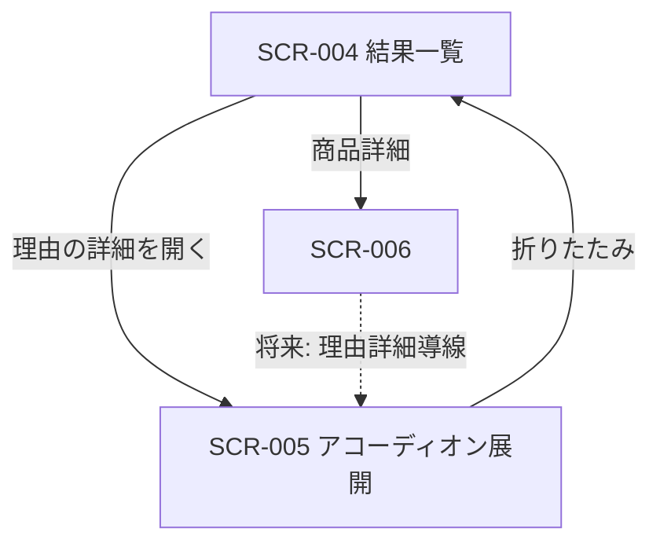

# 推薦理由詳細表示 画面仕様書

## 1. ドキュメント情報

| 項目     | 内容                 |
| -------- | -------------------- |
| 画面ID   | `SCR-005`            |
| 画面名   | 推薦理由詳細表示     |
| 画面種別 | `部品`（画面内展開） |
| MVP対象  | `○`                  |
| 作成日   | 2026-07-16           |
| 更新日   | 2026-07-16           |

---

## 2. 概要

推薦結果の各 Item について、「なぜこの商品か」を詳しく確認するための UI 部品である。独立した URL を持たず、**SCR-004（レコメンド結果一覧）内の Item 単位アコーディオン**として表示する。

画面一覧の画面種別は「モーダル / 部品」、画面遷移図も「モーダルまたは画面内展開」と記載があるが、本仕様（およびホスト画面の正本 [SCR-004_レコメンド結果一覧画面画面仕様書.md](./SCR-004_レコメンド結果一覧画面画面仕様書.md) §7.4）では **MVP はアコーディオン（画面内展開）を採用**し、独立 route・モーダル専用ページは採用しない。

---

## 3. 目的

- カード上では表示しきれない推薦理由を、ユーザーがオンデマンドで確認できるようにすること
- 理由要約・バッジ・注意文を、展開領域で過不足なく提示すること
- SCR-004 の一覧スクロールを阻害せず、複数 Item を比較できるようにすること
- Public API が返す理由フィールドのみを表示し、内部スコア・reason_basis を晒さないこと

---

## 4. 対象ユーザー

| ユーザー種別 | 内容 |
| ------------ | ---- |
| 主利用者     | ギフト候補の選定理由を確認したいエンドユーザー |
| 補助利用者   | なし（MVP） |
| 管理者       | なし（MVP） |

---

## 5. 画面表示条件

| 項目            | 内容 |
| --------------- | ---- |
| 表示URL / Route | **なし**（独立 route を新設しない）。ホストは SCR-004（例: `/recommendations/{resultId}`） |
| 遷移元          | SCR-004 の各 Item 上で「理由の詳細」トグルを開いたとき |
| 遷移先          | なし（折りたたみで非表示に戻る）。Feedback 等の導線はホスト画面側 |
| 認証要否        | 不要（MVP） |
| 権限条件        | なし（MVP） |
| 初期表示条件    | 結果一覧が表示されており、当該 Item のアコーディオンが展開されていること |

---

## 6. 画面遷移



### 6.1 遷移一覧

|  No | 操作               | 遷移先     | 条件                         | 備考 |
| --: | ------------------ | ---------- | ---------------------------- | ---- |
|   1 | 理由の詳細を開く   | SCR-005 展開 | SCR-004 で Item 表示中       | 他 Item の展開状態は変更しない |
|   2 | 理由の詳細を閉じる | SCR-004 一覧 | 展開中                       | モーダル閉じる操作は不要 |
|   3 | （将来）SCR-006 から開く | SCR-005 | 商品詳細に理由詳細導線がある場合 | **本 Epic MVP では深掘りしない**（言及のみ） |

### 6.2 MVP 方針（UI 形態）

| 項目 | MVP 方針 |
| ---- | -------- |
| UI 形態 | **アコーディオン（画面内展開）を採用**（SCR-004 §7.4 と整合。確定事項として扱う） |
| 独立 URL | **採用しない** |
| モーダル専用ページ | **MVP では採用しない**（画面一覧・遷移図の「モーダル」表記は将来選択肢として残すが、本仕様の正はアコーディオン） |
| 同時展開 | **複数 Item 同時オープン可**（排他なし） |
| 初期状態 | **全 Item 折りたたみ** |

---

## 7. 画面レイアウト

### 7.1 レイアウト概要

SCR-004 の各 Item 行内に、トグルリンク／ボタンと展開パネルを配置する。展開パネルは枠線付きの領域とし、高さ上限を超えた内容は**詳細枠内スクロール**とする。

### 7.2 ワイヤーフレーム簡易図

```text
┌─ Item 行（SCR-004）──────────────────────────┐
│ [順位] 商品名 … 価格                         │
│ [badges]                                     │
│ reasonSummary                                │
│ ▶ 理由の詳細                                 │  ← 折りたたみ
└──────────────────────────────────────────────┘

┌─ Item 行（展開時）───────────────────────────┐
│ …（カード上の要約・バッジは維持）            │
│ ▼ 理由の詳細                                 │
│ ┌─ 詳細パネル（高さ上限・枠内スクロール）─┐ │
│ │ [Alert: caution]（任意）               │ │
│ │ reason_points（2〜3）※Public にある場合│ │
│ │ reason_detail ※Public にある場合       │ │
│ │ （無い場合）要約・バッジ再掲 + 案内文  │ │
│ └────────────────────────────────────────┘ │
│ [商品詳細] [外部EC] [Feedback]               │
└──────────────────────────────────────────────┘
```

### 7.3 画面領域

| 領域 | 内容 | 表示条件 |
| ---- | ---- | -------- |
| トグル | `▶ 理由の詳細` / `▼ 理由の詳細` | Item 表示時は常時 |
| 展開パネル | 詳細内容（§8） | トグル展開時 |

### 7.4 展開高さ上限

| 項目 | 方針 |
| ---- | ---- |
| 上限 | モバイル優先の初期目安 **約 `12rem`**（5〜7 行相当）。実装時の微調整可 |
| 超過時 | 詳細枠内スクロール（一覧ページ全体のスクロールとは独立） |
| CSS 例 | `max-h-48` 相当（既存実装の定数と整合） |

---

## 8. 表示項目

### 8.1 展開パネル内の表示項目（理想・ドメイン）

Reason生成定義書および画面一覧に基づく項目。

|  No | 項目名         | ドメイン名         | Public API（現状） | MVP 表示 |
| --: | -------------- | ------------------ | ------------------ | -------- |
|   1 | 推薦理由ポイント | `reason_points`    | **未定義**         | §8.3 参照 |
|   2 | 推薦理由詳細文 | `reason_detail`    | **未定義**         | §8.3 参照 |
|   3 | 注意・補足     | `caution_note`     | `cautionNote`      | ○（値があるとき） |
|   4 | 推薦理由要約（再掲） | `reason_summary` | `reasonSummary`    | △（詳細薄いとき） |
|   5 | 推薦理由バッジ（再掲） | `reason_badges` | `reasonBadges`     | △（詳細薄いとき） |
|   6 | 汎用理由ヒント | （派生）           | `isFallback`       | △（カード上で表示済みなら再掲しない） |

### 8.2 カード上（SCR-004 ホスト）との分担

| 項目 | SCR-004 カード上 | SCR-005 展開内 |
| ---- | ---------------- | -------------- |
| `reasonSummary` | 主表示 | 詳細が薄い場合のみ再掲（最小限） |
| `reasonBadges` | 主表示 | 詳細が薄い場合のみ再掲（最小限） |
| `cautionNote` | 非表示でも可 | **展開時に Alert で表示**（値があるとき） |
| `isFallback` 補足 | カード上で控えめ表示 | 原則再掲しない |
| `reason_points` / `reason_detail` | 非表示 | 利用可能なら展開内の主内容（§8.3） |

### 8.3 Public に無いフィールドの MVP 方針（Human Review 確認待ち）

**事実**: 現行 API-PUB-002 Public `items[]` には `reasonSummary` / `reasonBadges` / `cautionNote` / `isFallback` があり、`reasonPoints` / `reasonDetail` は **OpenAPI 上未定義**である。

| 方針案 | 内容 | 備考 |
| ------ | ---- | ---- |
| **A（提案・本仕様の既定）** | MVP では Public 既存フィールドのみで SCR-005 を充足する。展開時は `cautionNote`（任意）→ `reasonSummary` / `reasonBadges` 再掲 → 「詳細な説明文はありません」相当の案内を表示する | SCR-004 §7.4「詳細文が薄い場合」と整合。OpenAPI 変更不要 |
| B | Public に `reasonPoints` / `reasonDetail` を追加してから SCR-005 を完成させる | Contract Gate / 別 Epic。本 Epic の out of scope |

**本仕様書の実装前提（案 A）**: 案 A を採用する。案 B が必要になった場合は Human 判断のうえ別 Epic 化する。

案 A における展開内容の優先順位:

1. `cautionNote`（値があるとき Alert）
2. `reasonSummary` 再掲（値があるとき）
3. `reasonBadges` 再掲（配列があるとき）
4. 短い案内文（詳細文が無い旨）

将来 Public に `reasonPoints` / `reasonDetail` が追加された場合の優先順位（SCR-004 §7.4）:

1. `reason_points`（2〜3）
2. 短い `reason_detail`
3. 必要時のみ `caution_note`
4. カード上要約・バッジの再掲は最小限

### 8.4 表示しない項目

| 項目 | 理由 |
| ---- | ---- |
| `final_score` / `score_breakdown` | 内部評価 |
| `reason_basis` | 内部根拠 |
| Reco Internal 専用フィールド | Public Response 外 |

---

## 9. 入力項目

なし（表示・開閉のみ。Feedback 入力は SCR-007）。

---

## 10. 操作仕様

|  No | 操作 | トリガー | 処理内容 | 成功時 | 失敗時 | 備考 |
| --: | ---- | -------- | -------- | ------ | ------ | ---- |
|   1 | 展開 | トグル（折りたたみ時） | 当該 Item のパネルを開く | 詳細表示 | - | `aria-expanded=true` |
|   2 | 折りたたみ | トグル（展開時） | パネルを閉じる | 非表示 | - | |
|   3 | 枠内スクロール | 展開領域内 | 高さ上限超過分を閲覧 | 続き表示 | - | ページスクロールと独立 |

Feedback・商品詳細・外部 EC・再検索は **SCR-004 ホスト側の操作**とし、本仕様の主対象外とする（展開中もホスト操作は利用可能）。

---

## 11. 状態別表示仕様

### 11.1 折りたたみ（初期）

- トグル表示: `▶ 理由の詳細`
- 展開パネル非表示

### 11.2 展開（詳細あり相当・案 A）

- トグル表示: `▼ 理由の詳細`
- §8.3 案 A の優先順位で内容表示
- `cautionNote` がある場合は warning Alert（タイトル例: 「注意」）

### 11.3 展開（詳細文が特に薄い）

- `reasonSummary` / `reasonBadges` / `cautionNote` がすべて空でも、案内文のみで展開可能とする（空パネルを避け、折りたたみ可能にする）

### 11.4 `isFallback=true`

- カード上の汎用理由ヒントは SCR-004 側で表示済み想定
- 展開パネルでは要約再掲時に同様のニュアンスを重複させすぎない（必要なら 1 行に留める）

---

## 12. エラー・例外

| 状況 | 表示 | 操作 |
| ---- | ---- | ---- |
| sessionStorage 欠落等 | SCR-004 の結果欠落 UI | SCR-005 は描画されない |
| 外部 URL 不正 | SCR-004 側で外部 EC 非表示／無効 | SCR-005 とは独立 |

本部品単体の API 呼び出しは行わない（結果はホストが保持する sessionStorage / props）。

---

## 13. API / データ依存

| 項目 | 内容 |
| ---- | ---- |
| 主データ | API-PUB-002 Response の `items[]`（SCR-004 経由） |
| 利用フィールド（MVP） | `reasonSummary`, `reasonBadges`, `cautionNote`, `isFallback` |
| 未利用（将来） | `reasonPoints`, `reasonDetail`（Public 追加後） |
| 再取得 | しない |

---

## 14. UI コンポーネント対応

| 用途 | 部品 | 備考 |
| ---- | ---- | ---- |
| 注意文 | `Alert`（warning） | `cautionNote` |
| 本文 | `Text` | 要約・案内 |
| バッジ | 簡易 chip / list | カード上と同趣旨 |
| トグル | button（リンク風可） | `aria-expanded` / `aria-controls` |

---

## 15. アクセシビリティ

| 項目 | 方針 |
| ---- | ---- |
| 開閉状態 | `aria-expanded` |
| パネル関連 | `aria-controls` とパネル `id` |
| キーボード | トグルは button として Enter / Space で操作可能 |

---

## 16. セキュリティ

| 項目 | 方針 |
| ---- | ---- |
| XSS | `reasonSummary` / badge label / `cautionNote` はエスケープ表示。`dangerouslySetInnerHTML` 禁止 |
| 内部情報 | スコア・reason_basis を表示しない |

---

## 17. SCR-004 / 既存実装とのギャップ（実装 Task 向け）

**事実（現行 develop）**:

- Item 内アコーディオン・高さ上限・`cautionNote` Alert・要約／バッジ再掲・案内文は実装済み
- Public に無い `reasonPoints` / `reasonDetail` の描画は未実装（フィールド自体が無い）

| ギャップ | 実装 Task での扱い（案） |
| -------- | ------------------------ |
| 仕様正本化 | 本仕様書を正とし、定数文言・a11y を仕様に合わせる |
| 詳細フィールド | 案 A 採用時は追加不要。案 B 採用時は別 Epic |
| コンポーネント切り出し | 任意。`ReasonDetailPanel` 等への抽出は可読性のため検討可（必須ではない） |
| SCR-006 導線 | 本 Epic では対象外 |

---

## 18. テスト観点（単体テスト Task 向け）

|  No | 観点 | 期待 |
| --: | ---- | ---- |
|   1 | 初期折りたたみ | パネル非表示 |
|   2 | 展開 | パネル表示・`aria-expanded=true` |
|   3 | caution | `cautionNote` があるとき Alert |
|   4 | 薄い詳細 | 要約／バッジ再掲＋案内文 |
|   5 | 同時展開 | 複数 Item を同時に開ける |
|   6 | 高さ上限 | 長文時に枠内スクロールクラスが付与される |

---

## 19. Human Review 観点

- アコーディオン採用（モーダル非採用）でよいか（画面一覧表記との整合）
- §8.3 **案 A**（Public 既存フィールドのみ）で MVP 完了としてよいか
- SCR-006 からの理由詳細は後続でよいか
- 展開高さ `12rem` 目安でよいか

---

## 20. 関連ドキュメント

| ドキュメント | 関係 |
| ------------ | ---- |
| [画面一覧.md](../../05_アプリケーション設計/アプリ/web/画面一覧.md) | SCR-005 行・表示項目 |
| [画面遷移図.md](../../05_アプリケーション設計/アプリ/web/画面遷移図.md) | 部品／モーダル扱い |
| [SCR-004_レコメンド結果一覧画面画面仕様書.md](./SCR-004_レコメンド結果一覧画面画面仕様書.md) | ホスト・§7.4 |
| [API-PUB-002_レコメンド実行API契約仕様書.md](../api/API-PUB-002_レコメンド実行API契約仕様書.md) | Public Item フィールド |
| [Reason生成定義書.md](../../04_ドメインモデル設計/Reason生成定義書.md) | 理由項目の意味 |
| [レーン1e_手動E2Eチェックリスト.md](../cross_cutting/レーン1e_手動E2Eチェックリスト.md) | D1 S5 |
