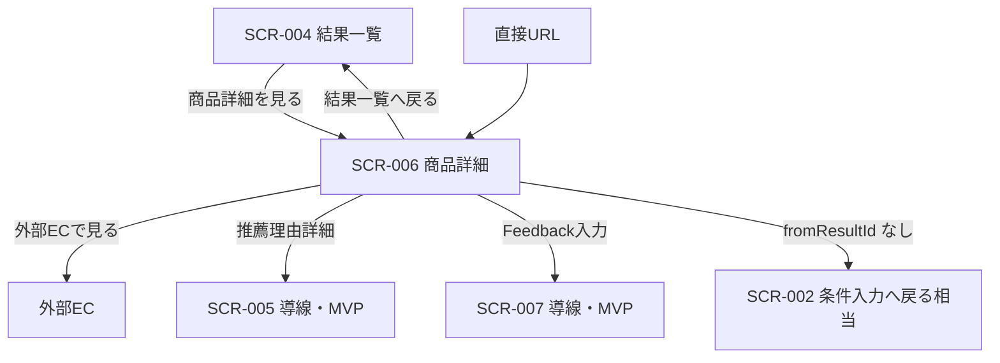

# 商品詳細画面 画面仕様書

## 1. ドキュメント情報

| 項目     | 内容               |
| -------- | ------------------ |
| 画面ID   | `SCR-006`          |
| 画面名   | 商品詳細画面       |
| 画面種別 | `通常画面`         |
| MVP対象  | `○`                |
| 作成日   | 2026-07-15         |
| 更新日   | 2026-07-15         |

---

## 2. 概要

推薦商品の詳細情報（商品名・説明・価格・画像・外部 EC URL 等）を **API-PUB-003（商品詳細取得）** で取得して表示する MVP 画面である。レコメンド結果一覧（SCR-004）から遷移した場合は、query `fromResultId` と sessionStorage 上の `RecommendationRunResponseData` から推薦文脈（順位・理由要約等）を補完表示する。推薦理由詳細（SCR-005）・Feedback（SCR-007）は MVP では導線レベルに留める。

---

## 3. 目的

- 推薦商品の詳細情報をユーザーが確認できるようにすること
- 外部 EC（楽天商品ページ等）への遷移導線を提供すること
- SCR-004 から遷移した場合、推薦順位・理由要約などの文脈を可能な範囲で表示すること
- 商品不存在・表示不可・通信障害時に、API-PUB-003 契約に沿ったエラー UX を提供すること

---

## 4. 対象ユーザー

| ユーザー種別 | 内容                                           |
| ------------ | ---------------------------------------------- |
| 主利用者     | ギフトを探したい一般ユーザー（MVP は非認証） |
| 補助利用者   | なし（MVP）                                    |
| 管理者       | なし（本画面は管理機能を持たない）             |

---

## 5. 画面表示条件

| 項目            | 内容                                                                 |
| --------------- | -------------------------------------------------------------------- |
| 表示URL / Route | `/items/{itemId}`（確定。画面一覧 §4.6・画面遷移図 §6.6 と一致。実装 path: `app/items/[itemId]`） |
| Query           | `fromResultId`（任意）。SCR-004 からの戻り先 `recommendationResultId` を保持する |
| 遷移元          | SCR-004（商品詳細を見る）。直接 URL アクセス（ブックマーク等）も許容 |
| 遷移先          | SCR-004（結果一覧へ戻る）、外部 EC、SCR-005（導線・MVP）、SCR-007（導線・MVP） |
| 認証要否        | `false`（MVP 非認証）                                                |
| 権限条件        | なし                                                                 |
| 初期表示条件    | route の `itemId` が非空であること。マウント時に API-PUB-003 を呼び出す |

---

## 6. 画面遷移



### 6.1 遷移一覧

|  No | 操作               | 遷移先                         | 条件                         | 備考 |
| --: | ------------------ | ------------------------------ | ---------------------------- | ---- |
|   1 | 商品詳細を見る     | SCR-006                        | SCR-004 から                 | `buildItemDetailHref(itemId, resultId)` で `fromResultId` 付与 |
|   2 | 結果一覧へ戻る     | SCR-004 `/recommendations/{resultId}` | `fromResultId` があるとき | 同一 `resultId` を維持 |
|   3 | 条件入力へ戻る     | SCR-002 `/recommendations`     | `fromResultId` がないとき    | 結果文脈なしの戻り先 |
|   4 | 外部ECで見る       | 外部サイト（`itemUrl`）        | API 成功かつ URL が安全      | 新規タブ。`isSafeExternalUrl` 準拠 |
|   5 | 推薦理由詳細を見る | SCR-005（導線・disabled）      | 推薦文脈がある／ないに関わらず MVP は導線のみ | 本 Epic では独立展開・モーダル本実装は対象外 |
|   6 | Feedback入力       | SCR-007（導線・disabled）      | 同上                         | API-PUB-004 本実装は別レーン |

### 6.2 データの受け渡し

| 項目 | 方針 |
| ---- | ---- |
| 商品詳細の正本 | API-PUB-003 成功レスポンスの `data`（Item 詳細） |
| 推薦文脈の正本 | API-PUB-002 成功レスポンスの `data`（`RecommendationRunResponseData`）。本画面では **再 API 呼び出ししない** |
| 推薦文脈の読取 | query `fromResultId` があるとき、マウント時に `readRecommendationResult(fromResultId)` で sessionStorage を読み、`items[]` から route `itemId` と一致する Item を特定する |
| 文脈不一致 | `fromResultId` があるが sessionStorage に該当結果が無い、または `items[]` に当該 `itemId` が無い場合は、推薦文脈行（順位・理由要約等）を **表示しない**（ invent しない） |
| 直接アクセス | `fromResultId` 無しでも API-PUB-003 により商品詳細のみ表示可能。推薦文脈行は非表示 |
| SCR-004 導線 | SCR-004 実装 Task 完了後、実装 Task で SCR-004 の「商品詳細」リンクを本画面（本仕様）へ差し替える（SCR-004 本文の更新は別 Task） |

---

## 7. 画面レイアウト

### 7.1 レイアウト概要

単一カラムの詳細画面。上部に戻る導線、メインに商品画像・名称・価格・説明、推薦文脈ブロック（条件付き）、操作ボタン群（外部 EC・SCR-005/007 導線）を配置する。SCR-004 と同様、過剰なカード装飾は避け、デザインルール §6.3・§9（SCR-006）に従う。

### 7.2 ワイヤーフレーム簡易図

```text
┌──────────────────────────────────────────┐
│ Header: 商品詳細                         │
│ ← 結果一覧へ戻る（fromResultId 時）      │
│   または 条件入力へ戻る（直接アクセス時）│
├──────────────────────────────────────────┤
│ [Alert: エラー]（Error 時）              │
│ [Loading: 読み込み中…]（Loading 時）     │
│                                          │
│ ┌ 商品ブロック ─────────────────────────┐│
│ │ [画像 / プレースホルダ]               ││
│ │ （複数 images[] がある場合は代表＋   ││
│ │  サムネイル列は実装 Task で任意）     ││
│ │ 商品名                                ││
│ │ キャッチコピー（あれば）              ││
│ │ ¥価格                                 ││
│ │ レビュー概要（あれば）                ││
│ │ ジャンル名 / 人気バッジ（あれば）     ││
│ │ 商品説明（折りたたみ可・長文時）      ││
│ └───────────────────────────────────────┘│
│                                          │
│ ┌ 推薦文脈（fromResultId＋session 時）─┐│
│ │ 推薦順位: N 位                        ││
│ │ reasonSummary                         ││
│ │ [badge][badge]                        ││
│ │ cautionNote（あれば）                 ││
│ │ isFallback 時は控えめ補足             ││
│ └───────────────────────────────────────┘│
│                                          │
│ [外部ECで見る]                           │
│ [推薦理由詳細]（disabled・準備中）       │
│ [Feedback]（disabled・準備中）           │
└──────────────────────────────────────────┘
```

### 7.3 画面領域

| 領域   | 内容                                         | 表示条件                 |
| ------ | -------------------------------------------- | ------------------------ |
| Header | 画面タイトル・戻る導線                       | 常時（Error 時も戻る導線は可能なら表示） |
| Main   | Loading / Error Alert / 商品詳細 / 推薦文脈 / 操作 | API 成功時に商品ブロック表示 |
| Footer | なし                                         | -                        |

### 7.4 推薦文脈ブロック方針

| 項目 | 方針 |
| ---- | ---- |
| 表示条件 | query `fromResultId` が非空 **かつ** sessionStorage から当該 `itemId` の Item が取得できたときのみ |
| データソース | Public `PublicRecommendationResultItem`（PUB-002 Response の `items[]`）。PUB-003 には含まれない |
| 表示項目 | `rank`、`reasonSummary`、`reasonBadges[].label`、`cautionNote`、`isFallback` 補足 |
| 非表示項目 | SCR-006 MVP では `reasonDetail` / `reasonPoints` を **表示必須としない**（SCR-005 展開 UI が主利用。Public 契約上は任意フィールドとして存在する #1398） |
| 欠落時 | 文脈ブロック全体を省略。商品詳細（PUB-003）のみ表示 |

---

## 8. 表示項目

|  No | 項目名               | 物理名 / key（UI）           | 型      | 表示形式   | 必須 | 表示条件                 | 備考 |
| --: | -------------------- | ---------------------------- | ------- | ---------- | ---- | ------------------------ | ---- |
|   1 | 画面タイトル         | `pageTitle`                  | string  | テキスト   | -    | 常時                     | 「商品詳細」 |
|   2 | 戻るリンク           | `backLink`                   | action  | BackLink   | -    | 常時                     | §6.1 の戻り先 |
|   3 | 商品画像（代表）     | `itemImageUrl`               | url     | Image      | △    | PUB-003 に URL があるとき | 無し時はプレースホルダ（§11.5） |
|   4 | 商品画像一覧         | `images[]`                   | list    | Image      | △    | `images` 配列があるとき  | MVP は代表画像優先。複数表示は実装 Task で任意 |
|   5 | 商品名               | `itemName`                   | string  | テキスト   | ○    | API 成功時               | PUB-003 |
|   6 | 商品キャッチコピー   | `itemCatchcopy`              | string  | テキスト   | △    | 値があるとき             | ショップ名の代替にしない |
|   7 | 価格                 | `itemPrice`                  | number  | 通貨表示   | ○    | API 成功時               | JPY。`¥` 付与 |
|   8 | 商品説明             | `itemDescription`            | string  | テキスト   | △    | 値があるとき             | 長文は折りたたみ可（§22.1） |
|   9 | レビュー概要         | `reviewSummary`              | object  | テキスト   | △    | `reviewSummary` があるとき | 平均・件数を簡潔に |
|  10 | ジャンル名           | `genreName`                  | string  | テキスト   | △    | 値があるとき             | `genreId` はユーザー向け primary 表示にしない |
|  11 | 人気バッジ           | `popularityBadge`            | object  | Badge      | △    | 値があるとき             | `label` を表示。内部スコアは出さない |
|  12 | 推薦順位             | `rank`                       | number  | テキスト   | △    | 推薦文脈ブロック表示時     | sessionStorage 由来 |
|  13 | 推薦理由要約         | `reasonSummary`              | string  | テキスト   | △    | 推薦文脈ブロック表示時     | sessionStorage 由来 |
|  14 | 推薦理由バッジ       | `reasonBadges`               | list    | Badge      | △    | 配列があるとき             | sessionStorage 由来 |
|  15 | 注意事項             | `cautionNote`                | string  | テキスト   | △    | 値があるとき             | sessionStorage 由来 |
|  16 | 汎用理由補足         | `isFallbackHint`             | string  | テキスト   | △    | `isFallback === true` 時 | SCR-004 と同強度（控えめ） |
|  17 | 外部EC遷移ボタン     | `externalEcButton`           | action  | Button/Link| -    | `itemUrl` が安全なとき   | ExternalLink / secondary |
|  18 | 推薦理由詳細導線     | `reasonDetailEntry`          | action  | Button     | -    | MVP 常時（disabled）     | SCR-005 本実装は別 Epic |
|  19 | Feedback入力導線     | `feedbackEntry`              | action  | Button     | -    | MVP 常時（disabled）     | SCR-007 / API-PUB-004 は別レーン |
|  20 | エラー Alert         | `errorAlert`                 | alert   | Alert      | -    | API / 状態エラー時       | §13 マッピング |

### 8.1 表示しない項目

| 項目 | 理由 |
| ---- | ---- |
| `shopName` | MVP 表示対象外（画面一覧 §4.6・API-PUB-003 契約上 optional だが画面では出さない） |
| `itemId` | ユーザー向け primary ラベルにしない（エラー/debug 用 muted 表示も原則不要） |
| `genreId` | 内部識別子。`genreName` があれば名称のみ可 |
| `itemFeature` / `embedding` / 内部スコア | API-PUB-003 契約上返却しない |
| `final_score` / `score_breakdown` | 内部評価 |
| `model_version_id` / `reason_basis` | 内部管理用 |
| `reasonDetail` / `reasonPoints` | Public PUB-002 に **任意**で存在しうる（#1398）。SCR-006 MVP では表示必須化しない（SCR-005 が主利用。画面一覧 §4.6 の △ 方針は維持） |
| Reco Internal 専用フィールド | Public Response 外 |

---

## 9. 入力項目

なし（本画面は表示・導線が主。Feedback 本文入力は SCR-007 / API-PUB-004 レーン側）。

---

## 10. 操作仕様

|  No | 操作           | トリガー           | 処理内容 | 成功時 | 失敗時 | 備考 |
| --: | -------------- | ------------------ | -------- | ------ | ------ | ---- |
|   1 | 初期取得       | マウント           | `GET /api/v1/items/{itemId}` を呼び出し | 商品詳細表示 | Error 状態（§13） | 並行して sessionStorage から推薦文脈を読取 |
|   2 | 推薦文脈読取   | マウント           | `fromResultId` があるとき `readRecommendationResult` | 文脈ブロック表示または省略 | 文脈省略（商品詳細は継続） | API 失敗とは独立 |
|   3 | 結果一覧へ戻る | BackLink           | `/recommendations/{fromResultId}` へ | SCR-004 | - | `fromResultId` 必須 |
|   4 | 条件入力へ戻る | BackLink           | `/recommendations` へ | SCR-002 | - | `fromResultId` 無し時 |
|   5 | 外部ECで見る   | ボタン             | `isSafeExternalUrl(itemUrl)` を確認し新規タブで開く | 外部サイト | ボタン非表示／無効 | SCR-004 と同一ユーティリティ |
|   6 | 推薦理由詳細   | ボタン             | MVP は `disabled` ＋短い説明 | - | - | SCR-005 本実装は別 Epic |
|   7 | Feedback入力   | ボタン             | MVP は `disabled` ＋短い説明 | - | - | API-PUB-004 呼び出しなし |
|   8 | 再試行         | ボタン（Error 時） | 同一 `itemId` で API-PUB-003 を再呼び出し | 商品詳細表示 | Error 維持 | 5xx / 503 系向け |
|   9 | 商品説明展開   | トグル（長文時）   | 折りたたみ UI を開閉 | 全文閲覧 | - | 実装 Task で閾値決定（§22.1） |

---

## 11. 状態別表示仕様

### 11.1 初期表示

- route `itemId` を path から取得
- query `fromResultId` を読取
- API-PUB-003 呼び出し開始

### 11.2 Loading状態

| 種別 | 表示 | 操作 |
| ---- | ---- | ---- |
| 商品詳細 API | 「読み込み中…」等の短い Loading | 操作不可（戻るリンクは表示してよい） |
| 推薦文脈読取 | 同期的。Loading 専用 UI は不要 | - |

### 11.3 Empty状態

本画面の主 Empty 状態は **商品不存在（404）** として §11.4 Error に統合する。API 200 で必須フィールドが欠ける等の契約逸脱は Error または実装レビュー対象とする。

### 11.4 Error状態

| HTTP / Code | ユーザー向け概要 | 表示 | 操作 |
| ----------- | ---------------- | ---- | ---- |
| 404 `GRS-ITM-001` | 商品なし | Alert（warning または info） | 戻る導線 |
| 422 `GRS-ITM-002` | 表示不可（非 active） | Alert | 戻る導線 |
| 400 `GRS-REQ-001` | 条件確認（`itemId` 不正等） | Alert | 戻る導線 |
| 5xx `GRS-DB-*` / `GRS-ITM-999` | 再試行＋戻る | Alert（error） | 「再試行」＋戻る導線 |
| 503 `GRS-DB-001` | 同上 | 同上 | 同上 |
| ネットワーク失敗 | 通信エラー | Alert（error） | 再試行＋戻る |
| 推薦文脈欠落 | - | **エラーにしない** | 商品詳細のみ表示 |

技術詳細（HTTP status 生値、stack trace、`error.code` の羅列）はユーザー向けに出さない。開発時ログは mask する。

### 11.5 Success状態

- PUB-003 `data` の表面フィールドを表示
- `itemImageUrl` / `images` が無い場合（200 正常系）は **プレースホルダ画像** を表示し、Error にしない（API-PUB-003 §7.2・§7.4.2）
- 推薦文脈が取得できた場合のみ §7.4 ブロックを追加
- `isFallback === true` の Item は SCR-004 と同様、控えめな補足のみ

---

## 12. バリデーション仕様

なし（入力フォームなし）。表示前に以下の防御的チェックのみ行う。

|  No | 対象 | 内容 | 失敗時 |
| --: | ---- | ---- | ------ |
|   1 | `itemId`（route） | 非空 | クライアント側で 400 相当 UX（条件確認）または API に委譲 |
|   2 | `fromResultId` | 任意。非空なら sessionStorage 読取を試行 | 文脈省略 |
|   3 | 外部 URL | `isSafeExternalUrl(itemUrl)` | 外部 EC ボタン非表示 |

---

## 13. エラー表示仕様

| エラー種別 | 発生条件 | 表示内容 | ユーザー操作 | 備考 |
| ---------- | -------- | -------- | ------------ | ---- |
| 商品なし | 404 / `GRS-ITM-001` | 「商品情報が見つかりません。」相当 | 戻る | API 契約 §8.2 |
| 表示不可 | 422 / `GRS-ITM-002` | 「この商品は現在表示できません。」相当 | 戻る | 非 active |
| 条件確認 | 400 / `GRS-REQ-001` | 「条件を確認してください。」相当 | 戻る | `itemId` 不正等 |
| API通信エラー | 5xx / 503 / ネットワーク | 「データ取得に失敗しました。」等＋再試行 | 再試行・戻る | `GRS-DB-*` / `GRS-ITM-999` |
| 認証エラー | MVP 非対象 | - | - | |
| 権限エラー | MVP 非対象 | - | - | |
| 入力エラー | なし | - | - | |
| 想定外エラー | レンダリング例外等 | 汎用エラー＋戻る | 戻る | secret を出さない |

---

## 14. API連携仕様

### 14.1 利用API一覧

|  No | API名 | Method | Endpoint | 利用タイミング | 用途 |
| --: | ----- | ------ | -------- | -------------- | ---- |
|   1 | API-PUB-003 商品詳細取得 | `GET` | `/api/v1/items/{itemId}` | マウント時・再試行時 | 商品詳細の正本 |
|   2 | API-PUB-002 レコメンド実行 | `POST` | `/api/v1/recommendations` | **本画面では呼び出さない** | 推薦文脈の契約正本（sessionStorage 経由） |
|   3 | API-PUB-004 Feedback送信 | `POST` | `/api/v1/recommendation-results/{resultId}/feedback` | SCR-007 / 別レーン | MVP では呼び出さない |

### 14.2 Request

Path parameter のみ。Query は MVP では付与しない（`fromResultId` は **web ルートの query** であり API には送らない）。

```http
GET /api/v1/items/item_001 HTTP/1.1
Accept: application/json
```

### 14.3 Response（表示に用いる契約）

成功時 `data` 例（API-PUB-003 §7.4.1 準拠）:

```json
{
  "data": {
    "itemId": "item_001",
    "itemName": "上品な焼き菓子ギフトセット",
    "itemPrice": 4320,
    "itemUrl": "https://example.invalid/item/001",
    "itemImageUrl": "https://example.invalid/item/001.jpg",
    "itemCatchcopy": "贈答にふさわしい上質な焼き菓子",
    "itemDescription": "厳選した素材を使用した、上品な味わいの焼き菓子詰め合わせです。",
    "genreName": "スイーツ・お菓子",
    "reviewSummary": {
      "average": 4.2,
      "count": 128
    },
    "popularityBadge": {
      "label": "ランキング入り",
      "rank": 12
    },
    "isActive": true
  },
  "meta": {
    "traceId": "550e8400-e29b-41d4-a716-446655440000",
    "requestId": "req_01HZYX"
  }
}
```

画像なし正常系（200）では `itemImageUrl` / `images` を省略し、画面側プレースホルダとする。

### 14.4 画面項目とのマッピング

| 画面項目 | API項目 | 変換内容 | 備考 |
| -------- | ------- | -------- | ---- |
| route `itemId` | Path `itemId` | API 呼び出しキー | 表示ラベルにしない |
| 商品名 | `data.itemName` | そのまま | PUB-003 |
| 価格 | `data.itemPrice` | JPY 表示 | |
| 代表画像 | `data.itemImageUrl` | optional | 無し→プレースホルダ |
| 画像一覧 | `data.images[].url` | optional | |
| キャッチコピー | `data.itemCatchcopy` | optional | |
| 商品説明 | `data.itemDescription` | optional | 折りたたみ可 |
| 外部EC | `data.itemUrl` | `isSafeExternalUrl` 後リンク | |
| レビュー | `data.reviewSummary` | 平均・件数 | |
| ジャンル | `data.genreName` | optional | `genreId` は出さない |
| 人気バッジ | `data.popularityBadge.label` | optional | スコアは出さない |
| 推薦順位 | sessionStorage `items[].rank` | `fromResultId`＋`itemId` 一致時 | PUB-002 由来 |
| 理由要約 | sessionStorage `items[].reasonSummary` | 同上 | |
| 理由バッジ | sessionStorage `items[].reasonBadges` | 同上 | |
| 注意事項 | sessionStorage `items[].cautionNote` | 同上 | |
| 汎用理由 | sessionStorage `items[].isFallback` | UI 補足 | |
| shopName | `data.shopName` | **表示しない** | |

---

## 15. データ取得・更新タイミング

| タイミング | 処理 | 対象API / 処理 | 備考 |
| ---------- | ---- | -------------- | ---- |
| 初期表示時 | 商品詳細 GET | API-PUB-003 | 必須 |
| 初期表示時 | sessionStorage 読取 | ローカルのみ | `fromResultId` があるとき |
| ユーザー操作時 | 再試行 | API-PUB-003 | Error 時 |
| ユーザー操作時 | 外部遷移・戻る | なし／導線 | |
| 再表示時（同一 tab） | 同一 `itemId` で再 GET | API-PUB-003 | Next.js クライアント遷移時は実装方針に従う |

画面状態は DB に保存しない。

---

## 16. 非機能・UX観点

| 観点 | 方針 |
| ---- | ---- |
| レスポンシブ対応 | モバイル優先の単一カラム。画像＋テキストが折り返しで崩れないこと |
| アクセシビリティ | 戻るリンク・外部 EC ボタンに明確な名前。画像に意味のある `alt`。disabled 導線は `aria-disabled` 等 |
| パフォーマンス | 1 商品 1 API 呼び出し。不要な PUB-002 再実行なし |
| SEO | 対象外（アプリ画面） |
| 多言語対応 | MVP 対象外（日本語固定） |
| ブラウザ対応 | 現行 web-foundation の対象ブラウザに従う |

---

## 17. セキュリティ観点

| 観点 | 方針 |
| ---- | ---- |
| 認証 | MVP 非認証 |
| 認可 | なし（MVP） |
| 個人情報表示 | 推薦結果・入力復元データをログに生出しない |
| secret表示防止 | API key / token を client に埋め込まない |
| XSS対策 | `itemName` / `itemDescription` / `reasonSummary` 等はエスケープ表示。`dangerouslySetInnerHTML` 禁止 |
| 外部URL | `isSafeExternalUrl`（`apps/web/src/features/recommendation-result/is-safe-external-url.ts`）で `http:` / `https:` のみ許可。`javascript:` 等は開かない。SCR-004 と同一方針 |
| CSRF対策 | MVP の cookie セッション前提でない。PUB-004 導入時に再検討 |

---

## 18. ログ・計測

| 種別 | 内容 | 出力タイミング | 備考 |
| ---- | ---- | -------------- | ---- |
| 画面表示ログ | SCR-006 表示（itemId の有無、fromResultId の有無） | 初期表示 | PII・商品全文を載せない |
| 操作ログ | 外部ECクリック・戻る・再試行 | 各操作 | MVP は client 計測最小で可 |
| エラーロード | API エラーコード種別 | 検知時 | ユーザー向け文言と分離 |
| メトリクス | （将来）item_detail_view / external_ec_click | API-FUT-005 等 | MVP 任意 |

---

## 19. MVP対象範囲

### 19.1 MVP対象

- API-PUB-003 による商品詳細表示（名称・価格・説明・画像・外部 EC URL 等）
- 画像なし時のプレースホルダ（200 正常系）
- SCR-004 からの遷移（`fromResultId`）と戻る導線
- sessionStorage 由来の推薦文脈（順位・理由要約・バッジ・注意事項）の **取得できる範囲での表示**
- 外部 EC 遷移（`itemUrl`・安全 URL  policy）
- 契約どおりの Error UX（404 / 422 / 400 / 5xx）
- SCR-005 / SCR-007 の導線（`disabled` ＋短い説明）
- 既存スタブ `apps/web/src/app/items/[itemId]/page.tsx` の本仕様への差し替え（実装 Task）

### 19.2 MVP対象外

- API-PUB-002 / PUB-003 の再設計・契約変更
- `reasonDetail` / `reasonPoints` の SCR-006 内表示必須化（Public 任意追加 #1398 後も SCR-005 が主。本画面では表示しない方針を維持）
- SCR-005 推薦理由詳細の本実装（アコーディオン／モーダル）
- SCR-007 Feedback 本実装および API-PUB-004 結合
- `shopName` 表示
- feature / embedding / 内部スコア表示
- 認証・履歴からの商品詳細再表示
- SCR-004 画面仕様書本文の更新（スタブ方針の記載変更は実装 Task 側で SCR-004 実装と合わせて別途）

---

## 20. テスト観点

|  No | 観点 | 確認内容 | 種別 |
| --: | ---- | -------- | ---- |
|   1 | 初期表示 | PUB-003 成功時に商品詳細が表示される | manual / integration |
|   2 | Loading | API 完了まで Loading が出る | manual |
|   3 | 404 | `GRS-ITM-001` で商品なし UX | manual / integration |
|   4 | 422 | `GRS-ITM-002` で表示不可 UX | manual / integration |
|   5 | 400 | 不正 `itemId` で条件確認 UX | manual / unit |
|   6 | 5xx | 再試行＋戻る導線 | manual |
|   7 | 画像なし | 200 でプレースホルダ表示（Error にならない） | manual |
|   8 | 推薦文脈 | `fromResultId`＋session ありで rank / reasonSummary 表示 | manual / unit |
|   9 | 文脈欠落 | session 無しでも商品詳細のみ表示 | manual |
|  10 | 非表示項目 | shopName / itemId ラベル / スコア系が出ない | manual |
|  11 | 外部EC | 安全 URL のみ新規タブ | manual / unit |
|  12 | 戻る | `fromResultId` あり→SCR-004、無し→SCR-002 | manual |
|  13 | 導線 | SCR-005 / SCR-007 が disabled＋説明 | manual |
|  14 | レスポンシブ | 狭幅で操作可能 | manual |

---

## 21. レビュー観点

- 画面一覧 §4.6・画面遷移図 §6.6 と画面ID・URL・表示項目が一致しているか
- API-PUB-003 契約（404/422/400/画像なし 200）と画面状態が整合しているか
- SCR-004 仕様書の `fromResultId` / sessionStorage 分担と矛盾していないか
- 推薦文脈を PUB-003 から invent していないか
- SCR-005 / SCR-007 を導線レベルに留め、本 Epic に Feedback / 理由詳細本実装を混入していないか
- `isSafeExternalUrl` 方針が SCR-004 と一致しているか
- スタブ差し替え・SCR-004 導線更新が備考に明記されているか
- secret / `.env` 実値を含んでいないか

---

## 22. 未決事項

なし（旧未決事項は推奨案どおり確定。§22.1 参照）。

### 22.1 確定方針（旧未決）

|  No | 論点 | 確定内容 | 参照 |
| --: | ---- | -------- | ---- |
|   1 | Route / Query | `/items/{itemId}`。optional query `fromResultId` で SCR-004 へ戻る | §5・§6 |
|   2 | 商品詳細のデータソース | マウント時 **API-PUB-003** `GET /api/v1/items/{itemId}` | §14 |
|   3 | 推薦文脈のデータソース | PUB-003 外。`fromResultId` 時のみ sessionStorage の PUB-002 Response から `itemId` 一致 Item を読む。欠落時は行ごと省略 | §6.2・§7.4 |
|   4 | `reasonDetail` / `reasonPoints` | Public 任意追加（#1398）後も SCR-006 MVP では表示しない。展開 UI は SCR-005 | §8.1 |
|   5 | SCR-005 / SCR-007 | 導線のみ（`disabled` ＋短い説明）。本 Epic 対象外 | §10・§19 |
|   6 | 画像なし | HTTP 200。プレースホルダ UI（Error にしない） | §11.5 |
|   7 | 商品説明の折りたたみ | 長文（目安 400 文字超または 8 行超）で折りたたみ初期閉じ。実装 Task で微調整可 | §10 |
|   8 | SCR-004 スタブ方針 | SCR-004 本文は本 Task では変更しない。実装 Task で SCR-004 導線を本画面に差し替え | §24 |

---

## 23. 関連資料

| 種別 | パス / URL | 用途 |
| ---- | ---------- | ---- |
| 画面一覧 | `docs/05_アプリケーション設計/アプリ/web/画面一覧.md` | SCR-006 定義 §4.6 |
| 画面遷移図 | `docs/05_アプリケーション設計/アプリ/web/画面遷移図.md` | 遷移 §6.6 |
| API一覧 | `docs/05_アプリケーション設計/アプリ/api/API一覧.md` | API-PUB-003 位置づけ |
| API-PUB-003 契約 | `docs/06_実装設計/api/API-PUB-003_商品詳細取得API契約仕様書.md` | Request / Response / Error |
| SCR-004 画面仕様書 | `docs/06_実装設計/web/SCR-004_レコメンド結果一覧画面画面仕様書.md` | 導線元・sessionStorage |
| デザインルール | `docs/05_アプリケーション設計/アプリ/web/デザインルール.md` | SCR-006 適用 §9 |
| UIコンポーネント一覧 | `docs/05_アプリケーション設計/アプリ/web/UIコンポーネント一覧.md` | PageLayout / ExternalLink 等 |
| OpenAPI / generated | `apps/web/src/generated/api/giftRecommendationServicePublicAPI.schemas.ts` | Response 型 |
| 安全 URL  util | `apps/web/src/features/recommendation-result/is-safe-external-url.ts` | 外部 EC 方針 |
| 導線 util | `apps/web/src/features/recommendation-result/constants.ts` | `buildItemDetailHref` |
| 受け渡し実装 | `apps/web/src/features/recommendation-input/form-persistence.ts` | sessionStorage |
| スタブ現状 | `apps/web/src/app/items/[itemId]/page.tsx` | 実装 Task で置換 |
| Task Definition | `prompts/definitions/tasks/scr-006-item-detail/screen-spec.yaml` | 本 Task 条件 |

---

## 24. 備考

- 本画面は SCR-006 Epic（Issue #1303）の画面仕様正本である
- 既存の `apps/web/src/app/items/[itemId]/page.tsx` プレースホルダは、**実装 Task** で本仕様に置換する
- SCR-004 画面仕様書は現時点「商品詳細＝スタブ URL 導線」と記載されている。実装 Task 完了時に SCR-004 の「商品詳細を見る」導線先を本画面（API-PUB-003 本実装）へ差し替える。**SCR-004 本文の更新は本 Task（#1304）の out of scope** とし、実装 Task または SCR-004 追随 Task で行う
- 直接 URL（`fromResultId` 無し）でも商品詳細は表示可能とする（API-PUB-003 の独立利用）
- Issue: #1304 / Parent Epic: #1303
