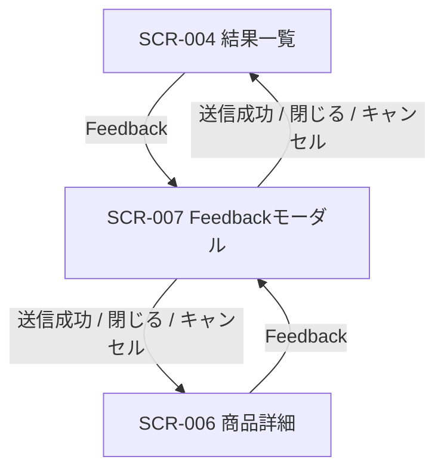

# Feedback入力表示 画面仕様書

## 1. ドキュメント情報

| 項目     | 内容               |
| -------- | ------------------ |
| 画面ID   | `SCR-007`          |
| 画面名   | Feedback入力表示   |
| 画面種別 | `モーダル / 部品`  |
| MVP対象  | `○`                |
| 作成日   | 2026-07-15         |
| 更新日   | 2026-07-15         |

---

## 2. 概要

推薦結果一覧（SCR-004）または商品詳細（SCR-006）から呼び出す **Feedback 入力モーダル**である。ユーザーの簡易評価を **API-PUB-004（Feedback送信）** で登録し、推薦品質改善の材料とする。独立 URL は持たない。

---

## 3. 目的

- 推薦結果・商品候補に対するユーザー反応を取得すること
- API-PUB-004 契約に沿った Request を組み立て、受付結果を画面に返すこと
- SCR-004 / SCR-006 の「準備中」導線を本実装へ接続すること
- SCR-005（推薦理由詳細）未実装時でも、item / result 粒度の Feedback を提供可能にすること

---

## 4. 対象ユーザー

| ユーザー種別 | 内容                                           |
| ------------ | ---------------------------------------------- |
| 主利用者     | ギフトを探したい一般ユーザー（MVP は非認証） |
| 補助利用者   | なし（MVP）                                    |
| 管理者       | なし（本画面は管理機能を持たない）             |

---

## 5. 画面表示条件

| 項目            | 内容                                                                 |
| --------------- | -------------------------------------------------------------------- |
| 表示URL / Route | なし（独立 URL を持たない。親画面内モーダル）                         |
| 遷移元          | SCR-004（結果一覧の Feedback）、SCR-006（商品詳細の Feedback）       |
| 遷移先          | 送信成功・キャンセル・閉じる → 遷移元モーダルを閉じる（親画面は維持） |
| 認証要否        | `false`（MVP 匿名 Feedback。API-PUB-004 と同方針）                   |
| 権限条件        | なし                                                                 |
| 初期表示条件    | 親画面から `resultId` と Feedback 対象コンテキストが渡されていること |

### 5.1 起動時に必要なコンテキスト（親 → SCR-007）

| 項目 | 必須 | 内容 |
| ---- | ---- | ---- |
| `resultId`（`recommendationResultId`） | ○ | Path に相当。API-PUB-002 Response / sessionStorage 由来 |
| `feedbackTargetType` 初期値 | ○ | MVP 既定は `item`（§19） |
| `resultItemId` | `item` 対象時 ○ | Public `recommendationResultItemId` |
| `itemId` | 表示用（任意） | ユーザー向けラベル用。API Path には送らない |
| `itemName` | 表示用（任意） | モーダル見出し補助 |
| `reasonId` | `reason` 対象時 ○ | SCR-005 本実装後。MVP では reason 導線は出さない（§22） |
| `sourcePage` | ○（実装で付与） | `SCR-004` / `SCR-006` を渡す、または常に `SCR-007`（§14） |

---

## 6. 画面遷移



### 6.1 遷移一覧

|  No | 操作           | 遷移先                         | 条件                         | 備考 |
| --: | -------------- | ------------------------------ | ---------------------------- | ---- |
|   1 | Feedback を開く | SCR-007 モーダル表示          | SCR-004 / SCR-006            | 既存 disabled を本実装で有効化 |
|   2 | 送信           | モーダル内 Success → 自動/手動閉じる | Validation OK               | API-PUB-004 呼び出し |
|   3 | キャンセル     | モーダル閉じる                 | 常時                         | 未送信の入力は破棄 |
|   4 | 閉じる（×）    | モーダル閉じる                 | 常時                         | 同上 |
|   5 | 再試行         | モーダル内維持・再送信         | Error かつ retryable         | |

### 6.2 データの受け渡し

| 項目 | 方針 |
| ---- | ---- |
| Feedback 送信の正本 | API-PUB-004 `POST /api/v1/recommendation-results/{resultId}/feedback` |
| 対象 ID の正本 | 親が保持する API-PUB-002 Response（sessionStorage）または SCR-006 起動時に渡した result 文脈。**本画面で PUB-002 を再実行しない** |
| 欠落時 | `resultId` 欠落、または `item` 対象で `resultItemId` 欠落時はモーダルを開かず Alert、または起動直後に Error 表示（invent しない） |

---

## 7. 画面レイアウト

### 7.1 レイアウト概要

オーバーレイ＋中央寄せ（または画面下部シート）のモーダル。タイトル、対象商品名（任意）、評価ボタン群、任意コメント、送信 / キャンセルを配置する。過剰なカード装飾は避け、デザインルールに従う。

### 7.2 ワイヤーフレーム簡易図

```text
┌────────────────────────────────────┐
│ Feedback                      [×]  │
│ （対象: 商品名 または 推薦結果）   │
├────────────────────────────────────┤
│ この候補についてどう感じましたか？ │
│ [良い] [微妙] [文脈に合わない] …   │
│                                    │
│ コメント（任意）                   │
│ [                              ]   │
│                                    │
│ [キャンセル]            [送信]     │
│                                    │
│ （送信中… / 完了メッセージ / エラー）│
└────────────────────────────────────┘
```

### 7.3 画面領域

| 領域   | 内容                                       | 表示条件 |
| ------ | ------------------------------------------ | -------- |
| Header | タイトル・閉じる・対象ラベル               | 常時     |
| Main   | 評価選択・コメント・状態メッセージ         | 常時     |
| Footer | キャンセル / 送信（送信中は disabled）     | 常時     |

---

## 8. 表示項目

|  No | 項目名           | 物理名 / key        | 型     | 表示形式 | 必須 | 表示条件 | 備考 |
| --: | ---------------- | ------------------- | ------ | -------- | ---- | -------- | ---- |
|   1 | モーダルタイトル | `modalTitle`        | string | テキスト | -    | 常時     | 「Feedback」 |
|   2 | 対象ラベル       | `targetLabel`       | string | テキスト | △    | `itemName` 等があるとき | invent しない |
|   3 | 誘導文           | `promptText`        | string | テキスト | -    | 常時     | |
|   4 | 評価ボタン群     | `feedbackTypeButtons` | action | Button | -  | 入力中・Error 時 | §9 |
|   5 | コメント入力     | `comment`           | string | TextArea | △  | MVP 任意（画面一覧 △） | max 500 |
|   6 | 送信ボタン       | `submitButton`      | action | Button | -    | 常時（選択なし時 disabled） | |
|   7 | キャンセルボタン | `cancelButton`      | action | Button | -    | 常時     | |
|   8 | 送信中表示       | `submitting`        | status | Text/Spinner | - | 送信中 | |
|   9 | 完了メッセージ   | `successMessage`    | string | Alert/Text | - | 成功時 | API `message` 優先、なければ固定文 |
|  10 | エラー Alert     | `errorAlert`        | alert  | Alert | - | Error 時 | §13 |

### 8.1 表示しない項目

| 項目 | 理由 |
| ---- | ---- |
| `recommendationFeedbackId` | ユーザー向け primary 表示にしない（debug 出しもしない） |
| `traceId` / `requestId` | ユーザー向けに出さない（開発ログのみ） |
| `anonymous_user_id` / UA | 契約上返却・表示しない |
| 内部スコア・Ranking 更新結果 | MVP 対象外 |
| Reason 詳細本文 | SCR-005 本実装外。本画面は `reasonId` 必須の reason Feedback を MVP で出さない |

---

## 9. 入力項目

|  No | 項目名 | 物理名 / key（UI） | API フィールド | 型 | 必須 | 制約 | 備考 |
| --: | ------ | ------------------ | -------------- | -- | ---- | ---- | ---- |
|   1 | 評価種別 | `selectedFeedbackType` | `feedbackType` | enum | ○ | §9.1 | ボタン選択 |
|   2 | 対象粒度 | （起動コンテキスト） | `feedbackTargetType` | enum | ○ | §9.1 | UI 切替は MVP 最小 |
|   3 | Result Item ID | （起動コンテキスト） | `resultItemId` | string | 条件 | `item` 時必須 | |
|   4 | 評価値（rating） | （UI から派生） | `rating` | integer | ○ | 1〜5 | §9.2 |
|   5 | コメント | `comment` | `comment` | string | △ | max 500 | 空は omit |
|   6 | sessionId | （実装生成） | `sessionId` | string | △ | PII なし | §14.4 |
|   7 | sourcePage | （実装付与） | `sourcePage` | string | △ | `SCR-007` 推奨 | |

### 9.1 MVP で画面に出す Feedback Type（推奨確定）

**MVP 第1段（SCR-004 / SCR-006 から開く既定）は `item` 粒度のみ。**

| UI ラベル（例） | `feedbackType` | `feedbackTargetType` | 既定 `rating` |
| --------------- | -------------- | -------------------- | ------------- |
| 良い | `item_good` | `item` | 5 |
| 微妙 | `item_bad` | `item` | 2 |
| 贈答文脈に合わない | `item_not_match` | `item` | 2 |
| NG条件に反する | `item_ng_violation` | `item` | 1 |
| 避けたい条件に近い | `item_avoid_match` | `item` | 2 |

契約上の `result_*` / `reason_*` / `comment` type は契約は許容するが、**MVP UI 第1段ではボタンとして出さない**（後続拡張。§22）。

`feedbackChoiceCode` / `feedbackReasonCategory` は MVP 第1段では **未使用可**（未送信）。必要なら実装 Task で `item_not_match` のみ簡易コードを足してよい。

### 9.2 rating の扱い

API-PUB-004 は `rating`（1〜5）必須。画面一覧は「簡易評価ボタン」中心のため、**星 UI を必須とせず**、選択した `feedbackType` から §9.1 の既定値をセットする。ユーザーに別入力させない（MVP）。

### 9.3 Validation（クライアント）

|  No | 対象 | 内容 | 失敗時 |
| --: | ---- | ---- | ---- |
|   1 | `selectedFeedbackType` | 1つ選択必須 | 送信 disabled + 短い誘導 |
|   2 | `comment` | 500 文字以内 | 超過時は送信不可 + 文言 |
|   3 | `resultId` / `resultItemId` | 欠落チェック | Error / 起動拒否 |

サーバ Validation（`GRS-FDB-001` 等）は §13。

---

## 10. 操作仕様

|  No | 操作       | トリガー     | 処理内容 | 成功時 | 失敗時 | 備考 |
| --: | ---------- | ------------ | -------- | ------ | ------ | ---- |
|   1 | モーダル表示 | 親の Feedback | コンテキストを受け取り初期表示 | 入力 UI | Error | disabled 解除は実装 Task |
|   2 | 評価選択   | ボタン       | `feedbackType` / `rating` を確定 | 選択状態 | - | 単一選択 |
|   3 | コメント入力 | TextArea   | ローカル state | - | - | |
|   4 | 送信       | ボタン       | API-PUB-004 POST | Success 表示 | Error | 二重送信防止 |
|   5 | キャンセル | ボタン / ×   | モーダル閉鎖・state 破棄 | 親へ | - | |
|   6 | 再試行     | ボタン       | 同一 Payload で再 POST | Success | Error | 5xx / ネットワーク向け |

---

## 11. 状態別表示仕様

### 11.1 初期表示

- 評価未選択、コメント空、送信 disabled（または誘導のみ）

### 11.2 入力中

- 評価選択済みで送信 enabled
- 送信中以外は操作可能

### 11.3 送信中（Submitting）

- 送信ボタン loading / disabled
- 評価・コメントは原則編集不可

### 11.4 Success

- 「フィードバックを受け付けました。」等（API `message` 優先）
- 短時間表示後に自動で閉じる、または閉じるボタンのみ（実装 Task でどちらか確定。推奨: 約 1.5s 後自動閉じ＋即閉じ可）

### 11.5 Error

| HTTP / Code | ユーザー向け | 操作 |
| ----------- | ------------ | ---- |
| 400 `GRS-FDB-001` / `GRS-REQ-001` 等 | 入力内容を確認してください | 修正して再送 |
| 404 `GRS-FDB-002` | 対象の推薦結果が見つかりません | 閉じる（親へ戻る） |
| 5xx / ネットワーク | Feedbackを送信できませんでした | 再試行・閉じる |

技術詳細（HTTP 生値、stack、`error.code` 羅列）はユーザー向けに出さない。

---

## 12. バリデーション仕様

§9.3 に記載。サーバ側は API-PUB-004 §8 に準拠。

---

## 13. エラー表示仕様

| エラー種別 | 発生条件 | 表示内容 | ユーザー操作 | 備考 |
| ---------- | -------- | -------- | ------------ | ---- |
| 入力不足 | 未選択等 | 誘導文 | 選択 | クライアント |
| Validation | 400 | 条件確認系 | 修正・再送 | |
| 対象なし | 404 | 対象なし系 | 閉じる | |
| 通信/サーバ | 5xx / network | 送信失敗系 | 再試行・閉じる | 画面一覧 SCR-008 パターンと整合 |
| 想定外 | レンダリング例外 | 汎用エラー | 閉じる | secret を出さない |

---

## 14. API連携仕様

### 14.1 利用API一覧

|  No | API名 | Method | Endpoint | 利用タイミング | 用途 |
| --: | ----- | ------ | -------- | -------------- | ---- |
|   1 | API-PUB-004 Feedback送信 | `POST` | `/api/v1/recommendation-results/{resultId}/feedback` | 送信時 | Feedback 登録 |
|   2 | API-PUB-002 | `POST` | `/api/v1/recommendations` | **呼び出さない** | 対象 ID の契約正本（親/session） |

### 14.2 Request（MVP item_good 例）

```http
POST /api/v1/recommendation-results/result_001/feedback HTTP/1.1
Content-Type: application/json
Accept: application/json
```

```json
{
  "feedbackTargetType": "item",
  "resultItemId": "result_item_001",
  "feedbackType": "item_good",
  "feedbackValueType": "boolean",
  "feedbackValue": true,
  "rating": 5,
  "sourcePage": "SCR-007",
  "sessionId": "sess_local_xxx"
}
```

### 14.3 Response

- 201: `data.status = accepted`
- 200: `data.status = updated`（同一 sessionId + 対象 + type の再送）
- いずれも Success UX（文言で区別してよいが、必須ではない）

### 14.4 sessionId

- client で生成し `sessionStorage` に保持（例: キー方針は実装 Task。PII・認証 cookie を入れない）
- 未設定でも API は受理しうるが、更新扱いにならない。**MVP では送信時に付与を推奨**

### 14.5 generated client

- `apps/web/src/generated/api/feedback/feedback.ts` の `submitRecommendationFeedback` を利用
- `public-api` ラップ（base URL 解決）を実装 Task で追加してよい
- OpenAPI / generated の手編集は禁止

---

## 15. データ取得・更新タイミング

| タイミング | 処理 | 備考 |
| ---------- | ---- | ---- |
| モーダル表示 | 親コンテキスト読取のみ | API なし |
| 送信 | PUB-004 POST | |
| 再表示 | 新規表示として state 初期化 | |

DB への直接アクセスはしない。

---

## 16. 非機能・UX観点

| 観点 | 方針 |
| ---- | ---- |
| レスポンシブ | モバイル優先。モーダルが狭幅で操作可能 |
| アクセシビリティ | モーダルの `role` / フォーカストラップ方針は実装時に UI コンポーネントに合わせる。評価ボタンに明確な名前 |
| パフォーマンス | 1 送信 1 API。PUB-002 再実行なし |
| 多言語 | MVP 日本語固定 |

---

## 17. セキュリティ観点

| 観点 | 方針 |
| ---- | ---- |
| 認証 | MVP 非認証 |
| secret | client に API key 等を埋め込まない |
| XSS | `comment` / `itemName` はエスケープ表示。`dangerouslySetInnerHTML` 禁止 |
| PII | `sessionId` にメール・氏名等を入れない。ログに comment 全文を出さない |
| 二重送信 | Submitting 中は送信ボタン disabled |

---

## 18. ログ・計測

| 種別 | 内容 | 備考 |
| ---- | ---- | ---- |
| 操作 | モーダル open / submit 成否（type 種別） | PII・comment 全文なし |
| エラー | error 種別（コード種別のみ） | |

---

## 19. MVP対象範囲

### 19.1 MVP対象

- Feedback モーダル部品（SCR-007）
- `item` 粒度の Feedback Type（§9.1）
- 任意コメント（max 500）
- API-PUB-004 呼び出しと Success / Error UX
- SCR-004 / SCR-006 の Feedback ボタン有効化（モーダル起動）
- `sessionId` 付与（推奨）

### 19.2 MVP対象外（本仕様では出さない / 後続）

- `reason_*` Feedback UI（SCR-005 + `reasonId` 整備後）
- `result_*` / 単独 `comment` type の専用 UI（必要なら後続）
- 星評価 UI の別入力
- Ranking 即時反映
- 認証必須化
- API-PUB-004 契約変更

---

## 20. テスト観点

|  No | 観点 | 確認内容 | 種別 |
| --: | ---- | -------- | ---- |
|   1 | 起動 | SCR-004 / SCR-006 からモーダルが開く | manual / component |
|   2 | 未選択 | 送信できない | unit / component |
|   3 | 送信成功 | 201/200 で完了表示 | component（mock） |
|   4 | 400/404/5xx | 文言と操作が妥当 | component |
|   5 | comment 上限 | 500 超で送信不可 | unit |
|   6 | 二重送信 | Submitting 中に再送しない | component |
|   7 | reason UI | MVP で reason ボタンが出ない | component |

---

## 21. レビュー観点

- 画面一覧 §4.7・画面遷移図と一致するか
- API-PUB-004 の必須 `rating` / Target・Type 整合と UI が矛盾しないか
- Recommendation Feedback定義書の MVP type と齟齬がないか
- SCR-004 / SCR-006 への変更が導線有効化に閉じるか
- secret / `.env` 実値がないか

---

## 22. 未決事項（実装 Task で微調整可・方針は確定）

|  No | 論点 | 確定内容 |
| --: | ---- | -------- |
|   1 | 独立 URL | 持たない（モーダル） |
|   2 | MVP 評価 UI | item 系ボタン + rating 自動マッピング |
|   3 | comment | 任意（画面一覧 △） |
|   4 | reason Feedback | SCR-005 後続。本 Epic UI 第1段では出さない |
|   5 | Success 後 | 短時間後自動閉じ推奨。実装で微調整可 |
|   6 | 004/006 導線 | 本 Epic 実装 Task で disabled を解除し本モーダルを接続 |

---

## 23. 関連資料

| 種別 | パス | 用途 |
| ---- | ---- | ---- |
| 画面一覧 | `docs/05_アプリケーション設計/アプリ/web/画面一覧.md` | §4.7 |
| 画面遷移図 | `docs/05_アプリケーション設計/アプリ/web/画面遷移図.md` | Feedback 遷移 |
| API-PUB-004 契約 | `docs/06_実装設計/api/API-PUB-004_Feedback送信API契約仕様書.md` | I/F 正本 |
| Feedback定義書 | `docs/04_ドメインモデル設計/RecommendationFeedback定義書.md` | Type / Target |
| SCR-004 仕様 | `docs/06_実装設計/web/SCR-004_レコメンド結果一覧画面画面仕様書.md` | 導線元 |
| SCR-006 仕様 | `docs/06_実装設計/web/SCR-006_商品詳細画面画面仕様書.md` | 導線元 |
| generated | `apps/web/src/generated/api/feedback/feedback.ts` | client |
| Task Definition | `prompts/definitions/tasks/scr-007-feedback-input/screen-spec.yaml` | 本 Task |

---

## 24. 備考

- 本画面は SCR-007 Epic（Issue #1325）の画面仕様正本である
- SCR-004 / SCR-006 仕様書本文の大幅改訂は本 Task out of scope。導線 disabled 解除は実装 Task で行い、必要なら 004/006 仕様への短い追従は別 Task または実装 PR 内の最小 docs 差分として扱う
- `apps/web/src/components/feedback/**`（Alert 等）は UI 部品名であり、本ドメインの Feedback 入力とは別物である
