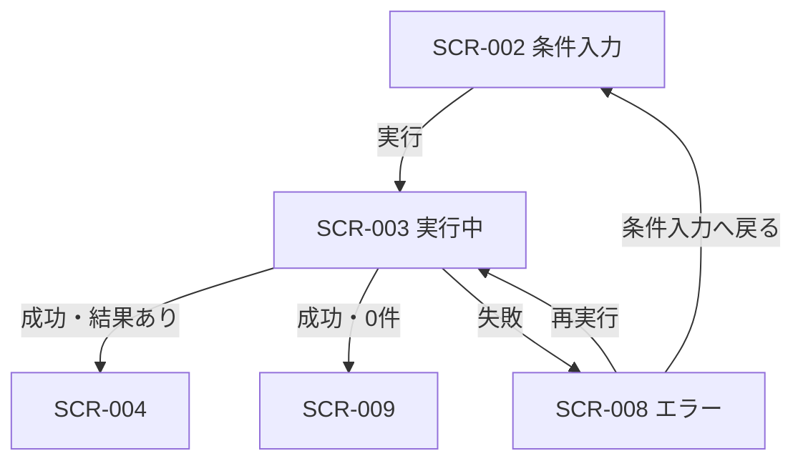

# エラー表示 画面仕様書

## 1. ドキュメント情報

| 項目     | 内容         |
| -------- | ------------ |
| 画面ID   | `SCR-008`    |
| 画面名   | エラー表示   |
| 画面種別 | `画面状態`   |
| MVP対象  | `○`          |
| 作成日   | 2026-07-16   |
| 更新日   | 2026-07-16   |

---

## 2. 概要

推薦実行（API-PUB-002）が失敗したときに、ユーザーへ失敗内容を伝え、条件入力へ戻るか（提案として）同一条件で再実行できる画面状態である。独立した URL を持たず、主に SCR-002（レコメンド条件入力）の実行後分岐として表示する。

フィールド入力エラー・マスタ取得失敗は **SCR-002 内**で扱い、本仕様の主対象は **推薦実行失敗** とする（画面一覧の「入力エラー」パターンとの分担は §8）。

---

## 3. 目的

- 推薦実行が失敗したことを、内部詳細を晒さずに伝えること
- 問い合わせ用に `error.code` / `meta.traceId` を必要に応じて提示すること
- ユーザーが条件入力へ戻れること（必須）
- 再実行できること（MVP 提案。最終採否は Human Review）
- SCR-009（0件）や SCR-003（実行中）と混同しないこと

---

## 4. 対象ユーザー

| ユーザー種別 | 内容 |
| ------------ | ---- |
| 主利用者     | ギフトを探しているエンドユーザー |
| 補助利用者   | なし（MVP） |
| 管理者       | なし（MVP）。ログ調査はサーバ側 |

---

## 5. 画面表示条件

| 項目            | 内容 |
| --------------- | ---- |
| 表示URL / Route | **なし**（独立 route を新設しない）。SCR-002 と同一 URL（例: `/recommendations`）上の画面状態 |
| 遷移元          | SCR-003（レコメンド実行中）経由で API-PUB-002 が失敗したとき |
| 遷移先          | SCR-002（条件入力へ戻る）／再実行時は SCR-003 |
| 認証要否        | 不要（MVP） |
| 権限条件        | なし（MVP） |
| 初期表示条件    | `phase = error` かつ実行エラー状態が保持されていること |

---

## 6. 画面遷移



### 6.1 遷移一覧

|  No | 操作               | 遷移先     | 条件                         | 備考 |
| --: | ------------------ | ---------- | ---------------------------- | ---- |
|   1 | （自動）実行失敗   | SCR-008    | API-PUB-002 非成功 / 通信例外 | SCR-003 から |
|   2 | 条件入力へ戻る     | SCR-002    | 常時                         | エラー状態をクリア |
|   3 | 再実行             | SCR-003    | フォーム値が検証可能         | 同一条件で PUB-002 再呼出 |

### 6.2 MVP 方針（Human Review 確認待ちの提案）

| 項目 | MVP 方針（提案） |
| ---- | -------- |
| 専用エラー URL | **採用しない**（画面遷移図・画面一覧と整合。確定事項として扱う） |
| 条件入力へ戻る | **必須**（画面遷移図の主復帰導線。確定事項として扱う） |
| 再実行 | **提案: 採用**（現状実装あり。直前条件で PUB-002 を再呼出）。**最終採否は Human Review** |
| トップへ戻る | 画面遷移図 §6.9 にあるが、**MVP では主操作としない**（条件入力へ戻る / 再実行を主操作。トップ復帰は任意または後続） |
| 閉じる（モーダルのみ） | 本状態はフル画面置換のため **対象外** |

---

## 7. 画面レイアウト

### 7.1 レイアウト概要

PageLayout タイトル「エラー」の下に、error 系 Alert を主領域として表示する。操作ボタンを Alert 内または直下に配置する。

### 7.2 ワイヤーフレーム簡易図

```text
┌──────────────────────────────────────┐
│ エラー                               │
├──────────────────────────────────────┤
│ [Alert: error]                       │
│  レコメンド実行に失敗しました        │
│  {error.message}                     │
│  code: {error.code}         （任意） │
│  traceId: {meta.traceId}    （任意） │
│                                      │
│  [条件入力へ戻る]  [再実行]          │
└──────────────────────────────────────┘
```

### 7.3 画面領域

| 領域   | 内容                         | 表示条件 |
| ------ | ---------------------------- | -------- |
| Header | PageLayout タイトル「エラー」 | 常時     |
| Main   | Alert + 操作ボタン           | 常時     |

---

## 8. 表示パターンと SCR-002 との分担

| パターン（画面一覧） | MVP の扱い | 担当 |
| -------------------- | ---------- | ---- |
| 入力エラー           | フィールド直下 InlineError | **SCR-002**（本状態へは遷移しない） |
| マスタ取得失敗       | 画面上部 Alert + 再試行 | **SCR-002** |
| APIエラー（PUB-002 実行失敗） | 本状態（Alert） | **SCR-008** |
| recoエラー（PUB-002 経由で返る推薦失敗） | 本状態（API エラーと同一 UI） | **SCR-008** |
| 商品取得エラー       | SCR-006 側（本 Epic out of scope） | 言及のみ |
| Feedback送信エラー   | SCR-007 側（本 Epic out of scope） | 言及のみ |

---

## 9. 表示項目

| 項目 | 内容 | MVP |
| ---- | ---- | --: |
| タイトル | 「レコメンド実行に失敗しました」（Alert title） | ○ |
| メッセージ | API `error.message`。欠落時は汎用文「レコメンド実行に失敗しました。条件を変えて再度お試しください。」 | ○ |
| error.code | ErrorResponse の `error.code`。レスポンスにあれば表示 | ○ |
| meta.traceId | ErrorResponse の `meta.traceId`。レスポンスにあれば表示 | ○ |
| 条件入力へ戻る | 主操作。フォーム状態へ復帰 | ○ |
| 再実行 | 副操作（提案）。同一条件で再実行。最終採否は Human Review | ○ |

内部スタックトレース、secret、サーバ詳細メッセージは表示しない。

---

## 10. 状態

| 状態ID | 名前 | 説明 |
| ------ | ---- | ---- |
| ST-ERR-RUN | 実行失敗表示 | PUB-002 失敗後の本状態 |
| （参考）ST-ERR-FIELD | 入力エラー | SCR-002 内。本仕様の主対象外 |
| （参考）ST-ERR-MASTER | マスタ失敗 | SCR-002 内。本仕様の主対象外 |

---

## 11. 操作仕様

|  No | 操作           | 処理 | 成功時 | 失敗時 |
| --: | -------------- | ---- | ------ | ------ |
|   1 | 条件入力へ戻る | エラー状態クリア、`phase=form` | SCR-002 再表示（入力値は保持してよい） | - |
|   2 | 再実行         | クライアント検証後 PUB-002 再呼出 | SCR-003 → 結果分岐 | 再び SCR-008 |

---

## 12. 利用 API

| API | タイミング | 備考 |
| --- | ---------- | ---- |
| API-PUB-002 | 再実行時 | 契約仕様書の ErrorResponse（`error.code` / `error.message` / `meta.traceId`）を表示に利用 |

本状態の **初回表示** は、直前の PUB-002 失敗レスポンス（または通信例外）をクライアントが保持した結果である。追加の GET は不要。

---

## 13. エラー表示仕様（本状態）

| 発生条件 | 表示 | ユーザー操作 |
| -------- | ---- | ------------ |
| HTTP 非 200 の ErrorResponse | Alert + `error.message` / `error.code` / `meta.traceId` | 戻る / 再実行 |
| ネットワーク例外等で body なし | 汎用メッセージ（`error.code` / `meta.traceId` なし可） | 戻る / 再実行 |
| `resultStatus=empty`（0件成功） | **本状態にしない** → SCR-009 | - |

---

## 14. SCR-003 / SCR-009 との境界

| 画面状態 | 条件 | 本仕様 |
| -------- | ---- | ------ |
| SCR-003 | PUB-002 呼び出し中 | 対象外（#1361） |
| SCR-008 | PUB-002 失敗 | **本仕様** |
| SCR-009 | PUB-002 成功かつ 0件 | 対象外（別 Epic） |

---

## 15. UI コンポーネント対応

| 部品 | 用途 |
| ---- | ---- |
| PageLayout | ページ枠・タイトル |
| Alert（error） | 失敗メッセージ本体 |
| Button（primary） | 条件入力へ戻る |
| Button（secondary） | 再実行 |

---

## 16. アクセシビリティ / コピー

- Alert はエラーであることが伝わる `variant=error` を用いる
- `error.code` / `meta.traceId` は補助情報として小さめのテキストでよい
- ユーザー向け文言に内部モジュール名やスタックを含めない

---

## 17. 既存実装との対応（参考）

MVP 実装は `apps/web/src/features/recommendation-input/RecommendationInputPage.tsx` の `phase === "error"` が本状態に相当する。

| 仕様 | 実装定数・要素（参考） |
| ---- | ---------------------- |
| 汎用メッセージ | `RUN_ERROR_FALLBACK_MESSAGE` |
| タイトル | Alert title「レコメンド実行に失敗しました」 |
| 戻る / 再実行 | 「条件入力へ戻る」「再実行」ボタン |

実装差分が必要な場合は後続 implementation Task で扱い、本 Task は docs のみとする。

---

## 18. 受け入れ観点

- [ ] 独立 route を要求していない
- [ ] 実行失敗と 0件（SCR-009）を混同していない
- [ ] 入力エラー / マスタ失敗を SCR-002 分担として明記している
- [ ] 条件入力へ戻るを必須とし、再実行を Human Review 確認待ちの提案として整理している
- [ ] secret / 内部詳細を表示しない

---

## 19. Human Review 観点

- 再実行を MVP 必須として維持してよいか（現状実装あり。§6.2 は提案表記）
- フィールド／マスタエラーを SCR-002 分担のままとしてよいか
- Alert タイトルと本文の文言粒度
- §6.2 の提案表現（再実行・トップへ戻る）が Human 判断待ちとして十分か

---

## 20. 関連ドキュメント

| ドキュメント | 用途 |
| ------------ | ---- |
| 画面一覧.md | SCR-008 定義 |
| 画面遷移図.md | 状態遷移 |
| SCR-002 画面仕様書 | 入力・マスタエラー分担 |
| API-PUB-002 契約仕様書 | ErrorResponse |
| レーン1e 手動E2Eチェックリスト | D1 S3 合格条件 |
| UIコンポーネント一覧 / デザインルール | Alert・ボタン |

---

## 21. 改訂履歴

| 日付 | 内容 |
| ---- | ---- |
| 2026-07-16 | 初版（Task #1368） |
| 2026-07-16 | AI Review 指摘対応: §6.2 を Human Review 確認待ちの提案表記へ是正。トップへ戻る・`meta.traceId` 表記を補足 |
