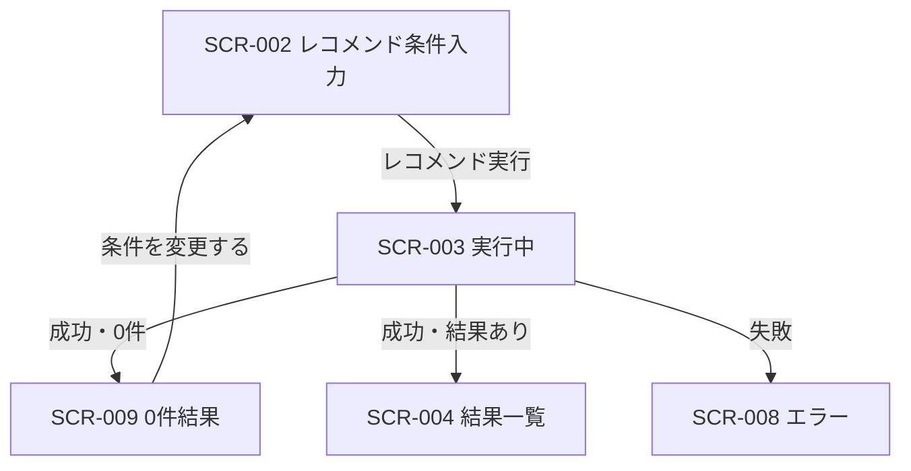

# 0件結果表示 画面仕様書

## 1. ドキュメント情報

| 項目     | 内容                   |
| -------- | ---------------------- |
| 画面ID   | `SCR-009`              |
| 画面名   | 0件結果表示            |
| 画面種別 | `画面状態`             |
| MVP対象  | `○`                    |
| 作成日   | 2026-07-16             |
| 更新日   | 2026-07-16             |

---

## 2. 概要

SCR-009 は、レコメンド条件入力（SCR-002）から API-PUB-002（レコメンド実行）を呼び出し、推薦処理が **正常完了したが候補が 0 件** だった場合の **0件結果 UI 状態** である。独立した業務画面・専用 URL ではない。

画面一覧の URL案 `/recommendations/{result_id}` は参考表記に留め、**MVP では専用 route を新設しない**。宿主は SCR-002 の実装面（`/recommendations` 上の recommendation-input）であり、0件時は `phase === "empty"` で EmptyState（UI-033）を表示する。

0件は API 異常終了ではなく **正常系**（API-PUB-002: HTTP 200、`resultStatus: "empty"`、`GRS-REC-001`）として扱う。

---

## 3. 目的

- 条件に合う商品が見つからなかったことをユーザーに伝え、次の行動（条件変更）へ導くこと
- 0件をエラーと誤認させず、条件緩和・見直しを促すこと
- SCR-003（実行中）完了後、結果あり（SCR-004）と分岐し、0件時に SCR-004 へ来ないことを保証すること
- デザインルール **ST-EMPTY** および UI-033（EmptyState）に沿った表示を定義すること

---

## 4. 対象ユーザー

| ユーザー種別 | 内容                                           |
| ------------ | ---------------------------------------------- |
| 主利用者     | ギフトを探したい一般ユーザー（MVP は非認証） |
| 補助利用者   | なし（MVP）                                    |
| 管理者       | なし（本画面状態は管理機能を持たない）         |

---

## 5. 画面表示条件

| 項目            | 内容                                                                 |
| --------------- | -------------------------------------------------------------------- |
| 表示URL / Route | 独立 URL なし。宿主は SCR-002 の `/recommendations`（画面遷移図 §10）。画面一覧の `/recommendations/{result_id}` は参考案であり MVP では採用しない |
| 遷移元          | SCR-003（レコメンド実行中。API-PUB-002 成功・0件）                   |
| 遷移先          | SCR-002（条件変更 / 再実行）。画面遷移図 §6.8 の「トップへ戻る」は任意導線（§6.3） |
| 認証要否        | `false`（MVP 非認証。API-PUB-002 と同方針）                          |
| 権限条件        | なし                                                                 |
| 初期表示条件    | API-PUB-002 が HTTP 200 で返却され、推薦結果が 0 件であること（§14.2） |

### 5.1 宿主・実装対応（現状正本）

| 項目 | 内容 |
| ---- | ---- |
| 宿主画面 | SCR-002 レコメンド条件入力画面 |
| 実装参照 | `apps/web/src/features/recommendation-input/RecommendationInputPage.tsx` |
| 状態キー | `phase === "empty"` |
| 表示部品 | `EmptyState`（UI-033）+ `Button`（secondary） |
| 0件メッセージ定数 | `EMPTY_RESULT_MESSAGE`（`constants.ts`） |
| EmptyState タイトル | `条件に合うギフトがありません`（コンポーネント prop） |
| PageLayout タイトル | `おすすめが見つかりませんでした`（現状実装） |
| 復帰ボタン | `条件を変更する` → `setPhase("form")` で入力フォームへ |

宿主は `phase === "empty"` ＋ EmptyState とする。専用 `/recommendations/{result_id}` page の新設は **MVP out of scope** とする。

### 5.2 画面遷移図との解釈差（MVP 正本）

画面遷移図 §3・§6.8 では、0件結果表示を「**レコメンド結果一覧画面（SCR-004）の状態**」として記載している。一方、MVP の実装宿主は **recommendation-input の `phase=empty`** である（Human 確定。Epic #1382 / SCR-002 実装設計書と整合）。

| 観点 | 画面遷移図（概念） | MVP 実装（正本） |
| ---- | ------------------ | ---------------- |
| 宿主 | SCR-004 の Empty 状態 | SCR-002 の `phase=empty`（同一 URL `/recommendations`） |
| URL | URL なし（§10） | `/recommendations` 上の React state。`result_id` 付き route へは遷移しない |
| 遷移分岐 | SCR-003 → 結果あり? → SCR-009 | `RecommendationInputPage` 内で Response 判定後 `setPhase("empty")`（SCR-004 へ `router.push` しない） |
| SCR-004 との関係 | 結果一覧の 0件状態 | 0件時は **SCR-004 に来ない**（SCR-004 画面仕様書 §11.3 設計逸脱検知方針と一致） |

**引用（SCR-002 実装設計書）:** レコメンド実行の成功は SCR-003 → SCR-004 / SCR-009 で扱う。0件は異常系ではなく正常系（API一覧方針）。

**引用（SCR-004 実装設計書）:** 空配列（0件）で本画面に来た場合は設計逸脱（SCR-009 へ送るのが正）。

後続で SCR-004 宿主へ 0件状態を移す場合は、専用 route・状態管理の設計変更 Task が必要（本 Task の out of scope）。

---

## 6. 画面遷移



### 6.1 遷移一覧

|  No | 操作               | 遷移先  | 条件                                      | 備考 |
| --: | ------------------ | ------- | ----------------------------------------- | ---- |
|   1 | 推薦成功・結果なし | SCR-009 | HTTP 200 かつ 0件判定（§14.2）            | SCR-003 から自動遷移。異常終了ではない |
|   2 | 条件を変更する     | SCR-002 | 復帰ボタン押下                            | `phase` を `form` に戻す。入力復元は §6.2 |
|   3 | 再検索             | SCR-002 | （MVP 非必須。§6.4）                      | 現状は操作 2 で充足 |
|   4 | トップへ戻る       | SCR-001 | （MVP 非必須。§6.3）                      | 画面遷移図 §6.8 任意導線。現状 UI なし |

SCR-008（失敗）から SCR-009 へは遷移しない。本仕様では SCR-008 の包括仕様は out of scope（遷移先言及のみ）。

### 6.2 入力復元（SCR-002 へ戻るとき）

SCR-009 から SCR-002（`phase === "form"`）へ戻るとき、前回入力は SCR-002 画面仕様書 §6.2 の分担に従い復元する。

| 保存先 | 対象項目 | 備考 |
| ------ | -------- | ---- |
| URL クエリ | relationshipCode, occasionCode, budgetMin, budgetMax, topK | 短い条件 |
| sessionStorage | preferredText, nonPreferredText, ngText | 長い自由記述 |

0件結果自体（`recommendationResultId` 等）は本状態の表示に必須ではない。sessionStorage の `lastResult` 保管は実装参考（SCR-004 未実装期の受け渡し）。MVP では 0件 UI に結果 ID を表示しない。

### 6.3 「トップへ戻る」導線（任意）

| 項目 | 内容 |
| ---- | ---- |
| 画面遷移図 | §6.8 に「トップへ戻る → トップ画面」を任意導線として記載 |
| 画面一覧 | 次画面はレコメンド条件入力画面のみ |
| 本仕様の扱い | **MVP 対象外（非必須）**。現状実装に該当ボタンなし |
| 備考 | 採用する場合は SCR-001 画面仕様書との整合 Task が必要 |

### 6.4 再検索ボタン（画面一覧 △）

| 項目 | 内容 |
| ---- | ---- |
| 画面一覧 | 再検索ボタンは MVP 対象 **△**（条件変更後に再実行） |
| 本仕様の扱い | **MVP 非必須（Human Review 採否待ち）** |
| 現状実装での充足 | 「**条件を変更する**」で `phase=form` に戻り、入力値を保持したまま再実行可能。画面遷移図 §6.8「条件を変更して再検索」と同等の UX を満たす |
| 未提供の場合 | 専用「再検索」ラベルのボタンは出さない（二重 CTA を避ける） |
| Human Review 観点 | 結果一覧（SCR-004）と同様の「再検索」ラベル統一、またはワンクリック再実行（条件変更なし）の要否 |

### 6.5 ブラウザ戻る / リロード時の扱い（MVP 方針）

SCR-009 は独立 URL ではなく React の `phase` 状態である。

| 操作 | MVP 方針 | 理由 |
| ---- | -------- | ---- |
| リロード | 0件 state は復元しない。再表示後は SCR-002 の入力フォーム（`phase === "form"`）。入力値は sessionStorage / クエリ復元方針に従う | `phase` はメモリ上のみ |
| ブラウザ戻る | 前履歴（例: SCR-001）へ戻る。0件 UI は破棄する | 同一 URL 上の状態のため、戻る＝ページ離脱 |
| 0件表示中の API 再呼び出し | **自動再実行しない** | ユーザー操作（条件変更 → 再実行）のみ |

---

## 7. 画面レイアウト

### 7.1 レイアウト概要

デザインルール **ST-EMPTY** に従い、画面中央に EmptyState（UI-033）を配置する。0件メッセージ・条件緩和の提案・復帰ボタンを EmptyState 内に集約する。入力フォームは非表示とし、結果カード一覧は出さない。

### 7.2 ワイヤーフレーム簡易図

```text
┌────────────────────────────────────┐
│ おすすめが見つかりませんでした     │  ← PageLayout title（宿主）
├────────────────────────────────────┤
│                                    │
│   ┌────────────────────────────┐   │
│   │ 条件に合うギフトがありません │   │  ← EmptyState title
│   │                              │   │
│   │ 条件に合うギフトが見つかり   │   │  ← EMPTY_RESULT_MESSAGE
│   │ ませんでした。条件を変えて   │   │     （条件緩和提案を含む）
│   │ 再度お試しください。         │   │
│   │                              │   │
│   │   [ 条件を変更する ]         │   │  ← Button secondary
│   └────────────────────────────┘   │
│                                    │
└────────────────────────────────────┘
```

### 7.3 画面領域

| 領域   | 内容                                         | 表示条件 |
| ------ | -------------------------------------------- | -------- |
| Header | PageLayout タイトル（例: 「おすすめが見つかりませんでした」） | 常時（宿主レイアウト） |
| Main   | EmptyState（title + description + action）   | `phase === "empty"` |
| Footer | なし（トップへ戻る・再検索専用 CTA は MVP 非必須。§6.3・§6.4） | - |

---

## 8. 表示項目

|  No | 項目名               | 物理名 / key           | 型     | 表示形式 | 必須 | 表示条件 | 備考 |
| --: | -------------------- | ---------------------- | ------ | -------- | ---- | -------- | ---- |
|   1 | 0件タイトル          | `emptyTitle`           | string | Text     | ○ | 常時（本状態中） | EmptyState `title`。§8.1 |
|   2 | 0件メッセージ        | `emptyDescription`     | string | Text     | ○ | 常時（本状態中） | `EMPTY_RESULT_MESSAGE`。§8.1 |
|   3 | 条件緩和の提案       | `relaxationHint`       | string | Text     | ○ | 常時（本状態中） | §8.2。現状は description に内包 |
|   4 | 条件入力へ戻るボタン | `backToInputAction`    | action | Button   | ○ | 常時（本状態中） | ラベル: 「条件を変更する」。§8.3 |
|   5 | 再検索ボタン         | `reSearchAction`       | action | Button   | - | 非表示 | MVP 非必須（§6.4） |
|   6 | ページタイトル       | `pageTitle`            | string | Text     | ○ | 常時 | PageLayout。§8.1 |
|   7 | 推薦結果カード       | `recommendationItems`  | array  | -        | - | 非表示 | SCR-004 の責務 |
|   8 | エラー詳細 / traceId | `errorDetail`          | -      | -        | - | 非表示 | SCR-008 の責務。0件は正常系 |

### 8.1 0件メッセージ・タイトル（正本）

| 項目 | 内容 |
| ---- | ---- |
| EmptyState タイトル | `条件に合うギフトがありません` |
| 0件メッセージ（description） | `条件に合うギフトが見つかりませんでした。条件を変えて再度お試しください。` |
| 定数名 | `EMPTY_RESULT_MESSAGE`（`apps/web/src/features/recommendation-input/constants.ts`） |
| PageLayout タイトル | `おすすめが見つかりませんでした`（現状実装。EmptyState タイトルと役割分担） |
| API `displayMessage` | API-PUB-002 0件時にサーバ返却あり（§14.3）。**MVP ではクライアント定数を正本とし、API 文案は未使用**（Human Review 観点: サーバ文案への統一要否） |
| 禁止 | HTTP status 生値、stack trace、`GRS-REC-001` の技術コードをユーザー向け本文に出さない |

### 8.2 条件緩和の提案（正本）

| 項目 | 内容 |
| ---- | ---- |
| 画面一覧要求 | 予算・NG条件・好み条件の見直し提案（MVP ○） |
| MVP 表現 | `EMPTY_RESULT_MESSAGE` 内の「**条件を変えて再度お試しください。**」で総括的に提案 |
| 具体例の列挙 | MVP では予算・NG・好みの個別 bullet は **出さない**（Human Review 観点: 具体文案の追加要否） |
| トーン | 責めない・次アクションを示す（デザインルール ST-EMPTY） |

### 8.3 復帰ボタン（正本）

| 項目 | 内容 |
| ---- | ---- |
| ラベル | `条件を変更する` |
| variant | `secondary`（現状実装） |
| 操作 | `setPhase("form")` — SCR-002 入力フォームを再表示 |
| 画面一覧対応 | 「条件入力へ戻るボタン」（MVP ○）を満たす |

### 8.4 表示しない項目

| 項目 | 理由 |
| ---- | ---- |
| 推薦結果一覧 / 順位 | 0件のため SCR-004 責務外 |
| エラー Alert / traceId | 0件は正常系。失敗は SCR-008 |
| `recommendationResultId` | MVP UI では非表示（URL 遷移もしない） |
| secret / token | 表示禁止 |

---

## 9. 入力項目

なし。

本状態中はユーザー入力を受け付けない。条件変更は復帰ボタンで SCR-002 フォームへ戻ってから行う。

---

## 10. 操作仕様

|  No | 操作             | トリガー           | 処理内容                                      | 成功時                 | 失敗時 | 備考 |
| --: | ---------------- | ------------------ | --------------------------------------------- | ---------------------- | ------ | ---- |
|   1 | 0件表示開始      | API-PUB-002 0件応答 | `phase` を `empty` にし EmptyState を表示     | 本状態表示             | - | SCR-003 から自動 |
|   2 | 条件を変更する   | 復帰ボタン         | `setPhase("form")`。入力復元は §6.2           | SCR-002 フォーム表示   | - | 再検索 △ を実質充足 |
|   3 | 再検索（専用）   | （なし）           | -                                             | -                      | - | MVP 非必須（§6.4） |
|   4 | トップへ戻る     | （なし）           | -                                             | -                      | - | MVP 非必須（§6.3） |

---

## 11. 状態別表示仕様

### 11.1 初期表示

本状態に入った直後、EmptyState を表示する。追加 API 呼び出しは行わない（応答は遷移元で受信済み）。

### 11.2 Loading状態

本状態では扱わない。直前は SCR-003。

### 11.3 Empty状態

本状態そのものが ST-EMPTY / EmptyState による 0件表示である。

### 11.4 Error状態

本状態では扱わない。API 失敗・通信失敗は SCR-008。0件は Error ではない。

### 11.5 Success状態

0件成功は本状態（SCR-009）として表示する。結果あり成功は SCR-004 へ遷移し、本状態には来ない。

---

## 12. バリデーション仕様

なし。

本状態に入力項目はない。条件変更のバリデーションは SCR-002 に委譲する。

---

## 13. エラー表示仕様

| エラー種別    | 発生条件           | 表示内容 | ユーザー操作 | 備考 |
| ------------- | ------------------ | -------- | ------------ | ---- |
| API通信エラー | PUB-002 失敗等     | SCR-008  | 条件入力へ戻る | 本状態では表示しない |
| 0件正常系     | PUB-002 200・0件   | 本状態   | 条件を変更する | エラー UI にしない |
| 認証エラー    | MVP 想定外         | -        | -            | 後続で再定義 |
| 権限エラー    | MVP 想定外         | -        | -            | 同上 |
| 入力エラー    | 本状態では発生しない | -      | -            | SCR-002 側 |
| 想定外エラー  | 0件判定不能等      | SCR-008 または実装防御 | 条件変更 | 通常は §14.2 判定で分岐 |

---

## 14. API連携仕様

### 14.1 利用API一覧

|  No | API名              | Method | Endpoint                    | 利用タイミング     | 用途 |
| --: | ------------------ | ------ | --------------------------- | ------------------ | ---- |
|   1 | API-PUB-002 レコメンド実行 | `POST` | `/api/v1/recommendations` | 遷移元（SCR-002/003）で呼び出し済み | 0件判定の根拠。本状態表示中は再呼び出ししない |

### 14.2 0件判定（正本）

以下 **いずれか** を満たせば SCR-009 へ遷移する（#1345 修正後の正常系。実装と一致）。

|  No | 条件 | 備考 |
| --: | ---- | ---- |
|   1 | `data.resultStatus === "empty"` | API-PUB-002 契約 enum |
|   2 | `data.resultItemCount === 0` | 件数 0 |
|   3 | `data.items` が空配列 `[]` | items 必須フィールド |

HTTP Status は **200**。`meta.resultCode: "GRS-REC-001"` は正常系コードであり、エラー Response ではない。

結果ありの場合は `router.push(/recommendations/{recommendationResultId})` で SCR-004 へ（本状態を経由しない）。

### 14.3 Response（0件例）

API-PUB-002 契約仕様書 §7.4.2 に準拠:

```json
{
  "data": {
    "recommendationResultId": "rr_01HXYZ",
    "resultStatus": "empty",
    "topK": 10,
    "resultItemCount": 0,
    "fallbackUsed": false,
    "displayMessage": "条件に合う商品が見つかりませんでした。条件を変更して再度お試しください。",
    "items": []
  },
  "meta": {
    "traceId": "01H...",
    "resultCode": "GRS-REC-001"
  }
}
```

### 14.4 画面項目とのマッピング

| 画面項目           | API項目              | 変換内容 | 備考 |
| ------------------ | -------------------- | -------- | ---- |
| 0件メッセージ      | `data.displayMessage` | MVP では **未使用**。クライアント定数 `EMPTY_RESULT_MESSAGE` を表示 | Human Review: 文案統一 |
| 0件タイトル        | なし                 | 固定文言（§8.1） | |
| 条件緩和の提案     | `data.displayMessage` または固定 | MVP では description 内包（§8.2） | |
| 条件入力へ戻る     | なし                 | UI アクションのみ | |
| 推薦結果           | `data.items`         | 表示しない（0件） | |

---

## 15. データ取得・更新タイミング

| タイミング     | 処理                         | 対象API / 処理 | 備考 |
| -------------- | ---------------------------- | -------------- | ---- |
| 初期表示時     | EmptyState 表示のみ          | なし（表示）   | API は遷移元で完了済み |
| ユーザー操作時 | 条件を変更する → form 復帰   | なし           | §10 No.2 |
| 応答受信時     | 0件判定 → `phase=empty`      | API-PUB-002 Response | SCR-003 宿主内 |
| 再表示時       | 0件 state は復元しない       | -              | §6.5。入力値は storage 復元可 |
| 結果保存       | `storeRecommendationResult`（参考） | sessionStorage | 0件でも実行されるが UI では未使用 |

---

## 16. 非機能・UX観点

| 観点             | 方針 |
| ---------------- | ---- |
| レスポンシブ対応 | EmptyState が主要ブレークポイントで読みやすいこと |
| アクセシビリティ | EmptyState の見出し階層（h2）、ボタンにキーボード到達可能。装飾のみにしない |
| パフォーマンス   | 0件表示中に不要な API 再呼び出しをしない |
| SEO              | 対象外（非インデックス前提） |
| 多言語対応       | MVP 対象外（日本語固定） |
| ブラウザ対応     | プロジェクト共通の対象ブラウザに従う |
| 0件 UX           | エラーと誤認させないトーン。次アクション（条件変更）を明示 |

---

## 17. セキュリティ観点

| 観点           | 方針 |
| -------------- | ---- |
| 認証           | MVP 非認証 |
| 認可           | なし |
| 個人情報表示   | 入力内容の再表示は SCR-002 復帰時のみ。0件 UI に PII を追加表示しない |
| secret表示防止 | API key / token / `.env` 実値 / Authorization を表示・ログ出力しない |
| XSS対策        | 固定文言が主。将来 API 文案を出す場合はエスケープ済みコンポーネント経由 |
| CSRF対策       | API 呼び出し方針に従う（本状態固有の追加要件なし） |

---

## 18. ログ・計測

| 種別         | 内容 | 出力タイミング | 備考 |
| ------------ | ---- | -------------- | ---- |
| 画面表示ログ | 0件状態表示（任意） | `phase` が `empty` になったとき | PII / secret を含めない |
| 操作ログ     | 「条件を変更する」押下（任意） | ボタン onClick | |
| エラーログ   | 0件では error 扱いしない | - | 失敗は SCR-008 / API 層 |
| メトリクス   | `recommendation_empty_rate` 等（API 一覧） | API 完了時 | サーバ側が主。クライアントは任意 |

---

## 19. MVP対象範囲

### 19.1 MVP対象

- 画面状態としての 0件結果表示（独立 URL なし）
- 宿主 `recommendation-input` の `phase === "empty"`
- ST-EMPTY / EmptyState（UI-033）による表示
- 0件メッセージ・条件緩和提案（description 内包）・「条件を変更する」復帰
- API-PUB-002 0件正常系判定（§14.2）と SCR-004 非遷移
- SCR-003 からの自動遷移

### 19.2 MVP対象外

- 専用 `/recommendations/{result_id}` route の新設（0件専用 URL）
- SCR-004 宿主への 0件状態移管（画面遷移図の概念モデルとの実装差は §5.2）
- 再検索ボタン（画面一覧 △）の専用 CTA — Human Review 採否待ち（§6.4）
- 「トップへ戻る」任意導線（§6.3）
- API `displayMessage` の画面表示（クライアント定数正本）
- 条件緩和の個別 bullet（予算・NG・好みの明示リスト）— Human Review 観点
- SCR-008 の包括仕様書作成（本 Task では遷移先言及のみ）
- OpenAPI / generated / ソースコード変更（本 Task は docs のみ）

---

## 20. テスト観点

|  No | 観点         | 確認内容 | 種別 |
| --: | ------------ | -------- | ---- |
|   1 | 初期表示     | 0件 API 応答後に EmptyState・正本文言・復帰ボタンが表示される | manual / E2E |
|   2 | Loading状態  | SCR-003 から本状態へ自動遷移し、実行中 UI に留まらない | manual |
|   3 | Empty状態    | ST-EMPTY 準拠。結果カードが出ない | manual |
|   4 | Error状態    | 0件をエラー UI と混同しない。失敗時は SCR-008 | manual |
|   5 | API連携      | `resultStatus=empty` / `resultItemCount=0` / `items:[]` で本状態へ。HTTP 200 | integration / E2E |
|   6 | SCR-004 非遷移 | 0件時に `/recommendations/{id}` へ push しない | manual / E2E |
|   7 | 復帰         | 「条件を変更する」でフォーム復帰・入力保持 | manual / E2E |
|   8 | レスポンシブ | 主要幅で EmptyState が崩れない | manual |

レーン 1e S2（`docs/06_実装設計/cross_cutting/レーン1e_手動E2Eチェックリスト.md`）を参照。

---

## 21. レビュー観点

- 画面一覧 SCR-009（表示項目・MVP ○/△）と整合しているか
- 画面状態として記載し、独立 URL 画面と誤記していないか
- MVP 宿主（`recommendation-input` / `phase=empty`）が明示されているか
- 画面遷移図「結果一覧の状態」と MVP 宿主の差が §5.2 で整理されているか
- 専用 `/recommendations/{result_id}` route 新設が MVP out of scope か
- ST-EMPTY / UI-033 対応がデザインルール・UIコンポーネント一覧と整合しているか
- API-PUB-002 0件正常系（`resultStatus=empty` / `GRS-REC-001`）と矛盾していないか
- SCR-003 からの 0件遷移・SCR-002 への復帰が整理されているか
- 0件時に SCR-004 へ来ないことが SCR-004 仕様と一致しているか
- 再検索ボタン（△）の MVP 扱いが Human Review 観点として切り出されているか
- secret / `.env` 実値を含んでいないか

---

## 22. 未決事項

|  No | 論点 | 判断が必要な理由 | 判断者 | 期限 | 備考 |
| --: | ---- | ---------------- | ------ | ---- | ---- |
|   1 | 再検索ボタン（画面一覧 △）の採否 | 専用ラベル・ワンクリック再実行の要否 | Human Review | - | 現状「条件を変更する」で form 復帰により充足（§6.4） |
|   2 | API `displayMessage` とクライアント定数の統一 | サーバ返却文案と `EMPTY_RESULT_MESSAGE` が類似だが未連携 | Human Review | - | §8.1・§14.4 |
|   3 | 条件緩和提案の具体化 | 予算・NG・好みの個別 bullet 追加要否 | Human Review | - | §8.2 |
|   4 | 「トップへ戻る」導線の採否 | 画面遷移図 §6.8 任意導線。画面一覧・現状実装になし | Human Review | - | §6.3 |

---

## 23. 関連資料

| 種別 | パス / URL | 用途 |
| ---- | ---------- | ---- |
| 画面一覧 | `docs/05_アプリケーション設計/アプリ/web/画面一覧.md` | SCR-009 定義・表示項目 |
| 画面遷移図 | `docs/05_アプリケーション設計/アプリ/web/画面遷移図.md` | 画面状態方針・遷移 |
| SCR-002 画面仕様書 | `docs/06_実装設計/web/SCR-002_レコメンド条件入力画面画面仕様書.md` | 宿主・入力復元・0件分岐 |
| SCR-003 画面仕様書 | `docs/06_実装設計/web/SCR-003_レコメンド実行中表示画面仕様書.md` | 遷移元・0件分岐 |
| SCR-004 画面仕様書 | `docs/06_実装設計/web/SCR-004_レコメンド結果一覧画面画面仕様書.md` | 0件非遷移・設計逸脱 |
| API-PUB-002 契約 | `docs/06_実装設計/api/API-PUB-002_レコメンド実行API契約仕様書.md` | 0件正常系 |
| デザインルール | `docs/05_アプリケーション設計/アプリ/web/デザインルール.md` | ST-EMPTY |
| UIコンポーネント一覧 | `docs/05_アプリケーション設計/アプリ/web/UIコンポーネント一覧.md` | UI-033 |
| E2E チェックリスト | `docs/06_実装設計/cross_cutting/レーン1e_手動E2Eチェックリスト.md` | S2 0件検証 |
| 実装（参考） | `apps/web/src/features/recommendation-input/RecommendationInputPage.tsx` | `phase === "empty"` |
| 実装定数（参考） | `apps/web/src/features/recommendation-input/constants.ts` | `EMPTY_RESULT_MESSAGE` |
| テンプレート | `prompts/templates/docs/screen-spec.md` | 章構成 |

---

## 24. 備考

- SCR-009 は独立業務画面ではなく UI 状態である（画面遷移図 §4・§432 相当）。
- 画面一覧の URL案 `/recommendations/{result_id}` と画面遷移図の「URLなし」は、MVP では **URL なし（専用 route 非採用）** を採る。0件時も `/recommendations` 上の state のみ。
- 画面遷移図 §3 の「結果一覧画面の状態」は概念モデル。MVP 実装正本は §5.1・§5.2（SCR-002 宿主）。
- 画面一覧の再検索ボタン（△）は §6.4・§22 No.1 で Human Review 観点として整理。MVP では非必須。
- SCR-008 の詳細仕様は各画面の仕様書 Task を正とし、本書類では遷移先としてのみ言及する。
- 本 Task ではソースコード変更を行わない（docs 成果物のみ）。
- Issue: #1384 / Parent Epic: #1382
