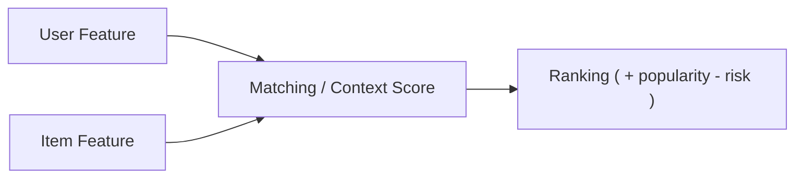

# 特徴量分布監視設計書

## 1. 目的

### 1.1 本設計書の目的

本設計書の目的は、Gift Recommendation Service における特徴量空間の健全性を継続的に監視し、分布異常・空間異常・マッチング異常を早期に検知できる状態を作ることである。

本サービスでは、単に商品をランキングするのではなく、

- ユーザー意図を特徴量空間に射影し
- 商品特徴量空間との対応関係を用いて
- Candidate Retrieval / Matching / Ranking を行う

構造を採用している。

そのため、監視対象は単一ではなく、以下の3層に分けて考える必要がある。

- 商品特徴量空間
- ユーザー特徴量空間
- ユーザー×商品相互作用

---

### 1.2 監視の基本思想

### 事実

- 特徴量分布は「正解」ではない
- 正規化は z-score → sigmoid を採用している
- clamp は行わない

### 設計思想

- 分布は**最適化対象**ではなく、**異常検知のセンサー**
- 重要なのは「分布を理想形に寄せること」ではなく、**異常や崩壊を説明可能にすること**
- 監視は必ず、後続の評価・改善フローに接続できる形で設計する

---

## 2. 監視対象の全体構造

本サービスの監視対象は以下の3層とする。



---

### 2.1 監視レイヤー構造

| 監視層                | 監視対象                            | 主な目的                              |
| --------------------- | ----------------------------------- | ------------------------------------- |
| A. 商品特徴量監視     | item_feature                        | 商品意味空間の健全性確認              |
| B. ユーザー特徴量監視 | user_feature                        | ユーザー意図推定の健全性確認          |
| C. 相互作用監視       | user_feature × item_feature / score | matching・ranking の健全性確認        |
| D. スコアバランス監視 | context / popularity / risk         | context / popularity / riskの影響監視 |

---

## 3. feature対象

### 3.1 固定8軸

| 区分     | feature                                                       |
| -------- | ------------------------------------------------------------- |
| Social   | formality, safety, brand_appropriateness                      |
| Symbolic | emotion, novelty, intimacy, symbolic_identity, story_richness |

---

### 3.2 派生軸

監視では、feature単体だけでなく、以下の派生軸も扱う。

| 派生軸        | 定義                                       | 用途                 |
| ------------- | ------------------------------------------ | -------------------- |
| social_mean   | Social3軸の平均                            | Social空間の代表値   |
| symbolic_mean | Symbolic5軸の平均                          | Symbolic空間の代表値 |
| meaning_diff  | symbolic_mean - social_mean                | 空間偏り確認         |
| context_score | social_match / symbolic_match を統合した値 | matching監視         |
| final_score   | ranking用最終スコア                        | 出力偏り監視         |

---

## 4. 統計指標の考え方（補足）

### 4.1 「共通指標」の定義

```
同じ計算式を、異なる母集団に対して別々に適用する
```

本設計書では μ / σ / p10 / p50 / p90 / skewness / kurtosis などを「共通指標」と呼ぶが、これは

- **同じ計算式を使う**
- **同じ意味で使うわけではない**

という点に注意する。

#### 母集団

| 対象        | 母集団           |
| ----------- | ---------------- |
| item        | 商品集合         |
| user        | ユーザー入力集合 |
| interaction | user-itemペア    |
| score       | rainking結果     |

### 重要な補足

共通指標とは、**商品特徴量だけから算出する指標**という意味ではない。

正しくは、**同じ定義の統計量を、異なる監視母集団に対して別々に計算する**という意味である。

---

### 4.2 母集団ごとの違い

| 指標        | 商品特徴量での意味 | ユーザー特徴量での意味 |
| ----------- | ------------------ | ---------------------- |
| μ           | 商品空間の中心     | ユーザー意図の中心傾向 |
| σ           | 商品空間の広がり   | ユーザー意図の多様性   |
| p10/p50/p90 | 商品分布の裾・中央 | ユーザー入力傾向の偏り |
| skewness    | 商品母集団の偏り   | 利用者傾向の偏り       |
| kurtosis    | 商品空間の集中度   | ユーザー意図の集中度   |

---

### 4.3 本サービスにおける位置づけ

本サービスでは、**商品特徴量空間がベース空間**であり、ユーザー特徴量はその空間にマッピングされる検索・マッチング起点として扱う。

したがって、

- 商品特徴量監視は「地形の監視」
- ユーザー特徴量監視は「検索意図の監視」
- 相互作用監視は「地形と意図の噛み合いの監視」

と整理する。

---

## 5. A. 商品特徴量分布監視

---

### 5.1 目的

商品特徴量分布監視の目的は、商品意味空間そのものの健全性を監視することである。

ここで異常が起きると、

- Candidate Retrieval の候補空間が歪む
- Matching が成立しにくくなる
- Ranking が同質化する

という影響が生じる。

---

### 5.2 主な監視観点

| 観点                    | 内容                        |
| ----------------------- | --------------------------- |
| feature単体分布         | 各featureの中心・分散・歪み |
| Social/Symbolicバランス | 片軸偏重がないか            |
| 空間の広がり            | collapseしていないか        |
| セグメント差            | カテゴリ別・価格帯別の偏り  |

---

### 5.3 商品側の監視指標

### 基本統計

| 指標            | 意味        |
| --------------- | ----------- |
| μ               | feature中心 |
| σ               | feature分散 |
| p10 / p50 / p90 | 分位点      |
| skewness        | 歪度        |
| kurtosis        | 尖度        |

### 補助指標

| 指標                        | 意味                    |
| --------------------------- | ----------------------- |
| active_item_count           | 有効商品数              |
| zero_ratio / center_ratio   | 中央密集率              |
| social_mean / symbolic_mean | 空間平均位置            |
| meaning_diff                | symbolic - social の差  |
| coverage_proxy              | feature空間の広がり近似 |

---

### 5.4 商品側の監視粒度

| 粒度       | 内容                     |
| ---------- | ------------------------ |
| 全体       | 全商品                   |
| カテゴリ別 | ジャンル・カテゴリごと   |
| 価格帯別   | 低価格 / 中価格 / 高価格 |
| リリース別 | ロジック改修前後比較     |

---

### 5.5 商品側 baseline

| 項目         | 内容                           |
| ------------ | ------------------------------ |
| baseline対象 | item_feature 全体              |
| 初期baseline | 初期安定稼働期間               |
| 保存単位     | feature単位 / セグメント単位   |
| 管理項目     | μ / σ / 分位 / skew / kurtosis |

---

### 5.6 商品側アラート例

| 条件                | 意味         | FB    |
| ------------------- | ------------ | ----- |
| σ < 0.05            | collapse     | FB-15 |
| p90 - p10 < 0.2     | 圧縮         | FB-15 |
| meaning_diff < -0.3 | social偏重   | FB-16 |
| meaning_diff > 0.3  | symbolic偏重 | FB-16 |

---

## 6. B. ユーザー特徴量分布監視

---

### 6.1 目的

ユーザー特徴量分布監視の目的は、ユーザー意図推定ロジックの健全性を監視することである。

ここで異常が起きると、

- ユーザー意図が正しく推定されない
- retrieval query がずれる
- matching前提が壊れる

という影響が生じる。

---

### 6.2 主な監視観点

| 観点                      | 内容                                    |
| ------------------------- | --------------------------------------- |
| feature単体分布           | 各featureが不自然に中央化していないか   |
| Social/Symbolicバランス   | symbolicが出なくなっていないか          |
| relationship / occasion差 | 文脈差が消えていないか                  |
| 推定器の効き              | rule / dictionary / hint が効いているか |

---

### 6.3 ユーザー側の監視指標

### 基本統計

| 指標            | 意味                   |
| --------------- | ---------------------- |
| μ               | ユーザー意図の中心傾向 |
| σ               | ユーザー意図の多様性   |
| p10 / p50 / p90 | 利用者傾向の分位       |
| skewness        | 意図偏り               |
| kurtosis        | 意図集中度             |

### 補助指標

| 指標                        | 意味                      |
| --------------------------- | ------------------------- |
| relationship別 μ / σ        | 関係性ルールの健全性      |
| occasion別 μ / σ            | occasion別偏り            |
| pair別 μ / σ                | relationship×occasion整合 |
| unknown_rate                | 解釈不能率                |
| dictionary_hit_rate         | 辞書ヒット率              |
| hint_apply_rate             | ヒント補正適用率          |
| social_mean / symbolic_mean | user空間上の重心          |
| meaning_diff                | user空間偏り              |

---

### 6.4 ユーザー側の監視粒度

| 粒度           | 内容                    |
| -------------- | ----------------------- |
| 全体           | 全ユーザー入力          |
| relationship別 | 恋人、父、上司など      |
| occasion別     | 誕生日、父の日など      |
| pair別         | relationship × occasion |
| 期間別         | 日次 / 週次 / 月次      |

---

### 6.5 ユーザー側 baseline

商品側より変動しやすいため、固定baselineに加え直近比較を持つ。

| 種別         | 内容                                     |
| ------------ | ---------------------------------------- |
| 固定baseline | 初期正常期間                             |
| 比較baseline | 直近4週平均                              |
| 保存単位     | feature / relationship / occasion / pair |

---

### 6.6 ユーザー側アラート例

| 条件                           | 意味             | FB    |
| ------------------------------ | ---------------- | ----- |
| σ < 0.05                       | 中央潰れ         | FB-15 |
| dictionary_hit_rate 急低下     | 辞書問題         | FB-05 |
| 恋人×記念日 で intimacy 低すぎ | meaning推定異常  | FB-01 |
| symbolic_mean 急低下           | symbolic死活異常 | FB-16 |

---

## 7. C. ユーザー×商品相互作用監視

---

### 7.1 目的

相互作用監視の目的は、ユーザー意図と商品空間が実際に噛み合っているかを監視することである。

商品分布が正常でも、ユーザー分布が正常でも、両者の相互作用が壊れていればレコメンド品質は劣化する。

---

### 7.2 主な監視観点

| 観点                | 内容                            |
| ------------------- | ------------------------------- |
| user-item距離       | 近い候補が取れているか          |
| retrieval後候補分布 | candidate段階で偏っていないか   |
| topK分布            | 出力が無難すぎ/攻めすぎでないか |
| λ_ctx整合           | λ_ctxと出力傾向が一致しているか |

---

### 7.3 相互作用の監視指標

| 指標                             | 意味                                     |
| -------------------------------- | ---------------------------------------- |
| preferred candidate count        | preferred_embedding で候補が取れているか |
| non_preferred penalty率          | non_preferred が効いているか             |
| user-item距離分布                | matching成立状況                         |
| topK social_mean / symbolic_mean | 出力傾向                                 |
| topK meaning_diff                | 出力バランス                             |
| λ_ctx別 topK傾向                 | λ_ctxの効き                              |
| context_score 分布               | matchingスコア分布                       |
| final_score 分布                 | ranking分布                              |
| diversity proxy                  | 上位Kの多様性                            |

---

### 7.4 相互作用の監視粒度

| 粒度           | 内容         |
| -------------- | ------------ |
| 全体           | 全推薦ログ   |
| relationship別 | 対象関係別   |
| occasion別     | シーン別     |
| λ_ctx帯別      | 低 / 中 / 高 |
| topK別         | top3 / top10 |

---

### 7.5 相互作用アラート例

| 条件                           | 意味             | FB           |
| ------------------------------ | ---------------- | ------------ |
| preferred candidate count 極小 | retrieval漏れ    | FB-06        |
| λ_ctx高でも topKがsocial偏重   | λ/マッチング異常 | FB-02, FB-07 |
| final_score上位が同質化        | diversity不足    | FB-10        |
| context_scoreと出力印象不一致  | context不一致    | FB-12        |

---

## 8. D. スコアバランス監視

---

### 8.1 目的

context / popularity / risk のバランス監視

### 8.2 スコア構造

```
final_score =
	  context
	+ popularity
	- risk
```

### 8.2 寄与率指標

```
context_ratio = context / final_score
popularity_ratio = popularity / final_score
risk_ratio = risk / final_score
```

### 8.3 分布監視

| 指標           |
| -------------- |
| popularity分布 |
| risk分布       |
| ratio分布      |

### 8.4. topK監視

| 指標                 | 意味     |
| -------------------- | -------- |
| topK popularity_mean | 人気偏重 |
| topK risk_mean       | 安全偏重 |
| topK context_mean    | 意味一致 |

### 8.5 異常パターン

| パターン       | 状態                              | 意味                       |
| -------------- | --------------------------------- | -------------------------- |
| popularity支配 | popularity_ratio >> context_ratio | 人気ランキング化           |
| risk支配       | risk_ratio >> context_ratio       | 無難化                     |
| context無効化  | context_ratioが極端に低い         | 意味モデル崩壊             |
| バランス崩壊   | popularity + riskが支配           | 意味レコメンドではなくなる |

## 8. 空間異常の定義

### 8.1 定義

本設計書でいう空間異常とは、feature単体の統計異常ではなく、**Social / Symbolic の2次元意味空間が実質的に1次元へ潰れること**を指す。

---

### 8.2 例

| 状態                             | 解釈                 |
| -------------------------------- | -------------------- |
| social ≫ symbolic                | 無難さ偏重、意味崩壊 |
| symbolic ≫ social                | 攻めすぎ、不安定     |
| 両方σ極小                        | 空間collapse         |
| userはsymbolic高、topKはsocial高 | 相互作用異常         |

---

### 8.3 代表指標

```
social_mean = mean(formality, safety, brand_appropriateness)
symbolic_mean = mean(emotion, novelty, intimacy, symbolic_identity, story_richness)
meaning_diff = symbolic_mean - social_mean
```

---

## 9. 監視頻度

| 対象               | 日次 | 週次 | リリース時 |
| ------------------ | ---- | ---- | ---------- |
| 商品特徴量監視     | ○    | ○    | ○          |
| ユーザー特徴量監視 | ○    | ○    | ○          |
| 相互作用監視       | ○    | ○    | ○          |

### 運用方針

- **日次**：異常検知
- **週次**：傾向レビュー
- **リリース時**：変更影響確認

---

## 10. アラートレベル

| レベル | 条件                                    | 対応             |
| ------ | --------------------------------------- | ---------------- |
| INFO   | 軽微なズレ                              | 記録のみ         |
| WARN   | 閾値超過                                | 週次レビュー対象 |
| ERROR  | collapse / 空間崩壊 / retrieval failure | 改善検討を即実施 |

---

## 11. ログ出力項目

### 11.1 共通ログ形式

```
{
  "date":"2026-04-02",
  "monitor_layer":"item",
  "segment":"all",
  "feature":"emotion",
  "mu":0.61,
  "sigma":0.08,
  "p10":0.50,
  "p50":0.60,
  "p90":0.72,
  "baseline_version":"v1",
  "alert_level":"WARN"
}
```

---

### 11.2 layer種別

| 値          | 意味               |
| ----------- | ------------------ |
| item        | 商品特徴量監視     |
| user        | ユーザー特徴量監視 |
| interaction | 相互作用監視       |

---

## 12. FB-01〜FB-16 との接続

| 監視対象           | 主なFB                                          |
| ------------------ | ----------------------------------------------- |
| 商品特徴量監視     | FB-03, FB-15, FB-16                             |
| ユーザー特徴量監視 | FB-01, FB-04, FB-05, FB-15, FB-16               |
| 相互作用監視       | FB-02, FB-06, FB-07, FB-08, FB-09, FB-10, FB-12 |

---

## 13. MVPスコープ

### 13.1 MVPで実装するもの

| 項目                                       | 実施 |
| ------------------------------------------ | ---- |
| item / user / interaction の3層分離監視    | 実施 |
| μ / σ / p10 / p50 / p90                    | 実施 |
| social_mean / symbolic_mean / meaning_diff | 実施 |
| baseline比較                               | 実施 |
| simple alert                               | 実施 |
| FB接続可能なログ出力                       | 実施 |

---

### 13.2 MVPでは後回しにするもの

| 項目                       | 方針   |
| -------------------------- | ------ |
| 高度異常検知（MLベース）   | 後回し |
| 自動補正                   | 後回し |
| 高次元空間の厳密な面積推定 | 後回し |
| 複雑な相関解析             | 後回し |

---

## 14. 本設計の要点

### 事実

本サービスは、商品特徴量空間をベースとし、その上にユーザー特徴量をマッピングして候補抽出・一致判定を行う。

### したがって

監視設計も、単一の分布監視では足りない。

### 結論

監視は以下の3層で設計する。

- **商品特徴量監視**：空間そのものが健全か
- **ユーザー特徴量監視**：意図推定が健全か
- **相互作用監視**：両者が噛み合っているか
