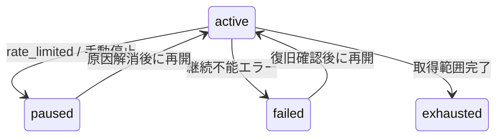

# 楽天Fetch運用方針

## 1. 文書情報

| 項目 | 内容 |
| ---- | ---- |
| 対象 | BATCH-001〜004 の楽天API Fetch運用 |
| 文書種別 | 運用方針正本 |
| 関連Issue | [#1752](https://github.com/ryo-chan-k6/GiftRecommendAPP_MVP_CYCLE_3/issues/1752) |
| 親Epic | [#1749](https://github.com/ryo-chan-k6/GiftRecommendAPP_MVP_CYCLE_3/issues/1749) |
| 作成日 | 2026-07-30 |
| 状態 | Draft（Human Review前） |

本書は、決定済みの楽天API制約と、live運用開始前にHuman判断が必要な運用値を分離して管理する。
secret、接続元IP、接続文字列などの実値は記載しない。

### 1.1 区分

| 区分 | 意味 |
| ---- | ---- |
| 決定済み | Human Decision Logまたは正本仕様で確定済み |
| 現状 | リポジトリのdocs・workflow・実装から確認できる事実 |
| 推奨案 | Human判断のための運用案。承認前は運用既定にしない |
| Human判断待ち | live切替・運用値として未確定 |
| Human採択 | Human Decision Logにより運用値として確定済み |

---

## 2. 適用範囲

### 2.1 対象

- BATCH-001 楽天ジャンル同期Batch
- BATCH-002 楽天ランキングスナップショット取得Batch
- BATCH-003 楽天商品疑似差分取得Batch
- BATCH-004 楽天既存商品再確認Batch
- 上記Batchの手動実行、Run分割、停止、再開
- 楽天APIをGitHub Actionsでlive実行可能にするための許可条件

### 2.2 対象外

- BATCH-001〜004のlive切替実装
- [#1607](https://github.com/ryo-chan-k6/GiftRecommendAPP_MVP_CYCLE_3/issues/1607) の固定egress IP、NAT、self-hosted runnerの設計・構築
- daily / weekly親workflowの `on.schedule` 有効化
- GitHub Secrets / Variablesの追加・変更・実値確認
- 常用QPSの再改訂
- Rate Limiter、楽天HTTP client、OpenAPI、Orval、generatedの変更

---

## 3. 決定済みの安全制約

| 項目 | 決定済み方針 | 運用上の扱い |
| ---- | ------------ | ------------ |
| 常用QPS | **2** | 通常の上限。旧目標QPS=8は常用しない |
| ハードキャップ | **10** | 設定・実装で超過させない。運用目標として使用しない |
| 安全側QPS | **1を推奨・任意**（推奨の存在は決定。運用採否は§10） | 常用QPS=2の決定を変更しない。長時間Run・連続再実行での採否は§10でHuman判断。既定QPS=1への変更は未確定 |
| live接続元 | 楽天側へ登録済みのegress IPのみ | 実行前に期待値と観測値を照合し、不一致・未設定なら楽天HTTPを行わない |
| CI live | **禁止** | GitHub-hosted runnerの動的IPから楽天liveを呼ばない |
| live起動 | 明示指定のみ | live指定がない実行を楽天HTTPへフォールスルーさせない |
| 429 | `GRS-EXT-102` / `rate_limited` | 対象 `fetch_cursor` がある場合は同一Batch処理内で `paused` へ遷移する |
| secret | 実値をdocs・Issue・PR・ログへ出さない | 環境変数名だけを扱い、値の確認・転記をしない |

根拠:

- [楽天API疎通検証結果](../../90_PoC/外部API疎通検証/楽天API疎通検証結果.md)
- [楽天API QPS / IP確認 Human Decision Log](../../../ai-logs/human-decisions/2026-07-24-rakuten-api-qps-ip-verify-policy.md)
- [楽天市場API 常用QPS=2 Human Decision Log](../../../ai-logs/human-decisions/2026-07-25-rakuten-operational-qps-revise-to-2.md)
- [Fetch Cursor テーブル定義書](../../06_実装設計/database/fetch_cursor_テーブル定義書.md)

---

## 4. 現在の実行状態

| 対象 | 現状 | 楽天live可否 |
| ---- | ---- | ------------ |
| BATCH-001葉workflow | `--scaffold-demo` | 不可 |
| BATCH-002葉workflow | `--scaffold-demo` | 不可 |
| BATCH-003葉workflow | 楽天はScaffold、DB / Object Storageはlive | 楽天liveは不可 |
| BATCH-004葉workflow | `--scaffold-demo` | 不可 |
| local / WSL疎通ハーネス | 登録済みegress IP照合と明示live指定あり | 最小疎通のみ実績あり |
| daily / weekly親workflow | `on.schedule` 無効、`workflow_dispatch` のみ | 定期実行不可 |

「live」は対象ごとに分ける。DB / Object Storage / Embedding のlive化と、楽天HTTP liveは別判断である。

したがって、§5以降の採用値はHuman承認後のlive実装Taskへの入力であり、現行workflowをlive化するものではない。

### 4.1 `max_items` の注意

daily / weekly親workflowの `max_items` は、主にItem反映・意味生成・Embedding生成などの後段件数を制御する。
BATCH-002のジャンル数・ページ数やBATCH-003の楽天API呼出回数を直接制限しない。

低い `max_items` だけで楽天Fetchの安全性を担保したと判断してはならない。楽天API利用量は、対象ジャンル、`max_pages`、`hits`、カーソル数、BATCH-004の再確認件数を別に制限する。

---

## 5. 取得量と運用予算

### 5.1 共通方針

1. **カタログ深さの方針と、1 Runの運用予算は別物**として扱う。
2. 見積もりは「取得商品件数」だけでなく「楽天API呼出回数」でも行う。
3. QPS=2では、理論上の最短間隔は500msである。実時間にはネットワーク、DB、Object Storage、retryの時間を加える。
4. 1 Runに複数ルート・多数ジャンルを詰め込まず、再実行可能な単位へ分割する。
5. 検証用低値から開始し、429なし・失敗なし・ログ追跡可能を確認してから運用予算を上げる。
6. 実装上のplaceholderジャンルIDを、Human承認済みfetch_planとして扱わない。

### 5.2 Batch別の方針

| Batch | カタログ深さ（方針） | 1 Runの運用予算（調整ノブ） | 検証用低値（推奨案） | Human判断 |
| ----- | -------------------- | --------------------------- | -------------------- | --------- |
| BATCH-001 | 承認済みfetch_planの起点ジャンルのみ | 1 Runで最大5起点ジャンル（推奨案） | 承認済み候補から1ジャンル | 実ID一覧と階層展開範囲 |
| BATCH-002 | **`max_pages=1` 決定済み**。必要時のみ2まで拡張可 | 対象ジャンル数 | 1ジャンル × 1ページ | 対象ジャンル数。2ページ拡張条件 |
| BATCH-003 | **事業上の取得打ち切り上限は設けない**（§5.3・Human採択）。承認済みスコープを cursor で継続走査し、`exhausted` まで進める | **Run単位**の `pages_per_run` / 消費cursor数 / 実行時間（運用概念名。BATCH-003 CLI名は§5.3.2で確定。GHA workflow input名は楽天live時に別途） | 1ルート × 1カーソル × 1ページ。疎通確認時は `hits=3` | 対象ジャンルの具体的 `fetch_plan`（[2026-07-31 Log](../../../ai-logs/human-decisions/2026-07-31-rakuten-fetch-mvp-fetch-plan.md)で承認済み。local パターンBは[検証結果](./楽天Fetch_local_live検証結果_1765.md)で実施済み。GHA楽天HTTPは禁止） |
| BATCH-004 | 優先度付き部分集合（全activeは週次既定にしない） | 100件から開始し、3回連続正常後に最大1000件/週 | `max_items=1` | 採択済み |

BATCH-002の `max_pages=1`（〜2）は現行設計のまま維持する。
BATCH-003の「運用予算」と監視閾値は§5.3.4 / §5.3.5の**Human採択値**である。#1765 で CLI / job への実装反映は完了。GHA葉は楽天 scaffold 維持のまま（当面 local のみ。workflow live化は別判断）。

### 5.3 BATCH-003: 継続取得と運用予算の分離

#### 5.3.1 カタログ深さ方針（Human採択）

- 商品数はレコメンドのバリエーションとサービス品質に直結するため、**事業上の取得件数上限で打ち切らない**。
- 楽天側の主制約は **QPS（常用2・ハードキャップ10）と429** であり、本プロジェクトの正本・Decision Log上、**トータルAPIリクエスト数の日次クォータは根拠として採用しない**。
- したがって BATCH-003 は、QPSを守った頻度で **承認済みスコープを継続実行**し、`fetch_cursor.position.page` を進め、取得範囲完了で `exhausted` とする。
- ただし OKURI の **DB容量・Object Storage・GHA実行時間/コスト・運用負荷**との兼ね合いがあるため、**取得件数・API呼出回数・Run回数は監視し、運用予算ノブで調整可能**にする。
- 本節は[楽天Fetch運用値 Human Decision Log](../../../ai-logs/human-decisions/2026-07-30-rakuten-fetch-ops-policy.md)により採択済みである。

#### 5.3.2 `max_pages` / Run予算の意味（BATCH-003）

| 概念 | 意味 | 使い方 |
| ---- | ---- | ------ |
| カタログ深さ上限 | あるジャンルを page N で永久打ち切り | **採用しない**（Human採択） |
| Run予算（旧称 `max_pages` をここに置く） | 1 Runで進める最大ページ数・cursor数 | timeout回避、再開単位、コスト調整 |
| 楽天APIのページング上限 | 同一クエリで最大100ページ、1ページ最大30件（`hits`） | API契約上の天井。超える場合はジャンル細分化等の別クエリ戦略が必要 |
| QPS | 常用2 | リクエスト頻度の安全制約。総量打ち切りではない |

`pages_per_run` / `cursors_per_run` / `routes_per_run` は本書上の運用概念名である。BATCH-003 CLI 実装名（#1765）は次のとおり。

| 運用概念 | CLI（BATCH-003） | 備考 |
| -------- | ---------------- | ---- |
| `pages_per_run` | `--pages-per-run` | 互換 alias `--max-pages`。カタログ深さ打ち切りではない |
| `cursors_per_run` | `--cursors-per-run` | CLI 既定 1（採択値）。job API で未指定時は計画上の全 active |
| wall-clock | `--wall-clock-seconds` | 通常継続の目安 2700（45分）。0 で無効 |
| `hits` | `--hits` | 既定 30 |
| 安全側 QPS | `--max-qps` | BATCH-003/004 live 既定 1。常用 QPS=2 は変更しない |

旧来の「BATCH-003初期live = `max_pages=1` で深さ固定」は、本方針では **採用しない**。
`max_pages` / `--max-pages` 相当の設定がある場合は、**1 Runの進行量（`pages_per_run`）**として解釈し、cursorを `exhausted` 扱いにして深いページを捨ててはならない。

#### 5.3.3 運用で監視・調整する指標（Human採択）

| 指標 | 目的 |
| ---- | ---- |
| 楽天API呼出回数 / Run・日 | QPS遵守とコスト・429監視 |
| Raw保存件数・容量増分 | Object Storage / DB成長 |
| `fetch_cursor` の `active` / `paused` / `exhausted` / `failed` | 走査進捗と詰まり検知 |
| Batch Run時間・GHA billable時間 | timeout・Actionsコスト |
| `rate_limited` 発生回数 | 過負荷・同時実行の兆候 |
| Item反映後の商品数（後段） | レコメンドバリエーションの効果観測 |

閾値超過時は、カタログ深さ方針を変えず、**Run予算を下げる・実行間隔を空ける・対象ジャンルを一時縮小・安全側QPS=1**などで調整する。恒久の取得打ち切りはHuman明示判断があるまで行わない。

#### 5.3.4 Run予算の初期値（Human採択・2026-07-30）

以下をBATCH-003のRun予算初期値として採択する。カタログ深さ打ち切りではなく、1 Runの進行量・時間の上限である。

| ノブ | smoke | 初期live（最初の3〜5 Run） | 通常継続（採択値） | 加速（安定後・任意） | コスト抑制 |
| ---- | ----: | -------------------------: | -------------------: | -------------------: | ---------: |
| `pages_per_run` | 1 | 10 | **60** | 100 | 10〜20 |
| `cursors_per_run` | 1 | 1 | 1 | 3〜5 | 1 |
| `routes_per_run` | 1 | 1 | 1 | 1 | 1 |
| `hits` | 3 | 30 | 30 | 30 | 30 |
| wall-clock上限 | 10分 | 20分 | **45分** | 60分 | 20分 |

上記ノブ名は運用概念名である。BATCH-003 CLI 実装名は §5.3.2 で確定（`--pages-per-run` / `--cursors-per-run` / `--wall-clock-seconds` 等）。GHA workflow input 名は楽天HTTP live化時に別途（当面 scaffold 維持）。

- 通常継続は `pages_per_run=60` / `cursors_per_run=1` / route 1本 / `hits=30` / 45分。
- 立ち上げは smoke → 初期live(10) を数回で実測し、429・容量増分に問題がなければ通常(60)へ上げる。
- routeは `ranking_supplement` backlogを最優先し、なければgenreを選ぶ。
- 「ずっと取る」は複数Runの継続で実現し、1 Runを無限にしない。Run予算到達時はcursor positionを保持して次回継続する。
- BATCH-002は本表の対象外（`max_pages=1` 維持）。

#### 5.3.5 監視閾値の初期値（Human採択・2026-07-30）

実容量の絶対値はプラン確定前のため、比率・増分・エラー率を初期採択値とする。**運用開始1週間の実測後に数値を見直す**前提とする。

本格収集（#1798 / #1799）では、見直し時点を [本格収集運用枠 Decision Log](../../../ai-logs/human-decisions/2026-07-31-batch-data-collect-ops-plan.md) により **段階2完了、または本格収集開始から7日経過のどちらか早い方** とする（維持も可。実測とdocs反映は後続収集Task）。

| 指標 | 警告（Run予算を下げる） | ハード（そのRun停止・Human通知） | アクション |
| ---- | ----------------------- | -------------------------------- | ---------- |
| `rate_limited` / 429 | 同一日に1回 | 同一Runで再発、または同日2回目 | QPS=1、`pages_per_run` を半減、15分以上クールダウン |
| Run時間 | 予算の80%（45分なら36分） | timeoutの90%（90分なら81分） | 新規pageを始めず正常終了相当で停止 |
| 楽天API呼出/日（003中心） | 2,000回/日 | 5,000回/日 | 超過日は追加Runを抑制。深さ方針は維持 |
| Raw増分/日 | 実測中央値の2倍 | 実測中央値の5倍、またはStorage残20%未満 | `pages_per_run` 半減、RetentionをHumanへ確認 |
| DB増分（metadata / log系） | 相対閾値（実測後に設定） | 残ディスク / プラン残20%未満 | ログ・古いRaw整理を検討。Fetch深さは切らない |
| `active` cursor滞留 | 7日以上進捗なし | 14日以上かつ失敗反復 | 失敗原因を切り分け。予算不足ならRun頻度を上げる |
| GHA Actions分（月） | 月予算の70% | 月予算の90% | 楽天liveはlocal継続を優先。GHAはScaffold / 検証に限定 |
| 同時楽天live Run | — | 2本目を検知 | 即停止（§6.2） |

数値は初期採択値であり、深さ方針の変更を意味しない。閾値超過時もRun予算・頻度・対象縮小・QPS=1で調整し、恒久打ち切りはHuman明示判断による。

### 5.4 対象ジャンル

- BATCH-001とBATCH-002は同一の承認済みfetch_planを使用する。
- BATCH-003のgenre routeも同じMVP対象ジャンルから選ぶ。対象を広げた分だけ継続走査の総量が増加する。
- 具体的なジャンルIDは設定正本で管理し、本書へ実値一覧を重複させない。
- キーワードrouteはfetch_planで明示された場合のみ実行する。
- `ranking_supplement` backlogがある場合はBATCH-003で最優先とする。

### 5.5 実行プロファイル（推奨案）

| プロファイル | BATCH-001 | BATCH-002 | BATCH-003 | BATCH-004 | 用途 |
| ------------ | --------- | --------- | --------- | --------- | ---- |
| 手動smoke | 1ジャンル | 1ジャンル × 1ページ | 1 route × 1 cursor × 1ページ、`hits=3` | 1件 | 初回live・変更後確認 |
| 継続取得（通常） | 実行しない | 承認済みジャンル × 1ページ | QPS遵守で cursor 継続。1 Runは運用予算内で複数page可。未完了cursorは次回以降も継続 | 実行しない | カタログ拡充 |
| 週次候補 | 承認済みジャンル、最大5起点/Run | 承認済みジャンル × 1ページ | 継続取得と同じ。route分割は維持 | 初回100件、段階拡張後も最大1000件/週 | 将来の週次運用 |
| コスト抑制 | 起点を縮小 | 変更なし（`max_pages=1`維持） | Run予算・実行頻度を下げ、深さ打ち切りはしない | 件数を下げる | DB/GHA逼迫時 |
| 障害再開 | 対象genreIdのみ | 対象genreId × pageのみ | 対象cursor × pageのみ（positionを捨てない） | 対象 `external_item_code` のみ | `paused` / `failed` 復旧 |

daily / weeklyの `on.schedule` は現在無効であり、本表は有効化を承認するものではない。

---

## 6. Run分割と同時多発回避

### 6.1 分割単位

| Batch | 再実行可能な分割単位 |
| ----- | -------------------- |
| BATCH-001 | 起点genreId |
| BATCH-002 | genreId × page |
| BATCH-003 | `cursor_type` × genre / keyword / itemCode × page |
| BATCH-004 | `external_item_code` / `recheck` cursor |

BATCH-003は、genre、keyword、update_sort、ranking_supplementを一度に大量実行せず、route単位にRunを分ける。
BATCH-003のRun分割は **timeout・再開・監視のためのチャンク**であり、未完了cursorを次回Runで継続する前提とする。
BATCH-004は100件単位を初期chunk候補とし、失敗時は該当cursorだけを再実行する。

### 6.2 同時実行

- 同じ楽天credentialを使うBATCH-001〜004のlive Runは、**常に1本だけ**とする。
- daily / weekly親workflowの共通 `batch-mainline` concurrencyだけに依存しない。葉workflowのconcurrency groupはBatchごとに異なるため、異なる葉同士の同時実行を防げない。
- 手動Run開始前に、対象Branch・実行環境を問わず楽天live Runが動いていないことを確認する。
- 既存Runがある場合はcancelせず完了を待つ。緊急停止判断はHumanへエスカレーションする。
- schedule有効化後も、手動Runと定期Runが重ならない運用窓を設ける。

### 6.3 Run開始前チェック

1. 実行対象Batchと分割単位を記録する。
2. 対象ジャンル、`max_pages`、`hits`、cursor数、`max_items`を確認する。
3. 他の楽天live Runがないことを確認する。
4. 登録済みegress IPとの照合が通ることを確認する。
5. live指定が明示され、Scaffoldとの取り違えがないことを確認する。
6. secretをログ・Summary・入力値へ出さないことを確認する。
7. 失敗時に再実行する最小単位を事前に決める。

---

## 7. `rate_limited` / `paused` / `failed` の扱い

### 7.1 決定済み状態遷移

- `api_call_log.call_status = rate_limited` の記録直後に、対象cursorを `paused` へ更新する。
- `paused` 遷移時はpage・`last_fetched_at`を成功扱いで進めない。
- 個別API呼出の一時失敗だけで必ずcursorを `failed` にするわけではない。retry上限超過や走査継続不能時に `failed` とする。
- `paused` / `failed` からの再開は、原因解消確認後に `active` へ戻して同じ位置から行う。

### 7.2 `paused` 再開手順（Human採択）

1. 対象Runを終了させ、新しい楽天live Runを開始しない。
2. `api_call_log`、`error_log`、`batch_run_log`から、429の対象cursorと発生時刻を確認する。
3. 同時実行、入力上限、QPS設定、短時間の連続再実行がなかったか確認する。
4. **15分以上**クールダウンする。再開後に429が再発した場合は60分以上へ延長し、同日の自動再開を行わない。
5. 対象cursorだけを `active` に戻す。ad hocな直接SQLではなく、承認済みのBatch管理経路を使用する。
6. QPS=1、1 cursor、1ページの低値で再開する。
7. 成功後も同じRunで上限を一気に戻さず、次のRunで段階的に戻す。

クールダウン時間と再開方式は§10でHuman採択済みである。初回15分以上のクールダウン後、原因確認を経て手動再開する。

### 7.3 `failed` 再開手順（Human採択）

1. 外部API、入力不正、DB、Object Storage、cursor更新失敗を切り分ける。
2. 原因が解消されていないcursorを `active` に戻さない。
3. 最後に成功したpositionと `last_fetched_at` を確認し、成功済みpageを重複進行させない。
4. 対象cursorだけを `active` に戻し、新しいRunとして再実行する。
5. 同じ原因で再失敗した場合は再開を止め、Human判断へエスカレーションする。

### 7.4 自動再開の扱い

MVPでは、`paused` / `failed` ともに**手動確認後の再開**とする（Human採択）。
次回定期Runでの無条件な自動 `active` 化は、429の再発や障害ループを招くため採用しない。

### 7.5 用語の正本

本書のcursor終端状態は、[Fetch Cursorテーブル定義書](../../06_実装設計/database/fetch_cursor_テーブル定義書.md) に従い **`exhausted`** とする。
BATCH-003仕様書の状態表に残る `completed` は用語揺れであり、運用・実装では `exhausted` を使う。BATCH-003本文の修正は本Taskの対象外とする。

---

## 8. GitHub Actionsで楽天liveを許可する条件

### 8.1 現在の判定

**許可条件未充足のため、BATCH-001〜004の楽天処理はGitHub ActionsでScaffoldを維持する。**

GitHub-hosted runnerの動的egress IPからの楽天live呼出は禁止である。

### 8.2 将来の許可ゲート

以下をすべて満たし、別Taskで実装・Human Reviewを完了した場合に限り、GHA葉workflowのlive化を検討できる。

| No | ゲート |
| --: | ------ |
| 1 | 楽天側へ登録済みの固定egress IPを持つ実行基盤である |
| 2 | 実行直前に期待egress IPと観測egress IPを照合し、不一致時は楽天HTTP前に停止する |
| 3 | 対象environmentにHuman承認または同等のproduction保護がある |
| 4 | liveは明示inputでのみ有効になり、既定はScaffoldである |
| 5 | BATCH-001〜004横断で楽天liveを1本に制限する排他制御がある |
| 6 | 対象ジャンル、BATCH-002の `max_pages`、BATCH-003のRun予算（pages/cursor）、BATCH-004件数のinputとvalidation、監視指標がある |
| 7 | `rate_limited` → `paused`、page非進行、再開経路を検証済みである |
| 8 | secretをログ・Summary・artifactへ出さないことを確認済みである |
| 9 | 1件・1ページのlive smokeを行い、429なし・追跡可能を確認済みである |
| 10 | daily / weekly scheduleは別のHuman承認まで無効のままである |

[#1607](https://github.com/ryo-chan-k6/GiftRecommendAPP_MVP_CYCLE_3/issues/1607) の設計・着手時期は本書で確定しない。

---

## 9. 観測と停止基準

### 9.1 Runごとに確認する項目

- API呼出回数
- `succeeded` / `failed` / `rate_limited` 件数
- 対象cursor数と `active` / `paused` / `exhausted` / `failed` 件数
- Batch Runの `succeeded` / `partially_succeeded` / `failed`
- 実行時間・GHA billable時間（GHA実行時）
- 対象ジャンル、route、page範囲（開始page〜終了page）
- Raw保存成功件数・概算容量増分
- BATCH-003の未完了 `active` cursor残件数（継続残）

### 9.2 停止基準（推奨案）

以下のいずれかで、**そのRunの追加取得**を停止する（BATCH-003のカタログ深さ方針の撤回ではない）。

- 429を1回でも観測し、retry後も解消しない
- 同一Runで429が再発した
- egress IP照合が不一致または未確認
- 当該Runの運用予算（pages / cursor数 / 時間）に到達した
- DB / Object Storage / GHAコストの監視閾値に到達した（Human設定）
- cursor更新またはログ追跡に失敗
- secretがログへ出た可能性がある
- 想定外の同時楽天live Runを検知

Run予算到達での停止後は、cursor positionを保持したまま次回Runで継続する。
secret漏えいの可能性がある場合は再実行せず、security incidentとしてHumanへ報告する。

---

## 10. Human判断事項

| No | 論点 | 選択肢 | 状態 / 案 |
| --: | ---- | ------ | --------- |
| 1 | MVP対象ジャンル | 具体的なfetch_planを承認する / 保留 | **2026-07-30: 本Decisionでは保留**。具体値は [2026-07-31-rakuten-fetch-mvp-fetch-plan](../../../ai-logs/human-decisions/2026-07-31-rakuten-fetch-mvp-fetch-plan.md) で承認（4ジャンル・直下children・keywordなし）。local 実楽天HTTP（パターンB）は [検証結果](./楽天Fetch_local_live検証結果_1765.md) で実施済み。GHA楽天HTTPは当面禁止（No.7） |
| 2 | BATCH-003カタログ深さ | 深さ打ち切りあり / **なしで継続取得** | **Human採択**。事業上の取得打ち切り上限を設けず、QPS遵守で継続し範囲完了時のみ `exhausted` とする |
| 2b | BATCH-003のRun予算 | pages/cursor/時間の初期値 | **Human採択**。§5.3.4（通常継続 `pages_per_run=60` / `cursors_per_run=1` / route 1本 / `hits=30` / 45分。立ち上げは10から段階拡張） |
| 2c | 監視閾値 | DB / Storage / GHA / 429 | **Human採択**。§5.3.5の比率・増分・エラー率ベース初期値。運用1週間後に実測で見直す |
| 3 | BATCH-004件数 | 100 / 500 / 1000件 | **Human採択**。100件から開始し、3回連続正常後に最大1000件/週 |
| 4 | Run分割 | route・cursor単位 / 一括 | **Human採択**。route・cursor単位。BATCH-003はRun予算到達後もpositionを保持して次回継続 |
| 5 | `paused` 再開 | 手動 / 次回Runで自動 | **Human採択**。初回15分以上のクールダウンと原因確認後に手動再開 |
| 6 | `failed` 再開 | 手動 / 次回Runで自動 | **Human採択**。原因解消・再実行安全性確認後に手動再開 |
| 7 | GHA楽天live | 当面localのみ / 条件付きGHA | **Human採択: 当面localのみ**。GitHub-hosted runnerから楽天HTTPを呼ばず、#1607を吸収しない |
| 8 | 安全側QPS=1 | 全Runの既定 / 長時間・再開時のみ / 不採用 | **Human採択**。長時間Run、BATCH-003/004、429後の再開時のみ適用。常用QPS=2は変更しない |
| 9 | クールダウン | 15分 / 30分 / 60分 / 別値 | **Human採択**。初回15分、再発時60分以上 |
| 10 | 本格収集運用枠（B-0下 local） | 段階・期間/Run数・停止・監視見直し | **Human採択（2026-07-31）**。[本格収集運用枠 Decision Log](../../../ai-logs/human-decisions/2026-07-31-batch-data-collect-ops-plan.md)。案A。ジャンル段階1→4。期間 **最大7日または BATCH-003累計 Run 20回**（どちらか先）で一旦停止し Epic内再判断。Run予算は§5.3.4維持。加速ノブ不使用。§5.3.5見直しは段階2完了または開始7日のどちらか早い時点 |

採択の正本は[楽天Fetch運用値 Human Decision Log](../../../ai-logs/human-decisions/2026-07-30-rakuten-fetch-ops-policy.md)とする。No.1の具体的 `fetch_plan` は [2026-07-31 Log](../../../ai-logs/human-decisions/2026-07-31-rakuten-fetch-mvp-fetch-plan.md) で承認済み。local 実楽天HTTP（パターンB）は [検証結果](./楽天Fetch_local_live検証結果_1765.md) で実施済み。secret投入・追加実行は引き続き Human 環境での判断とする。GHA楽天HTTP live化は当面禁止のまま（No.7）。本格収集の段階・期間上限は No.10 / [本格収集運用枠 Log](../../../ai-logs/human-decisions/2026-07-31-batch-data-collect-ops-plan.md) を正とする。

---

## 11. 後続Taskへの引き渡し条件

### 11.1 batch-live-rakuten-fetch

- §10のHuman判断が完了している（2026-07-30採択済み）。具体的 `fetch_plan` は 2026-07-31 Log で承認済み。local パターンB（実楽天HTTP）は [検証結果](./楽天Fetch_local_live検証結果_1765.md) で実施済み。GHA楽天HTTPは当面禁止
- BATCH-003について、Run予算とカタログ深さ打ち切りを混同しない実装になっている（#1765）
- Human採択後のRun予算・再開方式・監視指標がTask Definitionへ反映されている
- `max_items` と楽天FetchのRun予算が別物であることを実装・workflowで維持している
- `rate_limited` → `paused` とpage非進行、Run予算到達後のcursor継続をテストできる
- GHA liveの場合は§8.2をすべて満たす（当面 local のみのため未適用）

### 11.2 schedule判断

- 楽天live葉の低値手動検証が完了している（local。GHA楽天HTTPは当面禁止）
- 429、cursor、Raw保存、ログの運用確認が完了している
- 親workflowの既知のPARTIAL要因が解消またはHumanにより許容されている
- schedule有効化について別途Human明示承認がある
- **2026-07-31:** daily scheduleは [B-0 Decision Log](../../../ai-logs/human-decisions/2026-07-31-batch-daily-schedule-enable-b0.md) により**無効継続**。B-1再判断前に[監視・rollback最小手順](./親workflow_daily_schedule監視・rollback最小手順.md)を前提とする

### 11.3 batch-data-collect-ops（本格収集・監視改善）

- [本格収集運用枠 Decision Log](../../../ai-logs/human-decisions/2026-07-31-batch-data-collect-ops-plan.md) が **`decided`** である（#1799）
- 後続 `local-collect-and-monitor` は、同Logのジャンル段階・期間/Run上限（最大7日または BATCH-003累計20 Run）・停止条件・§5.3.5見直し計画に従う
- 実行は **local 楽天liveのみ**。GHA楽天HTTP・`on.schedule` 有効化（#1792）・#1607 は含めない
- 期間/Run上限到達後の継続は Epic #1798 内で Human 再判断する
- §5.3.5の実測見直し（維持含む）は収集Task側でdocsへ反映する

---

## 12. 関連資料

| 資料 | 用途 |
| ---- | ---- |
| [楽天API疎通検証計画](../../90_PoC/外部API疎通検証/楽天API疎通検証計画.md) | 疎通条件・検証範囲 |
| [楽天API疎通検証結果](../../90_PoC/外部API疎通検証/楽天API疎通検証結果.md) | live疎通・429観測 |
| [楽天API設計反映メモ](../../90_PoC/外部API疎通検証/楽天API_設計反映メモ.md) | 正式反映状況 |
| [楽天API QPS / IP確認 Human Decision Log](../../../ai-logs/human-decisions/2026-07-24-rakuten-api-qps-ip-verify-policy.md) | QPSキャップ・IP照合・CI live禁止 |
| [楽天市場API 常用QPS=2 Human Decision Log](../../../ai-logs/human-decisions/2026-07-25-rakuten-operational-qps-revise-to-2.md) | 常用QPS改訂 |
| [楽天Fetch運用値 Human Decision Log](../../../ai-logs/human-decisions/2026-07-30-rakuten-fetch-ops-policy.md) | §10の取得量・Run分割・再開・実行場所の採択 |
| [楽天Fetch MVP fetch_plan Human Decision Log](../../../ai-logs/human-decisions/2026-07-31-rakuten-fetch-mvp-fetch-plan.md) | §10 No.1 の具体的ジャンル・階層・route 承認 |
| [本格収集運用枠 Human Decision Log](../../../ai-logs/human-decisions/2026-07-31-batch-data-collect-ops-plan.md) | §10 No.10。B-0下 local 本格収集の段階・期間/Run上限・停止・監視見直し |
| [バッチ外部API本実装ギャップ一覧](../../05_アプリケーション設計/アプリ/batch/バッチ外部API本実装ギャップ一覧.md) | 外部API実装状態 |
| [バッチ実行スケジュール設計書](../../05_アプリケーション設計/アプリ/batch/バッチ実行スケジュール設計書.md) | 親子workflow・concurrency |
| [バッチ親workflow schedule有効化ギャップ一覧](../../05_アプリケーション設計/アプリ/batch/バッチ親workflow_schedule有効化ギャップ一覧.md) | schedule無効・Human決定 |
| [BATCH-001仕様書](../../06_実装設計/batch/BATCH-001_楽天ジャンル同期バッチ仕様書.md) | ジャンル同期 |
| [BATCH-002仕様書](../../06_実装設計/batch/BATCH-002_楽天ランキングスナップショット取得バッチ仕様書.md) | ランキング取得 |
| [BATCH-003仕様書](../../06_実装設計/batch/BATCH-003_楽天商品疑似差分取得バッチ仕様書.md) | 疑似差分取得 |
| [BATCH-004仕様書](../../06_実装設計/batch/BATCH-004_楽天既存商品再確認バッチ仕様書.md) | 既存商品再確認 |
| [Fetch Cursorテーブル定義書](../../06_実装設計/database/fetch_cursor_テーブル定義書.md) | cursor状態・再開 |
| [親workflow手動検証結果 D1](./親workflow手動検証結果_D1.md) | 親dispatchの既知結果 |
| [BATCH import連鎖 GHA live化メモ C3](./BATCH_import連鎖_GHA_live化メモ_C3.md) | GHAで楽天Scaffold・DB/Storage liveの分離実績 |
| [BATCH-001〜004 local live 検証結果（#1765）](./楽天Fetch_local_live検証結果_1765.md) | Run予算実装・UT結果・local パターンB（実楽天HTTP）実施結果。GHA楽天HTTPは対象外 |
| [親workflow daily schedule 案B再判断材料](./親workflow_daily_schedule案B再判断材料.md) | schedule有効化判断材料。**2026-07-31: B-0採択** |
| [親workflow daily schedule 監視・rollback最小手順](./親workflow_daily_schedule監視・rollback最小手順.md) | B-1再判断前の停止・復旧最低ライン |

---

## 13. 変更履歴

| 日付 | 内容 |
| ---- | ---- |
| 2026-07-30 | 初版。決定済み制約、取得量、Run分割、cursor再開、GHA live条件、QPS=1採否を整理 |
| 2026-07-30 | BATCH-003を「深さ打ち切りなし＋Run予算で監視調整」の推奨案に改訂。BATCH-002の `max_pages` は維持 |
| 2026-07-30 | BATCH-003のRun予算初期値（§5.3.4）と監視閾値初期値（§5.3.5）を推奨案として整理。Human判断待ち |
| 2026-07-30 | AI Review指摘対応: Epic scope外README差分を除去。「Human採択」表記を推奨案/判断待ちへ戻し、ギャップ一覧と同期 |
| 2026-07-30 | #1764: §10推奨案をHuman採択。対象ジャンルは本Decisionでは保留し、local live実行前承認をゲート化 |
| 2026-07-31 | #1765: BATCH-003 CLI（`--pages-per-run` 等）を運用概念と対応付け。local live検証結果を追加 |
| 2026-07-31 | #1775 AI Review対応: §5.2 / §5.3.4 の CLI TBD 残存を解消。§10 No.1 / §12 に fetch_plan Log を接続 |
| 2026-07-31 | #1785 AI Review対応: §5.2 / §10 No.1 / §11.1 の「実HTTP未実施」表記を検証結果（local パターンB実施済み）と同期。GHA楽天HTTP禁止は維持 |
| 2026-07-31 | #1791: §11.2 / §12 に daily schedule B-0採択と監視・rollback最小手順を接続 |
| 2026-07-31 | #1799: §10 No.10 / §11.3 / §12 に本格収集運用枠（案A・最大7日または累計20 Run）を接続 |
