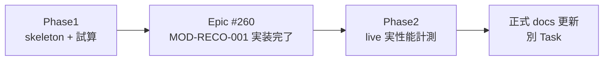

# Reco性能フィジビリティ検証計画書

## 1. 文書情報

| 項目 | 内容 |
| ---- | ---- |
| 文書種別 | PoC 検証計画書 |
| 検証ID | TV-007（全体テスト計画書） |
| 関連 Epic | [#759 [Epic]PoC:Reco性能フィジビリティ検証](https://github.com/ryo-chan-k6/GiftRecommendAPP_MVP_CYCLE_3/issues/759) |
| 配置 | `docs/90_PoC/性能フィジビリティ/` |
| 工程 | `90_PoC` |

### 1.1 参照正本

| 文書 | 参照節 | 用途 |
| ---- | ------ | ---- |
| 性能要件（バックエンド） | §3.1 / §4.1 / §5 | SLO・ステップ目標時間・タイムアウト設計 |
| 全体テスト計画書 | TV-007 | 検証ID・主な確認内容 |
| テスト定義書 | §9.1.4 | 性能フィジビリティ検証観点 |
| MOD-RECO-001 モジュール仕様書 | §13.2 | タイムアウト暫定値 |
| CI・CD方針書 | §12.2 | `perf-feasibility-*.yml` 分離方針 |
| TV-007 方針（全体） | — | [TV-007_Reco性能フィジビリティ](../計画/TV要件・実施方針/TV-007_Reco性能フィジビリティ.md) |

**参照メモ:** 計画作成時点（2026-06-25）では MOD-RECO-001 仕様書は Issue #758 Branch 上のみだった。**2026-07-21 時点では develop 上の** `docs/06_実装設計/reco/MOD-RECO-001_Recommendation Orchestratorモジュール仕様書.md` を正とする。

---

## 2. 検証目的

本 PoC は、Reco 推薦パイプライン（**入力解析〜Ranking**）について、以下を早期に評価することを目的とする。

1. **アーキテクチャ・処理方式として**、性能要件および MOD-RECO-001 §13.2 の暫定タイムアウト値が成立し得るか（フィジビリティ）を確認する
2. TV-007 に対応する検証観点を計画・実行・記録し、`docs/90_PoC/性能フィジビリティ/` に成果を残す
3. MOD-RECO-001 §13.2・性能要件（バックエンド）§5 **正式更新の判断材料**を提供する（正式反映は Phase2 完了後の別 Task）

Reason 生成（`MOD-RECO-023`）は本検証の**参考計測**とし、TV-007 の主対象（入力解析〜Ranking）からは除外する。

---

## 3. Phase1 / Phase2 区分

本 Epic は **2 フェーズ**で管理する。

| フェーズ | タイミング | 目的 | 検証モード | 管理 Task |
| ------ | ---------- | ---- | ---------- | --------- |
| **Phase1** | Epic #759（Due 2026-06-27） | §13.2 暫定値の**成立性見込み**を早期確認 | `skeleton` 実測 + `analysis` 試算 | poc-plan / poc-harness / poc-report |
| **Phase2** | **Epic #260 完了後** | 実装済みパイプラインの**実性能**を計測 | `live`（ephemeral DB / pgvector / mock or secrets OpenAI） | poc-live-verification（別 Issue、#260 Done 後に起票） |

**Phase1 完了条件:** 検証計画・計測ハーネス・Phase1 結果 doc が揃い、§13.2 更新候補が Human 判断材料として整理されていること。live 実測による最終根拠は Phase2 の成果物とする。

---

## 4. 検証対象

### 4.1 スコープ内

| 区分 | 内容 |
| ---- | ---- |
| パイプライン範囲 | 入力解析〜Ranking（Reason は参考） |
| 性能指標 | フェーズ別・全体の wall-clock 時間（p50 / p95） |
| 暫定判定対象 | MOD-RECO-001 §13.2 の soft / hard 暫定値 |
| 環境 | local / GHA Layer2（`workflow_dispatch`） |

### 4.2 スコープ外

| 区分 | 内容 |
| ---- | ---- |
| 実装変更 | `apps/reco/src/**`（Phase1。本格実装は Epic #260） |
| 正式反映 | 性能要件 §5 / MOD-RECO-001 §13.2 の正式 docs 更新 |
| 本番負荷 | production デプロイ・本番相当負荷試験 |
| Batch | TV-008 以降の Batch 性能（本 PoC 対象外） |

---

## 5. 検証モード

| モード | Phase | 説明 | データソース |
| ------ | ----- | ---- | ------------ |
| `skeleton` | Phase1 | Phase4a scaffold パイプライン（`ScaffoldPipelineStep`）の実測。`apps/reco` 変更なし | 固定 fixture / 最小入力 |
| `analysis` | Phase1 | 設計値・ベンチマーク文献・件数スケール試算（§9.1.4 観点） | 性能要件 §4.1、テスト定義書 §9.1.4 |
| `live` | Phase2 | Epic #260 完了後の実装済み Orchestrator + 下位モジュール | ephemeral DB / seed / pgvector |

計測ハーネス: `scripts/perf/reco_pipeline_bench.py`（Task poc-harness で整備）。

---

## 6. 計測ポイント

### 6.1 性能要件 §4.1 との対応

| 性能要件 §4.1 ステップ | 目標時間 | MOD-RECO-001 フェーズ群（§13.2） | 計測ポイント ID |
| ---------------------- | -------- | -------------------------------- | --------------- |
| 入力解析 | 50ms | Request 受付〜Config 解決前後 | `input_parse` |
| Meaning 推定 | 300ms | User Meaning 一括（`004`〜`010`） | `user_meaning` |
| Retrieval | 300ms | Retrieval 一括（`011`〜`013`） | `retrieval` |
| Ranking | 300ms | Ranking 一括（`017`〜`020`） | `ranking` |
| レスポンス整形 | 50ms | Output 一括（`021`〜`022`）※Reason 除く | `output` |
| **パイプライン全体** | 1,000ms 前後（通常目標） | 全体ウォッチドッグ | `pipeline_total` |

### 6.2 MOD-RECO-001 §13.2 フェーズ別 hard 上限

| フェーズ | モジュール群 | hard 上限（暫定） | 計測ポイント |
| -------- | ------------ | ----------------- | ------------ |
| Config 解決 | `003` | 300ms | `phase_config` |
| User Meaning | `004`〜`010` | 1,000ms | `phase_user_meaning` |
| Retrieval | `011`〜`013` | 1,000ms | `phase_retrieval` |
| Matching | `014`〜`016` | 500ms | `phase_matching` |
| Ranking | `017`〜`020` | 1,000ms | `phase_ranking` |
| Output | `021`〜`023` | 500ms（`023` は参考） | `phase_output` |
| **全体** | パイプライン全体 | **4,000ms**（hard） | `pipeline_total` |

### 6.3 TV-007 / テスト定義書 §9.1.4 マッピング

| TV-007 / §9.1.4 観点 | 本 PoC での扱い | Phase1 | Phase2 |
| -------------------- | --------------- | ------ | ------ |
| Reco 全体（2 秒台見込み） | `pipeline_total` p95 vs soft 2,000ms | skeleton + 試算 | live 実測 |
| User Feature 生成 | User Meaning フェーズ | 試算中心 | live |
| Candidate Retrieval / pgvector | Retrieval フェーズ | 試算 + skeleton 下限 | live + DB |
| Matching | Matching フェーズ | 試算 | live |
| Ranking / MMR | Ranking フェーズ | skeleton + 試算 | live |
| Embedding / 外部 AI | Retrieval・Meaning 内包 | 試算・mock 前提 | mock or secrets |
| DB 検索 | Retrieval 下位 | Phase1 対象外（参考試算） | live |

---

## 7. 判定基準

### 7.1 全体暫定値（MOD-RECO-001 §13.2）

| 種別 | 対象 | 暫定値 | Phase1 判定の扱い | Phase2 判定 |
| ---- | ---- | ------ | ----------------- | ----------- |
| soft（SLO 監視） | パイプライン全体 | **2,000ms**（p95 目標） | 見込み・skeleton 実測との差分を記録。暫定 Go/Adjust/Block 候補 | **実測 p95 で判定** |
| hard（中断） | パイプライン全体 | **4,000ms** | 同上 | **実測 p95 / max で判定** |

### 7.2 フェーズ別 hard 上限

各フェーズの計測 p95 が §13.2 hard 上限を**大幅に超過**する見込みがある場合、Adjust または Block 候補として結果 doc に記録する。

### 7.3 暫定判定ラベル（Human 判断材料）

| ラベル | 意味 | 記録先 |
| ------ | ---- | ------ |
| **Go** | 暫定値維持で実装進行可能な見込み | Phase1 / Phase2 結果 doc |
| **Adjust** | 暫定値・フェーズ上限の調整候補あり | 設計反映メモ |
| **Block** | 現行アーキテクチャでは暫定値達成が困難な見込み | 設計反映メモ + Human エスカレーション |

**注意:** Phase1 の判定は**最終確定ではない**。Phase2 live 実測後に Human Review で確定する。

### 7.4 性能要件（バックエンド）§3.1 との関係

| 指標 | レコメンド API p95 | 本 PoC との関係 |
| ---- | ------------------ | --------------- |
| 性能要件 §3.1 | 2,000ms | api 全体 SLO。Reco 内部 soft 2,000ms と整合確認 |
| 内部 Reco API timeout（§5.1） | 4,000ms | 全体 hard 4,000ms と整合 |

---

## 8. 検証環境

| 項目 | Phase1 | Phase2 |
| ---- | ------ | ------ |
| local | `scripts/perf/reco_pipeline_bench.py --mode skeleton` | `--mode live`（#260 後） |
| GHA Layer2 | `.github/workflows/perf-feasibility-reco.yml`（`workflow_dispatch` のみ） | 同上 + live 入力 |
| DB | 不要（skeleton） | ephemeral DB + migration + seed（`test-reco-quality.yml` 同型） |
| OpenAI | 不要 | mock または GHA Secrets 注入 |
| 通常 PR CI | **含めない**（CI・CD方針書 §12.2） | 同左 |

---

## 9. Phase2 開始条件

以下を**すべて**満たした時点で Phase2 Task（`poc-live-verification`）を起票する。

| # | 条件 |
| - | ---- |
| 1 | Epic [#260 MOD-RECO-001](https://github.com/ryo-chan-k6/GiftRecommendAPP_MVP_CYCLE_3/issues/260) が **Done** |
| 2 | Recommendation Orchestrator 実装が bench の `live` モードで実行可能 |
| 3 | Phase1 成果物（計画書・ハーネス・Phase1 結果 doc）が Epic Branch にマージ済み |
| 4 | ephemeral DB / seed が起動可能（GHA または local 手順が README にある） |

Phase2 未完了は Phase1 Epic 完了のブロッカーとしない。

---

## 10. worktree 運用

本 Epic および配下 Task では、以下を**必須**とする（`worktree.mdc` / `AGENTS.md` §14 準拠）。

| ルール | 内容 |
| ------ | ---- |
| 1 Issue = 1 Branch = 1 worktree | 各 Task Issue ごとに専用 Branch と専用 worktree |
| 混在禁止 | 1 worktree に複数 Issue の作業を混在させない |
| 作業開始前確認 | `pwd` / `git branch --show-current` / `git worktree list` |
| Epic worktree | `spike-epic-759-reco-performance-feasibility-poc` → `spike/epic-759-reco-performance-feasibility-poc` |
| Task worktree 例 | `docs-task-761-reco-perf-plan` → `docs/task-761-reco-perf-plan` |
| Phase2 worktree | #759 Epic Branch を base とした新規 worktree（#260 完了後） |

PR target: 子 Task PR は親 Epic Branch、Epic PR は `develop`。

---

## 11. 実施手順

### 11.1 Phase1

| 順序 | Task | 作業内容 | 成果物 |
| ---- | ---- | -------- | ------ |
| 1 | poc-plan（本 Task） | 本計画書の作成 | 本書 |
| 2 | poc-harness | 計測ハーネス整備 | `scripts/perf/**`、`perf-feasibility-reco.yml` |
| 3 | poc-report | skeleton 実行・結果記録 | `Reco性能フィジビリティ検証結果_Phase1.md`、`設計反映メモ.md` |

**Phase1 計測手順（概要）:**

1. 検証計画書に従い、固定入力・iteration 回数を決定する
2. `reco_pipeline_bench.py --mode skeleton` を local で実行する
3. 必要に応じ GHA `workflow_dispatch` で同一条件を実行する
4. 出力 JSON/Markdown から p50/p95 を抽出し、§13.2・§4.1 と比較する
5. テスト定義書 §9.1.4 の試算観点で不足分を `analysis` として補完する
6. 結果を Phase1 結果 doc に記録する

### 11.2 Phase2（概要・#260 後）

1. `/start-task @prompts/definitions/tasks/reco-performance-feasibility-poc/poc-live-verification.yaml` で Issue 起票
2. 専用 worktree で `live` モードを実装・有効化
3. ephemeral 環境で複数 iteration 計測
4. `Reco性能フィジビリティ検証結果_Phase2_live.md` を作成
5. 設計反映メモを更新し、正式 docs 更新 Task へ引き継ぎ

---

## 12. 成果物一覧

| 成果物 | Phase | パス | 担当 Task |
| ------ | ----- | ---- | --------- |
| 検証計画書 | 1 | `docs/90_PoC/性能フィジビリティ/Reco性能フィジビリティ検証計画書.md` | poc-plan |
| 計測ハーネス | 1–2 | `scripts/perf/reco_pipeline_bench.py` 等 | poc-harness / Phase2 |
| Phase1 結果 | 1 | `docs/90_PoC/性能フィジビリティ/Reco性能フィジビリティ検証結果_Phase1.md` | poc-report |
| 設計反映メモ | 1–2 | `docs/90_PoC/性能フィジビリティ/設計反映メモ.md` | poc-report / Phase2 |
| Phase2 結果 | 2 | `docs/90_PoC/性能フィジビリティ/Reco性能フィジビリティ検証結果_Phase2_live.md` | poc-live-verification |
| experiment log（任意） | 1–2 | `ai-logs/experiments/` | poc-report 等 |

---

## 13. リスクと停止条件

| リスク | 対応 |
| ------ | ---- |
| Phase1 のみでは実性能確定不可 | 本計画・結果 doc で Phase 区分を明示。Phase2 Task を Definition に先行定義 |
| Epic #260 未完了で live 不可 | Phase2 起票保留。Phase1 完了はブロッカーにしない |
| MOD-RECO-001 仕様 develop 未マージ | 本書 §1.1・#758 Branch 参照を明記 |
| 検証環境未整備 | 作業停止・incident 報告（Epic #759 §16） |
| secret 漏えい疑い | 即停止・Human 報告 |

---

## 14. 変更履歴

| 日付 | 変更内容 | 関連 |
| ---- | -------- | ---- |
| 2026-06-25 | 初版作成（Phase1 / Phase2 区分、TV-007 マッピング、worktree 運用） | Issue #761 / Task poc-plan |
