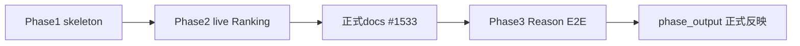

# TV-007: Reco性能フィジビリティ

## 1. 文書情報

| 項目 | 内容 |
| ---- | ---- |
| 検証ID | TV-007 |
| 検証名 | Reco性能フィジビリティ |
| 定義正本 | [全体テスト計画書](../../../05_アプリケーション設計/テスト/全体テスト計画書.md) §7.1.2 |
| 全体計画 | [技術検証全体計画](../技術検証全体計画.md) |
| 進捗 | [TV進捗一覧](../../管理/TV進捗一覧.md) |
| 棚卸し | [759_Reco性能フィジビリティ棚卸し_2026-07-21](../../管理/759_Reco性能フィジビリティ棚卸し_2026-07-21.md) |
| 関連 Epic | Phase1 [#759](https://github.com/ryo-chan-k6/GiftRecommendAPP_MVP_CYCLE_3/issues/759) / Phase2 [#1512](https://github.com/ryo-chan-k6/GiftRecommendAPP_MVP_CYCLE_3/issues/1512) / 正式反映 [#1532](https://github.com/ryo-chan-k6/GiftRecommendAPP_MVP_CYCLE_3/issues/1532)・[#1533](https://github.com/ryo-chan-k6/GiftRecommendAPP_MVP_CYCLE_3/issues/1533) / Phase3 [#1535](https://github.com/ryo-chan-k6/GiftRecommendAPP_MVP_CYCLE_3/issues/1535) |
| 結果の既定置き場 | `docs/90_PoC/性能フィジビリティ/` |

---

## 2. 要件（確認すること）

| 観点 | 内容 |
| ---- | ---- |
| Phase1/2 主対象 | 入力解析〜Ranking |
| **Phase3 主対象** | **入力解析〜Reason（最終レスポンス）** — Reason（`phase_output` / `MOD-RECO-023`）を含む |
| 判断結果の反映先 | Reco設計、非機能設計（性能要件 / MOD-RECO-001 §13.2） |
| 判定基準（#1533 Human 確定） | Reco 内部 soft **1,500ms** / hard **2,000ms**。同期外部 AI 込み soft **6,000ms** / hard **8,000ms**。`phase_output` は Phase3 で確定 |

**方針（2026-07-22 Human）:** 案A — Phase3 で Reason 込み E2E を正式主対象化する。Ranking までと Reason 込みの判定は**分離記載**する（#1533 の内部 / 外部 AI 分離と整合）。

---

## 3. 実施方針

全体計画の S0〜S4 に加え、本 TV は **Phase1 / Phase2 / Phase3** を用いる。

| フェーズ | 対応段階 | 内容 | 現状（2026-07-22） |
| -------- | -------- | ---- | ------------------ |
| Phase1 | S1〜S3（skeleton） | ハーネス整備、skeleton 実測、設計試算 | 完了（#1502） |
| Phase2 | S3（live・Ranking まで） | live 実測、暫定 Go/Adjust/Block | 完了（#1512 / #1530） |
| 正式反映（Ranking・User Meaning） | S4 後 | #1533 で soft/hard・主要フェーズ確定。`phase_output` のみ未確定 | #1533 CLOSED（Epic #1532 は develop 取り込み待ちの場合あり） |
| **Phase3** | S3（live・Reason 込み） | Reason 込み E2E、`phase_output` 上限案、分離判定 | **#1536 計測完了（Human 判定待ち）** |
| 正式反映（phase_output） | Phase3 後の別 Task または #1532 追従 | §13.2 `phase_output` / 性能要件の Reason 関連 | Phase3 結果・Human 確定後 |

### 3.1 依存

| 依存 | 扱い |
| ---- | ---- |
| #1533 Human 確定 | Phase3 の判定基準の正。内部 / 同期外部 AI 込み soft・hard を参照 |
| TV-005 / TV-006 | Reason / Embedding の精度向上に有用。Phase3 に内包しない（別 TV） |
| BATCH レーン | path 衝突は小さい。計測環境の取り合いに注意 |

---

## 4. 検証方針

| 項目 | 方針 |
| ---- | ---- |
| 環境 | local / GHA Layer2（`perf-feasibility-reco.yml`）。production 禁止 |
| モード | Phase1: `skeleton`。Phase2/3: `live`（ephemeral DB / mock or secrets） |
| 指標 | フェーズ別・全体 wall-clock（p50 / p95）。Phase3 は **Reason 込み E2E** と `phase_output` を必須 |
| 記録 | `性能フィジビリティ/` |
| CI | 通常 PR CI 必須ゲートにしない |
| 判定 | Go / Adjust / Block。**Ranking まで**と **Reason 込み**を分離記載 |
| 実装変更 | `apps/reco/src/**` は原則禁止（必要なら Human 確認） |

詳細: [Reco性能フィジビリティ検証計画書](../../性能フィジビリティ/Reco性能フィジビリティ検証計画書.md) / [scripts/perf/README.md](../../../../scripts/perf/README.md)

### 4.1 Phase2 live 計測境界（完了・参照）

| 境界 | 内容 |
| ---- | ---- |
| TV-007 主対象（当時） | 入力解析〜 Ranking。Reason は参考 |
| 判定（旧 soft/hard 2s/4s） | mock Go / secrets Adjust〜Block。#1533 で正式値へ更新 |

### 4.2 Phase3 live 計測境界（#1535）

| 境界 | 内容 |
| ---- | ---- |
| 実行 | `RecommendationOrchestrator` + PRODUCTION（HTTP 非経由）。Phase2 と同型 |
| **主対象** | 入力解析〜 **Reason（最終レスポンス）** |
| 必須指標 | Reason 込み E2E p50/p95、`phase_output` p50/p95、User Meaning（比較用） |
| 参考 | Ranking までの区間（Phase2 との比較） |
| DB | ephemeral Supabase + seed |
| OpenAI | mock / secrets（`scripts/perf` 差込。apps/reco 非改修） |
| 判定基準 | #1533: 内部 1.5s/2s、同期外部 AI 込み 6s/8s。`phase_output` は本 Phase で案出し → Human 確定 |
| 件数スケール | Phase2 同様、追加 seed がなければ未実施理由を明示 |

---

## 5. 関連Issue / 成果物

| 種別 | 状態 |
| ---- | ---- |
| Phase1 Epic | #759 CLOSED |
| Phase2 Epic / Task | #1512 / #1513 CLOSED |
| 正式反映 Task | #1533 CLOSED（`phase_output` 未確定を宣言） |
| Phase3 Epic | #1535 |
| Phase3 Task | #1536 `poc-reason-e2e-verification` |
| 結果 | Phase1/2/3 結果 doc、設計反映メモ |

---

## 6. 次アクション

1. Human Review で `phase_output` hard 最終値を確定（Phase3 案: soft 3s / hard 7s）
2. Reason 込み E2E を同期外部 AI 込み 6s/8s と同一枠にするか確定
3. §13.2 / 性能要件への `phase_output` 正式反映（#1532 追従または新 Task）

---

## 7. 改訂履歴

| 日付 | 内容 |
| ---- | ---- |
| 2026-07-21 | 初版方針。#759 棚卸しを反映（#1496） |
| 2026-07-21 | Phase1 develop 取り込みに合わせて現状・次アクションを更新 |
| 2026-07-21 | Phase2 live 計測境界（#1512/#1513）を追記 |
| 2026-07-22 | Phase3（Reason 込み E2E）を正式主対象化。#1533 / #1535 を反映 |
| 2026-07-22 | #1536 計測完了・結果 doc 参照。次アクションを Human 確定へ更新 |
