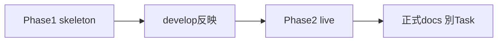

# TV-007: Reco性能フィジビリティ

## 1. 文書情報

| 項目 | 内容 |
| ---- | ---- |
| 検証ID | TV-007 |
| 検証名 | Reco性能フィジビリティ |
| 定義正本 | [全体テスト計画書](../../../05_アプリケーション設計/テスト/全体テスト計画書.md) §7.1.2 |
| 全体計画 | [技術検証全体計画](../技術検証全体計画.md) |
| 進捗 | [TV進捗一覧](../../管理/TV進捗一覧.md) |
| 棚卸し | [759_Reco性能フィジビリティ棚卸し_2026-07-21](../../管理/759_Reco性能フィジビリティ棚卸し_2026-07-21.md) |
| 関連 Epic | [#759](https://github.com/ryo-chan-k6/GiftRecommendAPP_MVP_CYCLE_3/issues/759) |
| 結果の既定置き場 | `docs/90_PoC/性能フィジビリティ/` |

---

## 2. 要件（確認すること）

| 観点 | 内容 |
| ---- | ---- |
| 主な確認内容 | 入力解析〜Rankingまでの概算時間 |
| 判断結果の反映先 | Reco設計、非機能設計（性能要件 §5 / MOD-RECO-001 §13.2） |
| 暫定判定対象 | soft 2,000ms / hard 4,000ms（§13.2 暫定値） |

Reason 生成は参考計測とし、TV-007 主対象からは除外する（#759 計画書方針）。

---

## 3. 実施方針

全体計画の S0〜S4 に加え、本 TV は **Phase1 / Phase2** を用いる（#759 計画書）。

| フェーズ | 対応段階 | 内容 | 現状（2026-07-21） |
| -------- | -------- | ---- | ------------------ |
| Phase1 | S1〜S3（skeleton） | ハーネス整備、skeleton 実測、設計試算、設計反映メモ | Epic Branch 上で完了。**develop 未着** |
| Phase2 | S3（live） | 実装済みパイプラインの実測、Go/Adjust/Block | **未実施** |
| 正式反映 | S4 後の別 Task | 性能要件 / Orchestrator 仕様の正式更新 | out of scope（#759） |

### 3.1 依存

| 依存 | 扱い |
| ---- | ---- |
| TV-005 / TV-006 | Phase2 live の精度向上に有用。内包最小計測か別 TV 先行かは Human 判断 |
| MOD-RECO 実装 | live 定義の前提。#260 CLOSED 後も実装が進んでいるため、Phase2 着手前に計測境界を再確認する |
| BATCH レーン | path 衝突は小さい。計測環境の取り合いに注意 |

---

## 4. 検証方針

| 項目 | 方針 |
| ---- | ---- |
| 環境 | local / GHA Layer2（`perf-feasibility-reco.yml`）。production 禁止 |
| モード | Phase1: `skeleton`。Phase2: `live`（ephemeral DB / mock or secrets） |
| 指標 | フェーズ別・全体 wall-clock（p50 / p95）。必要に応じ候補件数スケール |
| 記録 | `性能フィジビリティ/` に計画・結果・設計反映メモ |
| CI | 通常 PR CI 必須ゲートにしない |
| 判定 | soft/hard に対する Go / Adjust / Block（Phase2 実測根拠） |
| 実装変更 | `apps/reco/src/**` は原則禁止（計測のための変更が必要なら別 Issue） |

詳細手順の正本候補: Epic Branch 上の `Reco性能フィジビリティ検証計画書.md`（develop 反映後に本方針からリンクを更新する）。

---

## 5. 関連Issue / 成果物

| 種別 | 状態（2026-07-21） |
| ---- | ------------------ |
| Epic | #759 OPEN |
| 子 Task | #761 / #762 / #763 CLOSED（Phase1） |
| develop 上の結果 | 未着（`.gitkeep` のみ） |
| Epic Branch 上の結果 | 計画・Phase1結果・設計反映メモ・harness・workflow あり |

---

## 6. 次アクション候補（着手は Human 確認後）

1. Phase1 成果の develop 取り込み（Epic Branch 再ベース → Epic PR）
2. Phase2 の Issue 境界決定（#759 継続 or 新 Issue）
3. Phase2 計画の更新（live 定義・合格基準）
4. Phase2 実行 → 正式 docs 更新 Task

---

## 7. 改訂履歴

| 日付 | 内容 |
| ---- | ---- |
| 2026-07-21 | 初版方針。#759 棚卸しを反映（#1496） |
