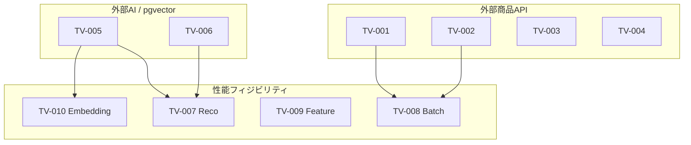
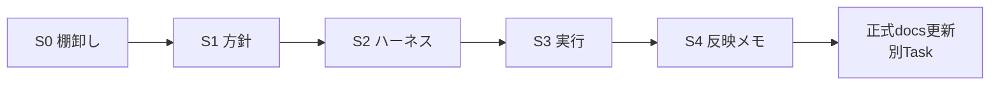

# 技術検証全体計画

## 1. 文書情報

| 項目 | 内容 |
| ---- | ---- |
| 文書種別 | PoC 全体計画 |
| 配置 | `docs/90_PoC/計画/` |
| 工程 | `90_PoC` |
| 検証ID定義の正本 | [全体テスト計画書](../../05_アプリケーション設計/テスト/全体テスト計画書.md) §7.1 |
| 関連 Epic | [#1496](https://github.com/ryo-chan-k6/GiftRecommendAPP_MVP_CYCLE_3/issues/1496)（本構成整備） |
| 更新方針 | 全体マップの変更は Human 確認後に反映する |

---

## 2. 目的

本計画は、技術検証テスト（TV-001〜TV-010）を**段階的に計画し、着実に検証〜改善**するための全体マップである。

- 個別 TV の詳細手順・結果は各 TV 方針書および結果ディレクトリに分離する
- 正式な非機能テスト・結合テストの代替ではない（早期リスクつぶし）
- PoC 結果を正式 docs へ反映する場合は、該当工程の正本へ別 Task で再整理する

---

## 3. 全体マップ

```text
技術検証テスト（早期リスクつぶし）
├─ 外部商品API疎通
│  ├─ TV-001  楽天商品検索API実疎通
│  ├─ TV-002  楽天ランキングAPI実疎通
│  ├─ TV-003  楽天ジャンルAPI実疎通
│  └─ TV-004  楽天属性API実疎通
├─ 外部AI / ベクトル基盤
│  ├─ TV-005  外部AI API疎通
│  └─ TV-006  pgvector検索性能
├─ Online / Batch 性能フィジビリティ
│  ├─ TV-007  Reco性能フィジビリティ     ← 現行並行レーン候補（#759）
│  ├─ TV-008  Batch性能フィジビリティ
│  ├─ TV-009  Feature生成性能
│  └─ TV-010  Embedding生成性能
```



依存の矢印は「後続 TV の live / 実測が、先行 TV の知見を参照し得る」関係である。**必ずしも直列必須ではない**（並列可能なものは並列してよい）。

---

## 4. TV一覧（要約）

| 検証ID | 検証名 | 主な確認内容 | 判断結果の反映先 | 方針書 |
| ------ | ------ | ------------ | ---------------- | ------ |
| TV-001 | 楽天商品検索API実疎通 | 項目、欠損、ページング、rate limit、エラー形式、応答時間 | 外部商品データ連携、Batch仕様、テーブル設計 | [TV-001](./TV要件・実施方針/TV-001_楽天商品検索API実疎通.md) |
| TV-002 | 楽天ランキングAPI実疎通 | ranking_snapshot化に必要な項目、rank、genreId、period、重複、応答時間 | Batch仕様、Ranking設計 | [TV-002](./TV要件・実施方針/TV-002_楽天ランキングAPI実疎通.md) |
| TV-003 | 楽天ジャンルAPI実疎通 | ジャンル階層取得、親子関係、更新差分、応答時間 | Master設計、Batch仕様 | [TV-003](./TV要件・実施方針/TV-003_楽天ジャンルAPI実疎通.md) |
| TV-004 | 楽天属性API実疎通 | 取得可否、schema、Feature補助情報としての有用性、応答時間 | Feature設計、Batch仕様 | [TV-004](./TV要件・実施方針/TV-004_楽天属性API実疎通.md) |
| TV-005 | 外部AI API疎通 | Embedding / LLMの応答時間、rate limit、失敗形式、利用料金集計・コスト感 | Reco設計、Batch設計、Error設計 | [TV-005](./TV要件・実施方針/TV-005_外部AI_API疎通.md) |
| TV-006 | pgvector検索性能 | 件数別検索時間、index効果、類似検索速度 | DB設計、Retrieval設計 | [TV-006](./TV要件・実施方針/TV-006_pgvector検索性能.md) |
| TV-007 | Reco性能フィジビリティ | Phase1/2: 入力解析〜Ranking。**Phase3: Reason 込み最終レスポンス** | Reco設計、非機能設計 | [TV-007](./TV要件・実施方針/TV-007_Reco性能フィジビリティ.md) |
| TV-008 | Batch性能フィジビリティ | 件数別処理時間、chunk / 並列化要否、GHAレートリミット・稼働時間 | Batch設計、Workflow設計 | [TV-008](./TV要件・実施方針/TV-008_Batch性能フィジビリティ.md) |
| TV-009 | Feature生成性能 | User / Item Feature生成時間 | shared_logic設計、Online / Batch責務 | [TV-009](./TV要件・実施方針/TV-009_Feature生成性能.md) |
| TV-010 | Embedding生成性能 | API応答時間、バッチ生成時間、コスト感 | Embedding設計、Batch設計 | [TV-010](./TV要件・実施方針/TV-010_Embedding生成性能.md) |

進捗の正: [TV進捗一覧](../管理/TV進捗一覧.md)

---

## 5. 段階方針（共通）

各 TV は原則として次の段階で進める。飛ばしてよい場合は方針書に明示する。

| 段階 | 目的 | 典型成果物 |
| ---- | ---- | ---------- |
| **S0 棚卸し** | 既存 Issue / Branch / 成果物の有無を確認 | `管理/` の棚卸しメモ |
| **S1 要件・方針確定** | 本ディレクトリの方針書を充足 | `計画/TV要件・実施方針/TV-xxx_*.md` |
| **S2 ハーネス / 最小スクリプト** | 計測・疎通の再現手段を用意 | `scripts/` / `tests/tech-verification/` / workflow（必要時） |
| **S3 実行・結果記録** | 数値・所見を残す | 結果系ディレクトリのレポート |
| **S4 設計反映メモ** | 正式 docs 更新の入力を整理 | 設計反映メモ（正式反映は別 Task） |



---

## 6. 成果物の配置対応

| TV群 | 計画 | 管理 | 結果の既定置き場 |
| ---- | ---- | ---- | ---------------- |
| TV-001〜004 | `計画/TV要件・実施方針/` | `管理/` | `外部API疎通検証/` |
| TV-005 | 同上 | 同上 | `外部API疎通検証/` または `技術検証結果/` |
| TV-006 | 同上 | 同上 | `技術検証結果/` |
| TV-007 / TV-008 | 同上 | 同上 | `性能フィジビリティ/` |
| TV-009 / TV-010 | 同上 | 同上 | `性能フィジビリティ/` または `技術検証結果/` |

既存の結果ディレクトリ名は維持する（破壊的な移動はしない）。配置に迷う場合は `管理/` に判断メモを残し Human 確認する。

---

## 7. 現行フォーカス（2026-07-22 時点）

| 優先 | 対象 | 根拠 | 次アクション候補 |
| ---- | ---- | ---- | ---------------- |
| 1 | **TV-007 Phase3** | Phase2 develop 着（#1530）。#1533 で soft/hard 確定・`phase_output` 未確定。Human により Reason 込み E2E を Phase3 正式主対象化（案A） | [#1535](https://github.com/ryo-chan-k6/GiftRecommendAPP_MVP_CYCLE_3/issues/1535) / [TV-007 方針](./TV要件・実施方針/TV-007_Reco性能フィジビリティ.md) |
| 2 | #1532 正式 docs develop 取り込み | #1533 は Epic Branch 反映済。`phase_output` 以外は確定済み | Epic PR → develop（Human） |
| 3 | TV-005 / TV-006 | Phase3 の外部 AI / pgvector 精度向上候補 | 別 TV。Phase3 に内包しない |
| 4 | TV-008〜010 | BATCH / Embedding 実装の進展に合わせて後続 | BATCH レーンと exclusive path を調整してから |
| 5 | TV-001〜004 | 楽天疎通。必要に応じて再確認 | 未実施なら S0 から |

詳細な #759 現状: [759_Reco性能フィジビリティ棚卸し_2026-07-21](../管理/759_Reco性能フィジビリティ棚卸し_2026-07-21.md)

---

## 8. 実施環境・制約（全体テスト計画書準拠）

| 項目 | 内容 |
| ---- | ---- |
| 実施環境 | local / dev |
| 実施方式 | Python検証スクリプト、curl、SQL測定、必要時 GHA（`perf-feasibility-*.yml` / `tech-verify-*.yml`） |
| CI | 原則、通常 PR CI の必須ゲートにはしない（分離 workflow） |
| secret | 実値を docs / commit に含めない |

---

## 9. Human 判断が必要な事項

- 全体マップ自体の変更（TV 追加・統合・削除）
- TV 間の必須依存の確定（並列可否の強制）
- TV-007 Phase3 の `phase_output` hard 最終値、Reason 込みを 6s/8s 枠と同一視するか
- 結果ディレクトリの大規模再編
- （消化済み）TV-007 Phase2 の Issue 境界 → 新 Epic #1512。Reason 正式主対象化 → Phase3 案A（#1535）

---

## 10. 改訂履歴

| 日付 | 内容 |
| ---- | ---- |
| 2026-07-21 | 初版。TV-001〜TV-010 全体マップと段階方針を追加（#1496） |
| 2026-07-21 | §7 現行フォーカスを Phase1 develop 取り込みに更新（#759） |
| 2026-07-21 | §7 を Phase2（#759 CLOSED 後）に更新 |
| 2026-07-21 | TV-001〜004 応答時間、TV-005 コスト感、TV-008 GHA計測を要約へ反映 |
| 2026-07-22 | TV-007 Phase3（Reason 込み E2E）を正式主対象として §4・§7 を更新（#1533/#1535） |
