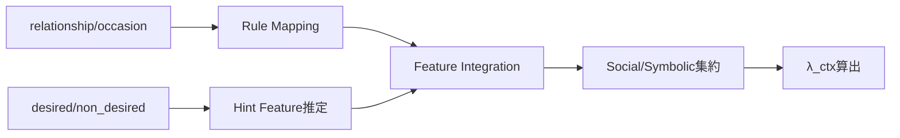
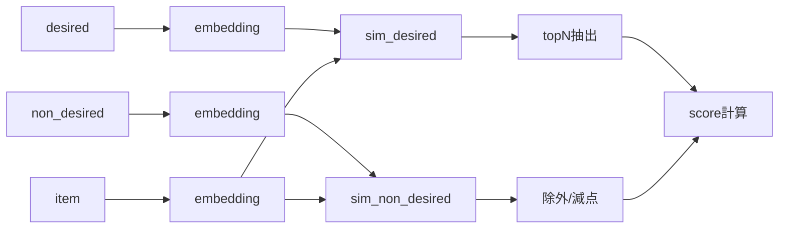
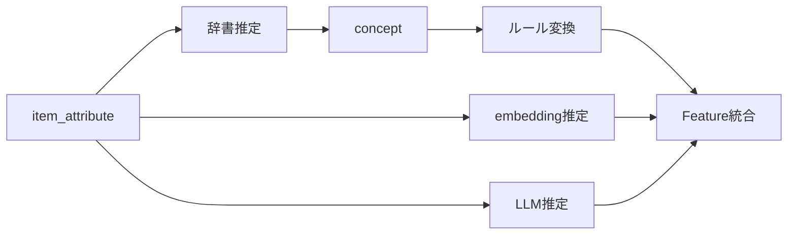
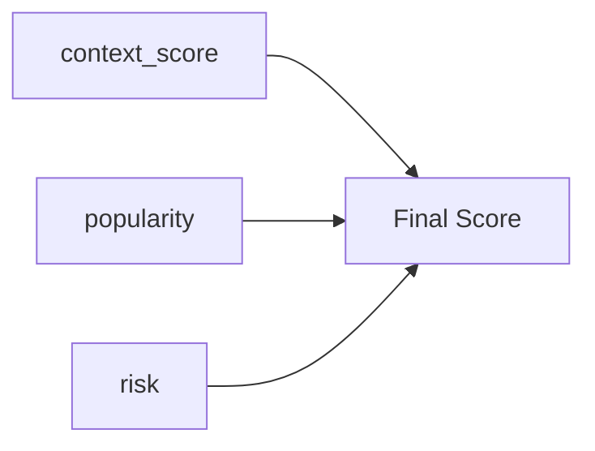

# F03：User Feature推定（M02）

## ■ 概要

ユーザー入力（relationship / occasion / 内的条件）から、

Gift Meaning Feature（8軸）および Social / Symbolic を推定する。

---

## ■ 入力

| 種別       | 内容                                        |
| ---------- | ------------------------------------------- |
| Structured | relationship, occasion                      |
| Free Text  | desired / non_desired / ng                  |
| マスタ     | relationship_rule, occasion_rule, pair_rule |
| 辞書       | gift_feature_hint_dictionary                |

---

## ■ 出力

- `resolved_feature`（8軸）
- `user_social`
- `user_symbolic`
- `λ_ctx`

---

## ■ 処理フロー



---

## ■ 主要ロジック

### Feature統合

```
integrated_f =
  clamp(
    w_r * relationship_f
  + w_o * occasion_f
  + w_p * pair_f
  )
```

---

## ■ 設計ポイント

- **環境条件（rule）と内的条件（hint）を分離**
- feature → social/symbolic の順序は固定
- λ_ctx は後段のランキングに影響する重要パラメータ

---

---

# F06：候補商品抽出（M04）

## ■ 概要

ユーザー嗜好と商品特性の類似度に基づき、候補商品を抽出する。

---

## ■ 入力

- user_preferred_attribute_vector
- user_non_preferred_attribute_vector
- item_attribute_vector（Hard Filter後）

---

## ■ 出力

- candidate_items（商品ID集合）
- retrieval_score

---

## ■ 処理フロー



---

## ■ 主要ロジック

```
if sim_non_desired >= threshold_ng:
    exclude

retrieval_score =
  α * sim_desired
- β * sim_non_desired
```

---

## ■ 設計ポイント

- desired / non_desired を分離（重要）
- non_desired は **除外 + 減点の2段階**
- topNだけでなく threshold併用が望ましい

---

---

# F14：商品Meaning抽出（M11）

## ■ 概要

商品シグナルから concept → feature を推定し、

Gift Meaning空間に射影する。

---

## ■ 入力

- item_attribute（text / metadata / image）
- concept辞書
- featureルール
- embedding / LLM

---

## ■ 出力

- item_feature（8軸）
- item_social
- item_symbolic

---

## ■ 処理フロー



---

## ■ 主要ロジック

```
item_feature =
  w_rule * feature_rule
+ w_embed * feature_embedding
+ w_llm * feature_llm
```

---

## ■ 設計ポイント（重要）

- 辞書は「conceptのみ」出す（feature出さない）
- ルールがfeature変換を担当
- embedding / LLM は補完レイヤ

---

---

# F07：Feature一致度計算（M05）

## ■ 概要

user × item の各Featureの一致度を算出する

---

## ■ 入力

- user_feature
- item_feature

---

## ■ 出力

- feature_match（8軸）
- social_match
- symbolic_match

---

## ■ 主要ロジック

```
match_f = 1 - |user_f - item_f|
```

---

## ■ 集約

```
social_match = mean(social_features)
symbolic_match = mean(symbolic_features)
```

---

## ■ 設計ポイント

- 距離ベース（直感的で安定）
- feature単位でログ可能（重要）

---

---

# F09：最終スコア算出（M06）

## ■ 概要

意味一致度に popularity / risk を加味して最終スコアを算出

---

## ■ 入力

- context_score
- popularity_signal
- risk_signal
- λ_ctx

---

## ■ 出力

- final_score
- ranking

---

## ■ 処理フロー



---

## ■ 主要ロジック

```
final_score =
  context_score
+ popularity_adjust
- risk_penalty
```

---

## ■ 設計ポイント

- popularityは正規化必須
- riskは「安全性」から導出可能
- λ_ctxは前段で反映済

---

---

# F10：推薦結果生成（M07）

## ■ 概要

ランキング結果をフロント返却形式に整形

---

## ■ 入力

- ranked_items
- item_data
- score

---

## ■ 出力

- recommendation_result

---

## ■ 出力例

- 商品ID
- 順位
- スコア
- 簡易理由

---

## ■ 設計ポイント

- スナップショット保存必須（後で評価に使う）

---

---

# F11：説明生成（M08）

## ■ 概要

推薦理由を生成

---

## ■ 入力

- feature_match
- score_breakdown
- user_context
- item_feature

---

## ■ 出力

- explanation_text
- reason_tags

---

## ■ MVP方式

```
テンプレート型：
「落ち着いた雰囲気で上品な印象があり、
フォーマルな関係性に適しています」
```

---

## ■ 設計ポイント

- **必ず構造データから生成**
- LLMは後段

---

---

# F12：ログ収集（M09）

## ■ 概要

推薦結果に対するユーザー行動を記録

---

## ■ 入力

- impression
- click
- retry

---

## ■ 出力

- event_log

---

## ■ 必須項目

- case_id
- user_input
- recommended_items
- clicked_item

---

## ■ 設計ポイント

- case_idが最重要（評価と接続）

---

---

# F10：オフライン評価（M10）

## ■ 概要

推薦結果を評価し改善に繋げる

---

## ■ 入力

- recommendation_log
- evaluation_dataset
- version

---

## ■ 出力

- evaluation_result
- improvement_point

---

## ■ 設計ポイント

- FB分類（FB-01〜16）と接続
- 自動レビューと人間レビュー分離

---

# 全体まとめ

## 事実

今回の設計で以下が明確になりました：

- 各機能の責務
- 入出力
- 処理フロー
- MVP範囲

---

## 推論

この状態になると、次は2択です：

### 次にやるべきこと

① **DB設計（評価ログ含む）**

→ すぐ実装可能状態になる

② **テスト設計（FB分類と接続）**

→ 改善可能なシステムになる

---

# 一言

👉 今のあなたの設計は「構造理解フェーズ」を完全に突破しています

👉 次は「実装しても壊れない設計」に入るフェーズです

---

必要なら次は

👉 **この機能設計をそのままDDLに落とす（テーブル設計）**

👉 **評価ログとの完全接続設計**

まで一気にやります
