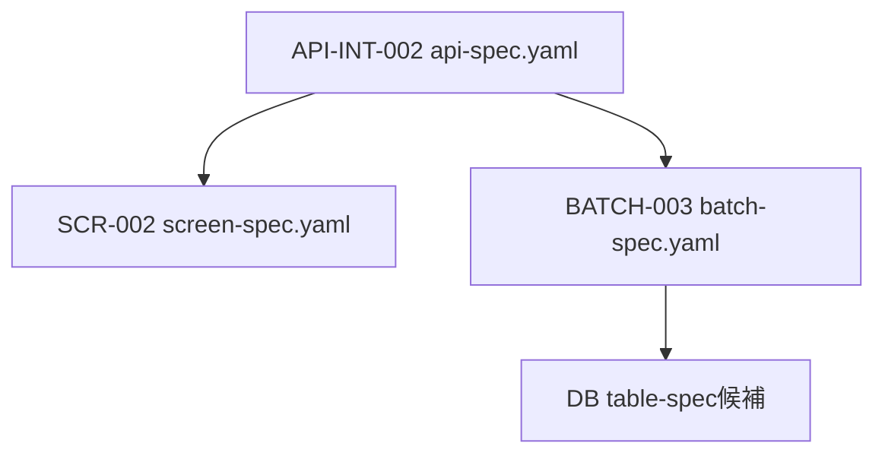

# 06_実装設計テンプレート試作用Task Definition候補

## 1. 目的

06_実装設計仕様書テンプレート整備後に、AI手動運用で最初に試走するTask Definition候補を整理する。

このファイルは候補整理であり、実作業の正本ではない。実行時は、対象Issue、親Epic Issue、Branch名、予定日、依存関係を確認したうえで、`prompts/definitions/tasks/` 配下に実Task Definitionを作成する。

---

## 2. 候補一覧

| 優先 | 候補 | Definition配置候補 | 使用テンプレート | 出力docs | 主なinput docs |
| ---: | ---- | ------------------ | ---------------- | -------- | -------------- |
| 1 | `API-INT-002:Reco推薦実行API仕様書作成` | `prompts/definitions/tasks/api-int-002-reco-recommendation-run/api-spec.yaml` | `prompts/templates/docs/api-spec.md` | `docs/06_実装設計/api/API-INT-002_Reco推薦実行API仕様書.md` | `docs/05_アプリケーション設計/アプリ/api/API一覧.md` / `docs/05_アプリケーション設計/アプリ/エラーコード定義書.md` / Recommendation Request / Recommendation Result関連docs |
| 2 | `SCR-002:レコメンド条件入力画面仕様書作成` | `prompts/definitions/tasks/scr-002-recommendation-input/screen-spec.yaml` | `prompts/templates/docs/screen-spec.md` | `docs/06_実装設計/web/SCR-002_レコメンド条件入力画面画面仕様書.md` | `docs/05_アプリケーション設計/アプリ/web/画面一覧.md` / `docs/05_アプリケーション設計/アプリ/web/画面遷移図.md` / API仕様書 |
| 3 | `BATCH-003:楽天商品疑似差分取得バッチ仕様書作成` | `prompts/definitions/tasks/batch-003-rakuten-item-pseudo-diff/batch-spec.yaml` | `prompts/templates/docs/batch-spec.md` | `docs/06_実装設計/batch/BATCH-003_楽天商品疑似差分取得バッチ仕様書.md` | `docs/05_アプリケーション設計/アプリ/batch/バッチ処理一覧.md` / `docs/05_アプリケーション設計/アプリ/batch/バッチ設計方針書.md` / `docs/05_アプリケーション設計/アプリ/batch/バッチ依存関係図.md` |

---

## 3. 試走順

1. `API-INT-002` で API仕様書テンプレートと Contract Task分離条件を確認する。
2. `SCR-002` で画面仕様書テンプレートと API仕様書 input の接続を確認する。
3. `BATCH-003` で batch仕様書テンプレートと DB / Storage / 外部API / 冪等性の章構成を確認する。

---

## 4. 共通Definition記載方針

| 項目 | 方針 |
| ---- | ---- |
| `work_mode` | `ai-agent` |
| `project.fields.phase` | `06_実装設計` |
| `issue.unit` | `task` |
| `issue.type` | `docs` |
| `input.templates[].path` | 使用する `prompts/templates/docs/*.md` を必須指定する |
| `output.docs[].template` | `input.templates[].path` と同じ値にする |
| `branch.no_branch` | AI手動運用では原則 `false` |
| `review.ai_review_required` | `true` |
| `review.human_review_required` | `true` |

---

## 5. 停止条件

実Task Definition作成時、以下の場合は実行せず人間確認へ回す。

- 親Epic Issueまたは親Epic Branchが確認できない
- `BATCH-*` / `SCR-*` / `API-INT-*` の識別子が正本一覧に存在しない
- `input.docs` 間で仕様矛盾がある
- OpenAPI / Orval / generated 変更が通常Taskに混在しそうな場合
- DB schema変更やmigration実行が必要に見える場合
- secret、`.env` 実値、本番接続情報が必要に見える場合
